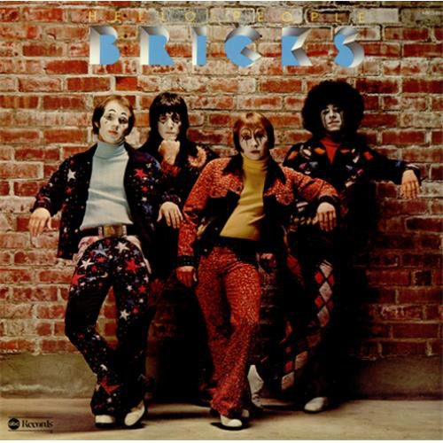

# Bricks

By **Hello People**

## Album Data

- **Catalog:** Beets
- **Format:** Digital, Album
- **Album:** Bricks
- **Artist:** Hello People
- **Albumartist:** Hello People
- **Genre:** Psychedelic Rock
- **MusicBrainz Album Artist ID:** [74afda69-9e33-4faa-af36-f9d0a5a871d1](https://musicbrainz.org/artist/74afda69-9e33-4faa-af36-f9d0a5a871d1)
- **MusicBrainz Album ID:** [f84c9c68-42af-4678-a493-2c4340323205](https://musicbrainz.org/release/f84c9c68-42af-4678-a493-2c4340323205)
- **MusicBrainz Release Group ID:** [6aa5b04f-dc10-4022-93f6-22f1b2ae42e1](https://musicbrainz.org/release-group/6aa5b04f-dc10-4022-93f6-22f1b2ae42e1)
- **Year:** 1975
- **Catalog #:** RGM-0128
- **Label:** Real Gone Music
- **Total Tracks:** 10

## Album Tracks

### Track 01 - White Winged Doves

- **Artist:** Hello People
- **Format:** MP3
- **Genre:** Psychedelic Rock
- **Length:** 4:16
- **MusicBrainz Track ID:** [0e4c41d0-bcc9-4de6-8063-9817d0a380d5](https://musicbrainz.org/recording/0e4c41d0-bcc9-4de6-8063-9817d0a380d5)
- **Title:** White Winged Doves
- **Track:** 01
- **Year:** 2013

### Track 02 - Anthem

- **Artist:** Hello People
- **Format:** MP3
- **Genre:** Psychedelic Rock
- **Length:** 4:05
- **MusicBrainz Track ID:** [e8616a2a-2378-46f8-ab79-b4e2909d506e](https://musicbrainz.org/recording/e8616a2a-2378-46f8-ab79-b4e2909d506e)
- **Title:** Anthem
- **Track:** 02
- **Year:** 2013

### Track 03 - Jelly Jam

- **Artist:** Hello People
- **Format:** MP3
- **Genre:** Psychedelic Rock
- **Length:** 4:05
- **MusicBrainz Track ID:** [77959b77-1058-4b27-a895-27d76d73fc66](https://musicbrainz.org/recording/77959b77-1058-4b27-a895-27d76d73fc66)
- **Title:** Jelly Jam
- **Track:** 03
- **Year:** 2013

### Track 04 - If I Should Sing Too Softly

- **Artist:** Hello People
- **Format:** MP3
- **Genre:** Psychedelic Rock
- **Length:** 3:21
- **MusicBrainz Track ID:** [b27d7242-dc6b-4e5d-aeeb-65577ded2d30](https://musicbrainz.org/recording/b27d7242-dc6b-4e5d-aeeb-65577ded2d30)
- **Title:** If I Should Sing Too Softly
- **Track:** 04
- **Year:** 2013

### Track 05 - How Does It Feel to Be Free

- **Artist:** Hello People
- **Format:** MP3
- **Genre:** Psychedelic Rock
- **Length:** 3:46
- **MusicBrainz Track ID:** [b7963940-6133-4a3b-bd9c-b458fe3dec6e](https://musicbrainz.org/recording/b7963940-6133-4a3b-bd9c-b458fe3dec6e)
- **Title:** How Does It Feel to Be Free
- **Track:** 05
- **Year:** 2013

### Track 06 - Pray for Rain

- **Artist:** Hello People
- **Format:** MP3
- **Genre:** Psychedelic Rock
- **Length:** 2:58
- **MusicBrainz Track ID:** [be3933ca-0dde-4fac-8744-8903bbb84d0d](https://musicbrainz.org/recording/be3933ca-0dde-4fac-8744-8903bbb84d0d)
- **Title:** Pray for Rain
- **Track:** 06
- **Year:** 2013

### Track 07 - A Dream of Tomorrow

- **Artist:** Hello People
- **Format:** MP3
- **Genre:** Psychedelic Rock
- **Length:** 4:42
- **MusicBrainz Track ID:** [642da82c-e04c-4917-bacc-3f78a5ff8af4](https://musicbrainz.org/recording/642da82c-e04c-4917-bacc-3f78a5ff8af4)
- **Title:** A Dream of Tomorrow
- **Track:** 07
- **Year:** 2013

### Track 08 - Everything’s Better

- **Artist:** Hello People
- **Format:** MP3
- **Genre:** Psychedelic Rock
- **Length:** 3:22
- **MusicBrainz Track ID:** [7d0c4a69-5556-4018-940f-f62190a66160](https://musicbrainz.org/recording/7d0c4a69-5556-4018-940f-f62190a66160)
- **Title:** Everything’s Better
- **Track:** 08
- **Year:** 2013

### Track 09 - Come and See Me

- **Artist:** Hello People
- **Format:** MP3
- **Genre:** Psychedelic Rock
- **Length:** 6:51
- **MusicBrainz Track ID:** [b5934171-e74e-4261-90d2-3cb973a3c86c](https://musicbrainz.org/recording/b5934171-e74e-4261-90d2-3cb973a3c86c)
- **Title:** Come and See Me
- **Track:** 09
- **Year:** 2013

### Track 10 - I Ride to Nowhere

- **Artist:** Hello People
- **Format:** MP3
- **Genre:** Psychedelic Rock
- **Length:** 3:10
- **MusicBrainz Track ID:** [e58764e1-2c95-4a5c-a236-a02dc6040ac5](https://musicbrainz.org/recording/e58764e1-2c95-4a5c-a236-a02dc6040ac5)
- **Title:** I Ride to Nowhere
- **Track:** 10
- **Year:** 2013

## See also

- [Fusion](Fusion.md)
- [Hello People](Hello_People.md)
- [The Handsome Devils](The_Handsome_Devils.md)
- [Vinyl: Bricks](../../Vinyl/Hello_People/Bricks.md)
- [Vinyl: Fusion](../../Vinyl/Hello_People/Fusion.md)
- [Vinyl: ](../../Vinyl/Hello_People/Hello_People.md)
- [Vinyl: The Handsome Devils](../../Vinyl/Hello_People/The_Handsome_Devils.md)
- [Vinyl: The Hello People](../../Vinyl/Hello_People/The_Hello_People.md)
