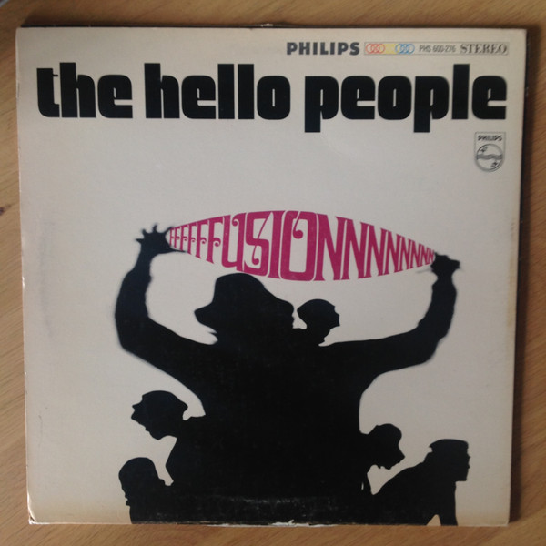

# Fusion

By **Hello People**

## Album Data

- **Catalog:** Beets
- **Format:** Digital, Album
- **Album:** Fusion
- **Artist:** Hello People
- **Albumartist:** Hello People
- **Genre:** Psychedelic Rock
- **MusicBrainz Album Artist ID:** [74afda69-9e33-4faa-af36-f9d0a5a871d1](https://musicbrainz.org/artist/74afda69-9e33-4faa-af36-f9d0a5a871d1)
- **MusicBrainz Album ID:** [82561180-fe94-452c-a581-f1e5b1c4b608](https://musicbrainz.org/release/82561180-fe94-452c-a581-f1e5b1c4b608)
- **MusicBrainz Release Group ID:** [154d368f-438c-4299-82d6-b271084be1aa](https://musicbrainz.org/release-group/154d368f-438c-4299-82d6-b271084be1aa)
- **Year:** 2013
- **Catalog #:** 
- **Label:** 
- **Total Tracks:** 09

## Album Tracks

### Track 01 - It's A Monday Kind Of Tuesday

- **Artist:** Hello People
- **Format:** MP3
- **Genre:** Psychedelic Rock
- **Length:** 3:26
- **MusicBrainz Track ID:** 
- **Title:** It's A Monday Kind Of Tuesday
- **Track:** 01
- **Year:** 1968

### Track 02 - Sunrise Meadow

- **Artist:** Hello People
- **Format:** MP3
- **Genre:** Psychedelic Rock
- **Length:** 6:12
- **MusicBrainz Track ID:** 
- **Title:** Sunrise Meadow
- **Track:** 02
- **Year:** 1968

### Track 03 - A Stranger At Her Door

- **Artist:** Hello People
- **Format:** MP3
- **Genre:** Psychedelic Rock
- **Length:** 2:43
- **MusicBrainz Track ID:** 
- **Title:** A Stranger At Her Door
- **Track:** 03
- **Year:** 1968

### Track 04 - Movin' And Growin'

- **Artist:** Hello People
- **Format:** MP3
- **Genre:** Psychedelic Rock
- **Length:** 3:40
- **MusicBrainz Track ID:** 
- **Title:** Movin' And Growin'
- **Track:** 04
- **Year:** 1968

### Track 05 - Paisley Teddy Bear

- **Artist:** Hello People
- **Format:** MP3
- **Genre:** Psychedelic Rock
- **Length:** 2:55
- **MusicBrainz Track ID:** 
- **Title:** Paisley Teddy Bear
- **Track:** 05
- **Year:** 1968

### Track 06 - (As I Went Down To) Jerusalem

- **Artist:** Hello People
- **Format:** MP3
- **Genre:** Psychedelic Rock
- **Length:** 4:20
- **MusicBrainz Track ID:** 
- **Title:** (As I Went Down To) Jerusalem
- **Track:** 06
- **Year:** 1968

### Track 07 - Lamplight, Nightlight

- **Artist:** Hello People
- **Format:** MP3
- **Genre:** Psychedelic Rock
- **Length:** 4:35
- **MusicBrainz Track ID:** 
- **Title:** Lamplight, Nightlight
- **Track:** 07
- **Year:** 1968

### Track 08 - Mr. Truth Evading, Masquerading Man

- **Artist:** Hello People
- **Format:** MP3
- **Genre:** Psychedelic Rock
- **Length:** 2:24
- **MusicBrainz Track ID:** 
- **Title:** Mr. Truth Evading, Masquerading Man
- **Track:** 08
- **Year:** 1968

### Track 09 - Paris In The Rain

- **Artist:** Hello People
- **Format:** MP3
- **Genre:** Psychedelic Rock
- **Length:** 4:54
- **MusicBrainz Track ID:** 
- **Title:** Paris In The Rain
- **Track:** 09
- **Year:** 1968

## See also

- [Bricks](Bricks.md)
- [Hello People](Hello_People.md)
- [The Handsome Devils](The_Handsome_Devils.md)
- [Vinyl: Bricks](../../Vinyl/Hello_People/Bricks.md)
- [Vinyl: Fusion](../../Vinyl/Hello_People/Fusion.md)
- [Vinyl: ](../../Vinyl/Hello_People/Hello_People.md)
- [Vinyl: The Handsome Devils](../../Vinyl/Hello_People/The_Handsome_Devils.md)
- [Vinyl: The Hello People](../../Vinyl/Hello_People/The_Hello_People.md)
