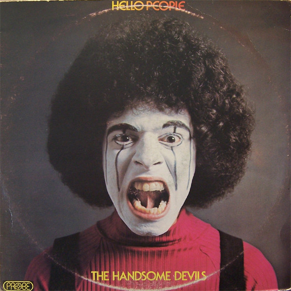

# The Handsome Devils

By **Hello People**

## Album Data

- **Catalog:** Beets
- **Format:** Digital, Album
- **Album:** The Handsome Devils
- **Artist:** Hello People
- **Albumartist:** Hello People
- **Genre:** Psychedelic Rock
- **MusicBrainz Album Artist ID:** [74afda69-9e33-4faa-af36-f9d0a5a871d1](https://musicbrainz.org/artist/74afda69-9e33-4faa-af36-f9d0a5a871d1)
- **MusicBrainz Album ID:** [22d2e3ef-28e2-49e3-9b78-fe020047ea48](https://musicbrainz.org/release/22d2e3ef-28e2-49e3-9b78-fe020047ea48)
- **MusicBrainz Release Group ID:** [a30eab8d-65fb-4e97-ad16-91be9051f478](https://musicbrainz.org/release-group/a30eab8d-65fb-4e97-ad16-91be9051f478)
- **Year:** 1974
- **Catalog #:** DSD-50184
- **Label:** Dunhill ABC
- **Total Tracks:** 11

## Album Tracks

### Track 01 - Future Shock

- **Artist:** Hello People
- **Format:** MP3
- **Genre:** Psychedelic Rock
- **Length:** 4:44
- **MusicBrainz Track ID:** [b4312c76-2448-458a-b8f0-e2faf413d83b](https://musicbrainz.org/recording/b4312c76-2448-458a-b8f0-e2faf413d83b)
- **Title:** Future Shock
- **Track:** 01
- **Year:** 1974

### Track 02 - Finger Poppin’ Time

- **Artist:** Hello People
- **Format:** MP3
- **Genre:** Psychedelic Rock
- **Length:** 2:43
- **MusicBrainz Track ID:** [bd52c9c7-e6a9-4b1a-949a-aa8ad6d2b54b](https://musicbrainz.org/recording/bd52c9c7-e6a9-4b1a-949a-aa8ad6d2b54b)
- **Title:** Finger Poppin’ Time
- **Track:** 02
- **Year:** 1974

### Track 03 - Take the Love in Your Body

- **Artist:** Hello People
- **Format:** MP3
- **Genre:** Psychedelic Rock
- **Length:** 2:46
- **MusicBrainz Track ID:** [61e731c3-511f-4b46-ace5-e9ed7a76a918](https://musicbrainz.org/recording/61e731c3-511f-4b46-ace5-e9ed7a76a918)
- **Title:** Take the Love in Your Body
- **Track:** 03
- **Year:** 1974

### Track 04 - Destiny

- **Artist:** Hello People
- **Format:** MP3
- **Genre:** Psychedelic Rock
- **Length:** 4:00
- **MusicBrainz Track ID:** [3307f914-c361-434a-bfe9-9191afef2f3e](https://musicbrainz.org/recording/3307f914-c361-434a-bfe9-9191afef2f3e)
- **Title:** Destiny
- **Track:** 04
- **Year:** 1974

### Track 05 - Ripped Again

- **Artist:** Hello People
- **Format:** MP3
- **Genre:** Psychedelic Rock
- **Length:** 6:14
- **MusicBrainz Track ID:** [148a5527-ae40-45ff-b966-ff8e513e27de](https://musicbrainz.org/recording/148a5527-ae40-45ff-b966-ff8e513e27de)
- **Title:** Ripped Again
- **Track:** 05
- **Year:** 1974

### Track 06 - Listen to Your Heart

- **Artist:** Hello People
- **Format:** MP3
- **Genre:** Psychedelic Rock
- **Length:** 2:16
- **MusicBrainz Track ID:** [5cc98779-c948-432a-b9df-f9c3f90f0bb2](https://musicbrainz.org/recording/5cc98779-c948-432a-b9df-f9c3f90f0bb2)
- **Title:** Listen to Your Heart
- **Track:** 06
- **Year:** 1974

### Track 07 - Creego

- **Artist:** Hello People
- **Format:** MP3
- **Genre:** Psychedelic Rock
- **Length:** 3:30
- **MusicBrainz Track ID:** [fe0a8114-00ed-4f7d-9aac-bd54325c93dc](https://musicbrainz.org/recording/fe0a8114-00ed-4f7d-9aac-bd54325c93dc)
- **Title:** Creego
- **Track:** 07
- **Year:** 1974

### Track 08 - Cry Baby

- **Artist:** Hello People
- **Format:** MP3
- **Genre:** Psychedelic Rock
- **Length:** 3:10
- **MusicBrainz Track ID:** [a00f9223-0816-44db-be68-f7372adf085d](https://musicbrainz.org/recording/a00f9223-0816-44db-be68-f7372adf085d)
- **Title:** Cry Baby
- **Track:** 08
- **Year:** 1974

### Track 09 - Just One Victory

- **Artist:** Hello People
- **Format:** MP3
- **Genre:** Psychedelic Rock
- **Length:** 4:19
- **MusicBrainz Track ID:** [cfce6a0c-1bce-4ffd-8b91-9b3fbe531925](https://musicbrainz.org/recording/cfce6a0c-1bce-4ffd-8b91-9b3fbe531925)
- **Title:** Just One Victory
- **Track:** 09
- **Year:** 1974

### Track 10 - How High Is the Moon

- **Artist:** Hello People
- **Format:** MP3
- **Genre:** Psychedelic Rock
- **Length:** 3:18
- **MusicBrainz Track ID:** [7e06cd28-42ca-4032-ada5-6f5b0bc0fb31](https://musicbrainz.org/recording/7e06cd28-42ca-4032-ada5-6f5b0bc0fb31)
- **Title:** How High Is the Moon
- **Track:** 10
- **Year:** 1974

### Track 11 - Save a Dance for Me

- **Artist:** Hello People
- **Format:** MP3
- **Genre:** Psychedelic Rock
- **Length:** 3:20
- **MusicBrainz Track ID:** [dac6528c-e6a1-4936-a34f-da0a9b17bf2c](https://musicbrainz.org/recording/dac6528c-e6a1-4936-a34f-da0a9b17bf2c)
- **Title:** Save a Dance for Me
- **Track:** 11
- **Year:** 1974

## See also

- [Bricks](Bricks.md)
- [Fusion](Fusion.md)
- [Hello People](Hello_People.md)
- [Vinyl: Bricks](../../Vinyl/Hello_People/Bricks.md)
- [Vinyl: Fusion](../../Vinyl/Hello_People/Fusion.md)
- [Vinyl: ](../../Vinyl/Hello_People/Hello_People.md)
- [Vinyl: The Handsome Devils](../../Vinyl/Hello_People/The_Handsome_Devils.md)
- [Vinyl: The Hello People](../../Vinyl/Hello_People/The_Hello_People.md)
