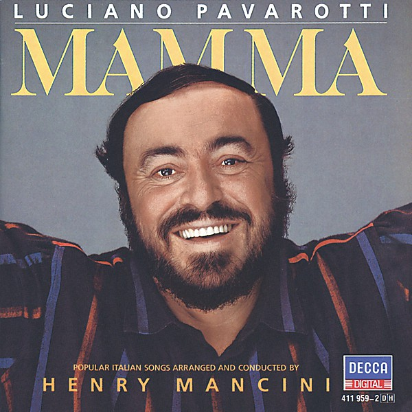

# Unknown Album

By **Henry Mancini**

## Album Data

- **Catalog:** Beets
- **Format:** Digital, Album
- **Album:** Unknown Album
- **Artist:** Henry Mancini
- **Albumartist:** Henry Mancini
- **Genre:** Jazz
- **MusicBrainz Album Artist ID:** 
- **MusicBrainz Album ID:** 
- **MusicBrainz Release Group ID:** 
- **Year:** 1969
- **Catalog #:** 
- **Label:** 
- **Total Tracks:** 00

## Album Tracks

### Track 00 - Love Theme - Romeo & Juliet

- **Artist:** Henry Mancini
- **Format:** AAC
- **Genre:** Jazz
- **Length:** 2:33
- **MusicBrainz Track ID:** 
- **Title:** Love Theme - Romeo & Juliet
- **Track:** 00
- **Year:** 1969

## See also

- [The Cop Show Themes](The_Cop_Show_Themes.md)
