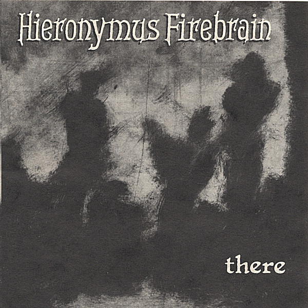

# There

By **Hieronymus Firebrain**

## Album Data

- **Catalog:** Beets
- **Format:** Digital, Album
- **Album:** There
- **Artist:** Hieronymus Firebrain
- **Albumartist:** Hieronymus Firebrain
- **Genre:** Rock
- **MusicBrainz Album Artist ID:** [c64e1296-ddab-43e8-a176-dfab086f90fc](https://musicbrainz.org/artist/c64e1296-ddab-43e8-a176-dfab086f90fc)
- **MusicBrainz Album ID:** [ef1891d6-f22d-4f74-a94b-aba552435954](https://musicbrainz.org/release/ef1891d6-f22d-4f74-a94b-aba552435954)
- **MusicBrainz Release Group ID:** [86a2c65e-95f2-3b61-93c1-773340c6b081](https://musicbrainz.org/release-group/86a2c65e-95f2-3b61-93c1-773340c6b081)
- **Year:** 1994
- **Catalog #:** MAG001
- **Label:** Magnetic Motorworks
- **Total Tracks:** 13

## Album Tracks

### Track 01 - Heaven's Expanse

- **Artist:** Hieronymus Firebrain
- **Format:** ALAC
- **Genre:** Rock
- **Length:** 4:53
- **MusicBrainz Track ID:** [75351c74-469b-42d9-acc5-f1a120d78d4f](https://musicbrainz.org/recording/75351c74-469b-42d9-acc5-f1a120d78d4f)
- **Title:** Heaven's Expanse
- **Track:** 01
- **Year:** 1994

### Track 02 - Relax

- **Artist:** Hieronymus Firebrain
- **Format:** ALAC
- **Genre:** Rock
- **Length:** 6:18
- **MusicBrainz Track ID:** [badde093-f317-455b-a4cc-2b81260eb6e1](https://musicbrainz.org/recording/badde093-f317-455b-a4cc-2b81260eb6e1)
- **Title:** Relax
- **Track:** 02
- **Year:** 1994

### Track 03 - Flame Is a Feeding Thing

- **Artist:** Hieronymus Firebrain
- **Format:** ALAC
- **Genre:** Rock
- **Length:** 4:25
- **MusicBrainz Track ID:** [e2f1a773-975d-401f-8885-963de302bd6c](https://musicbrainz.org/recording/e2f1a773-975d-401f-8885-963de302bd6c)
- **Title:** Flame Is a Feeding Thing
- **Track:** 03
- **Year:** 1994

### Track 04 - Wild Blackberries

- **Artist:** Hieronymus Firebrain
- **Format:** ALAC
- **Genre:** Rock
- **Length:** 4:37
- **MusicBrainz Track ID:** [a67b3672-06e9-4cfa-8de2-321198cff44f](https://musicbrainz.org/recording/a67b3672-06e9-4cfa-8de2-321198cff44f)
- **Title:** Wild Blackberries
- **Track:** 04
- **Year:** 1994

### Track 05 - I Remember

- **Artist:** Hieronymus Firebrain
- **Format:** ALAC
- **Genre:** Rock
- **Length:** 4:21
- **MusicBrainz Track ID:** [402dfc10-3cfa-4b47-82b8-2704cb74c1a9](https://musicbrainz.org/recording/402dfc10-3cfa-4b47-82b8-2704cb74c1a9)
- **Title:** I Remember
- **Track:** 05
- **Year:** 1994

### Track 06 - Yoodooright

- **Artist:** Hieronymus Firebrain
- **Format:** ALAC
- **Genre:** Rock
- **Length:** 4:03
- **MusicBrainz Track ID:** [45ece04e-e5ab-4fef-a0f0-5af257d5fd6a](https://musicbrainz.org/recording/45ece04e-e5ab-4fef-a0f0-5af257d5fd6a)
- **Title:** Yoodooright
- **Track:** 06
- **Year:** 1994

### Track 07 - It's Fine

- **Artist:** Hieronymus Firebrain
- **Format:** ALAC
- **Genre:** Rock
- **Length:** 4:31
- **MusicBrainz Track ID:** [71fd5c37-6426-45b3-b94a-9944f091a729](https://musicbrainz.org/recording/71fd5c37-6426-45b3-b94a-9944f091a729)
- **Title:** It's Fine
- **Track:** 07
- **Year:** 1994

### Track 08 - Beyond Our Threshold

- **Artist:** Hieronymus Firebrain
- **Format:** ALAC
- **Genre:** Rock
- **Length:** 4:39
- **MusicBrainz Track ID:** [3c11d2da-27ae-4ccd-aafd-f0498a0cb26e](https://musicbrainz.org/recording/3c11d2da-27ae-4ccd-aafd-f0498a0cb26e)
- **Title:** Beyond Our Threshold
- **Track:** 08
- **Year:** 1994

### Track 09 - Camel Driver

- **Artist:** Hieronymus Firebrain
- **Format:** ALAC
- **Genre:** Rock
- **Length:** 3:28
- **MusicBrainz Track ID:** [01645f9e-b90c-413f-a014-f6300e6ba605](https://musicbrainz.org/recording/01645f9e-b90c-413f-a014-f6300e6ba605)
- **Title:** Camel Driver
- **Track:** 09
- **Year:** 1994

### Track 10 - Crime Prevention Waltz

- **Artist:** Hieronymus Firebrain
- **Format:** ALAC
- **Genre:** Rock
- **Length:** 3:06
- **MusicBrainz Track ID:** [42b109c9-d597-4bd4-a1d0-b5ffea5385a6](https://musicbrainz.org/recording/42b109c9-d597-4bd4-a1d0-b5ffea5385a6)
- **Title:** Crime Prevention Waltz
- **Track:** 10
- **Year:** 1994

### Track 11 - Runaway

- **Artist:** Hieronymus Firebrain
- **Format:** ALAC
- **Genre:** Rock
- **Length:** 3:44
- **MusicBrainz Track ID:** [97ba75b4-e588-41c2-b9b5-2344da469317](https://musicbrainz.org/recording/97ba75b4-e588-41c2-b9b5-2344da469317)
- **Title:** Runaway
- **Track:** 11
- **Year:** 1994

### Track 12 - Yastilldooitrite

- **Artist:** Hieronymus Firebrain
- **Format:** ALAC
- **Genre:** Rock
- **Length:** 2:30
- **MusicBrainz Track ID:** [17d79d41-207d-4890-b239-79874352ed36](https://musicbrainz.org/recording/17d79d41-207d-4890-b239-79874352ed36)
- **Title:** Yastilldooitrite
- **Track:** 12
- **Year:** 1994

### Track 13 - Skin Holds It In

- **Artist:** Hieronymus Firebrain
- **Format:** ALAC
- **Genre:** Rock
- **Length:** 12:11
- **MusicBrainz Track ID:** [ef744ffe-84c1-416f-a9c9-99060197facf](https://musicbrainz.org/recording/ef744ffe-84c1-416f-a9c9-99060197facf)
- **Title:** Skin Holds It In
- **Track:** 13
- **Year:** 1994

