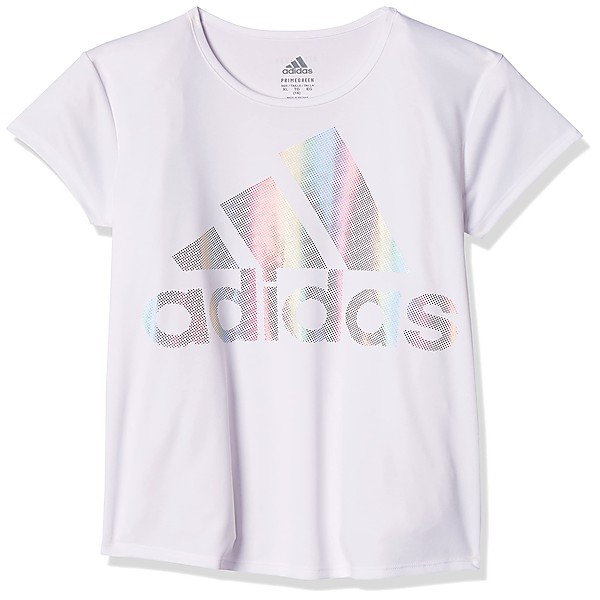

# Billboard Top Rock 'n' Roll Hi

By **Hollywood Argyles**

## Album Data

- **Catalog:** Beets
- **Format:** Digital, Album
- **Album:** Billboard Top Rock 'n' Roll Hi
- **Artist:** Hollywood Argyles
- **Albumartist:** Hollywood Argyles
- **Genre:** Rock And Roll
- **MusicBrainz Album Artist ID:** 
- **MusicBrainz Album ID:** 
- **MusicBrainz Release Group ID:** 
- **Year:** 1960
- **Catalog #:** 
- **Label:** 
- **Total Tracks:** 00

## Album Tracks

### Track 09 - / Alley - Oop

- **Artist:** Hollywood Argyles
- **Format:** AAC
- **Genre:** Rock And Roll
- **Length:** 2:47
- **MusicBrainz Track ID:** 
- **Title:** / Alley - Oop
- **Track:** 09
- **Year:** 1960

