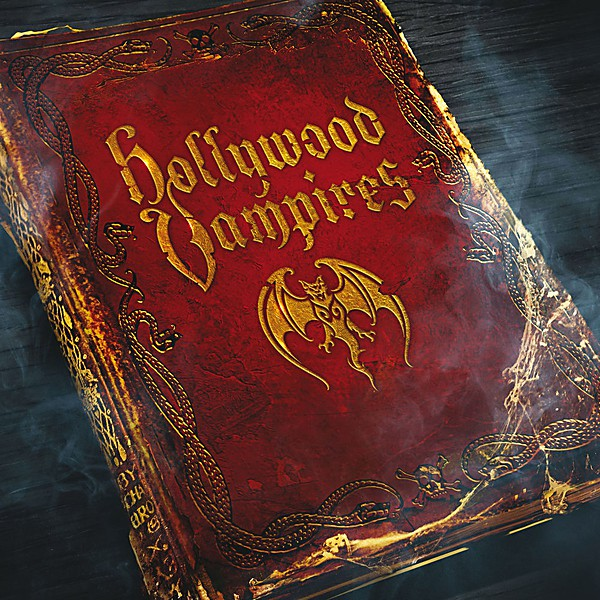

# Hollywood Vampires

By **Hollywood Vampires**

## Album Data

- **Catalog:** Beets
- **Format:** Digital, Album
- **Album:** Hollywood Vampires
- **Artist:** Hollywood Vampires
- **Albumartist:** Hollywood Vampires
- **Genre:** Hard Rock
- **MusicBrainz Album Artist ID:** [d30a1d2b-e88d-4470-89cb-69d8c335ce3d](https://musicbrainz.org/artist/d30a1d2b-e88d-4470-89cb-69d8c335ce3d)
- **MusicBrainz Album ID:** [b9c8ff0f-2f03-4672-9353-30a2a09d9c20](https://musicbrainz.org/release/b9c8ff0f-2f03-4672-9353-30a2a09d9c20)
- **MusicBrainz Release Group ID:** [52612c77-ec09-493d-a0ff-2d76a4218a73](https://musicbrainz.org/release-group/52612c77-ec09-493d-a0ff-2d76a4218a73)
- **Year:** 2015
- **Catalog #:** 
- **Label:** UMe Direct
- **Total Tracks:** 14

## Album Tracks

### Track 01 - The Last Vampire

- **Artist:** Hollywood Vampires
- **Format:** ALAC
- **Genre:** Hard Rock
- **Length:** 1:35
- **MusicBrainz Track ID:** [f5994f2c-ba42-44ce-ae28-6044bcdf9771](https://musicbrainz.org/recording/f5994f2c-ba42-44ce-ae28-6044bcdf9771)
- **Title:** The Last Vampire
- **Track:** 01
- **Year:** 2015

### Track 02 - Raise the Dead

- **Artist:** Hollywood Vampires
- **Format:** ALAC
- **Genre:** Hard Rock
- **Length:** 3:31
- **MusicBrainz Track ID:** [b889e40c-0919-4e4a-95c2-1250741f8f28](https://musicbrainz.org/recording/b889e40c-0919-4e4a-95c2-1250741f8f28)
- **Title:** Raise the Dead
- **Track:** 02
- **Year:** 2015

### Track 03 - My Generation

- **Artist:** Hollywood Vampires
- **Format:** ALAC
- **Genre:** Hard Rock
- **Length:** 2:47
- **MusicBrainz Track ID:** [f1ccb8e9-9f90-4c6d-8f0d-cc066245d7db](https://musicbrainz.org/recording/f1ccb8e9-9f90-4c6d-8f0d-cc066245d7db)
- **Title:** My Generation
- **Track:** 03
- **Year:** 2015

### Track 04 - Whole Lotta Love

- **Artist:** Hollywood Vampires
- **Format:** ALAC
- **Genre:** Hard Rock
- **Length:** 4:13
- **MusicBrainz Track ID:** [b1a0a4aa-852a-40aa-8adb-dd263a014606](https://musicbrainz.org/recording/b1a0a4aa-852a-40aa-8adb-dd263a014606)
- **Title:** Whole Lotta Love
- **Track:** 04
- **Year:** 2015

### Track 05 - I Got a Line on You

- **Artist:** Hollywood Vampires
- **Format:** ALAC
- **Genre:** Hard Rock
- **Length:** 2:48
- **MusicBrainz Track ID:** [67ae6809-c738-43ca-9b5b-2cc8e780ce1d](https://musicbrainz.org/recording/67ae6809-c738-43ca-9b5b-2cc8e780ce1d)
- **Title:** I Got a Line on You
- **Track:** 05
- **Year:** 2015

### Track 06 - Five to One / Break On Through (to the Other Side)

- **Artist:** Hollywood Vampires
- **Format:** ALAC
- **Genre:** Hard Rock
- **Length:** 4:17
- **MusicBrainz Track ID:** [a305ca3e-e081-4528-b53b-4090dea09696](https://musicbrainz.org/recording/a305ca3e-e081-4528-b53b-4090dea09696)
- **Title:** Five to One / Break On Through (to the Other Side)
- **Track:** 06
- **Year:** 2015

### Track 07 - One / Jump Into the Fire

- **Artist:** Hollywood Vampires
- **Format:** ALAC
- **Genre:** Hard Rock
- **Length:** 5:07
- **MusicBrainz Track ID:** [43ed7937-8eac-458a-8ad6-6d595cc7f684](https://musicbrainz.org/recording/43ed7937-8eac-458a-8ad6-6d595cc7f684)
- **Title:** One / Jump Into the Fire
- **Track:** 07
- **Year:** 2015

### Track 08 - Come and Get It

- **Artist:** Hollywood Vampires
- **Format:** ALAC
- **Genre:** Hard Rock
- **Length:** 2:59
- **MusicBrainz Track ID:** [5e9958ab-b6e8-4f39-a91b-ecd5ad95f1b8](https://musicbrainz.org/recording/5e9958ab-b6e8-4f39-a91b-ecd5ad95f1b8)
- **Title:** Come and Get It
- **Track:** 08
- **Year:** 2015

### Track 09 - Jeepster

- **Artist:** Hollywood Vampires
- **Format:** ALAC
- **Genre:** Hard Rock
- **Length:** 2:42
- **MusicBrainz Track ID:** [aeb090c4-a108-45fd-9c15-f90b5c99489b](https://musicbrainz.org/recording/aeb090c4-a108-45fd-9c15-f90b5c99489b)
- **Title:** Jeepster
- **Track:** 09
- **Year:** 2015

### Track 10 - Cold Turkey

- **Artist:** Hollywood Vampires
- **Format:** ALAC
- **Genre:** Hard Rock
- **Length:** 3:07
- **MusicBrainz Track ID:** [2df8fa88-fd45-4b08-ab64-e45e73299a98](https://musicbrainz.org/recording/2df8fa88-fd45-4b08-ab64-e45e73299a98)
- **Title:** Cold Turkey
- **Track:** 10
- **Year:** 2015

### Track 11 - Manic Depression

- **Artist:** Hollywood Vampires
- **Format:** ALAC
- **Genre:** Hard Rock
- **Length:** 2:43
- **MusicBrainz Track ID:** [bf9b0c60-0963-4825-a0d4-093981414e4f](https://musicbrainz.org/recording/bf9b0c60-0963-4825-a0d4-093981414e4f)
- **Title:** Manic Depression
- **Track:** 11
- **Year:** 2015

### Track 12 - Itchycoo Park

- **Artist:** Hollywood Vampires
- **Format:** ALAC
- **Genre:** Hard Rock
- **Length:** 2:55
- **MusicBrainz Track ID:** [406af412-2ff9-4b82-bf41-f1be208d3f32](https://musicbrainz.org/recording/406af412-2ff9-4b82-bf41-f1be208d3f32)
- **Title:** Itchycoo Park
- **Track:** 12
- **Year:** 2015

### Track 13 - School’s Out / Another Brick in the Wall, Part 2

- **Artist:** Hollywood Vampires
- **Format:** ALAC
- **Genre:** Hard Rock
- **Length:** 5:14
- **MusicBrainz Track ID:** [5c485ff4-e139-47bc-86c9-35729be2a270](https://musicbrainz.org/recording/5c485ff4-e139-47bc-86c9-35729be2a270)
- **Title:** School’s Out / Another Brick in the Wall, Part 2
- **Track:** 13
- **Year:** 2015

### Track 14 - My Dead Drunk Friends

- **Artist:** Hollywood Vampires
- **Format:** ALAC
- **Genre:** Hard Rock
- **Length:** 4:30
- **MusicBrainz Track ID:** [848ed35b-c640-4c12-8229-bf8925375cb9](https://musicbrainz.org/recording/848ed35b-c640-4c12-8229-bf8925375cb9)
- **Title:** My Dead Drunk Friends
- **Track:** 14
- **Year:** 2015

## See also

- [CD: ](../../CD/Hollywood_Vampires/Hollywood_Vampires_index.md)
- [CD: Hollywood Vampires](../../CD/Hollywood_Vampires/Hollywood_Vampires.md)
