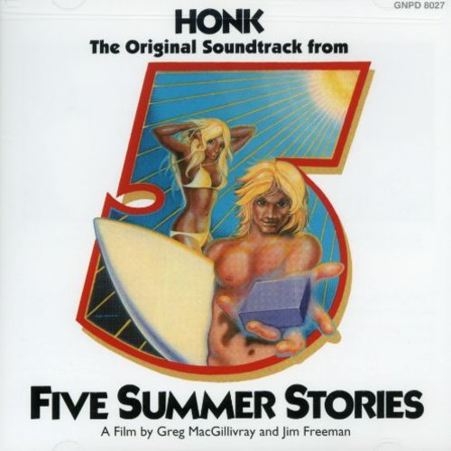

# The Original Soundtrack from Five Summer Stories

By **Honk**

## Album Data

- **Catalog:** Beets
- **Format:** Digital, Album
- **Album:** The Original Soundtrack from Five Summer Stories
- **Artist:** Honk
- **Albumartist:** Honk
- **Genre:** Southern Rock
- **MusicBrainz Album Artist ID:** 
- **MusicBrainz Album ID:** 
- **MusicBrainz Release Group ID:** 
- **Year:** 1972
- **Catalog #:** 
- **Label:** 
- **Total Tracks:** 12

## Album Tracks

### Track 01 - Creation

- **Artist:** Honk
- **Format:** MP3
- **Genre:** Southern Rock
- **Length:** 0:34
- **MusicBrainz Track ID:** 
- **Title:** Creation
- **Track:** 01
- **Year:** 1972

### Track 02 - Blue Of Your Backdrop

- **Artist:** Honk
- **Format:** MP3
- **Genre:** Southern Rock
- **Length:** 2:01
- **MusicBrainz Track ID:** 
- **Title:** Blue Of Your Backdrop
- **Track:** 02
- **Year:** 1972

### Track 03 - Brad And David's Theme

- **Artist:** Honk
- **Format:** MP3
- **Genre:** Jazz
- **Length:** 2:38
- **MusicBrainz Track ID:** 
- **Title:** Brad And David's Theme
- **Track:** 03
- **Year:** 1972

### Track 04 - High In The Middle

- **Artist:** Honk
- **Format:** MP3
- **Genre:** Southern Rock
- **Length:** 4:52
- **MusicBrainz Track ID:** 
- **Title:** High In The Middle
- **Track:** 04
- **Year:** 1972

### Track 05 - Hum Drums

- **Artist:** Honk
- **Format:** MP3
- **Genre:** Southern Rock
- **Length:** 1:17
- **MusicBrainz Track ID:** 
- **Title:** Hum Drums
- **Track:** 05
- **Year:** 1972

### Track 06 - Bear's Country

- **Artist:** Honk
- **Format:** MP3
- **Genre:** Southern Rock
- **Length:** 2:40
- **MusicBrainz Track ID:** 
- **Title:** Bear's Country
- **Track:** 06
- **Year:** 1972

### Track 07 - Made My Statement (Love You Baby)

- **Artist:** Honk
- **Format:** MP3
- **Genre:** Southern Rock
- **Length:** 2:39
- **MusicBrainz Track ID:** 
- **Title:** Made My Statement (Love You Baby)
- **Track:** 07
- **Year:** 1972

### Track 08 - Don't Let Your Goodbye Stand

- **Artist:** Honk
- **Format:** MP3
- **Genre:** Southern Rock
- **Length:** 2:51
- **MusicBrainz Track ID:** 
- **Title:** Don't Let Your Goodbye Stand
- **Track:** 08
- **Year:** 1972

### Track 09 - Lopez

- **Artist:** Honk
- **Format:** MP3
- **Genre:** Southern Rock
- **Length:** 3:35
- **MusicBrainz Track ID:** 
- **Title:** Lopez
- **Track:** 09
- **Year:** 1972

### Track 10 - Blue Of The Backdrop (Instrumental)

- **Artist:** Honk
- **Format:** MP3
- **Genre:** Southern Rock
- **Length:** 2:21
- **MusicBrainz Track ID:** 
- **Title:** Blue Of The Backdrop (Instrumental)
- **Track:** 10
- **Year:** 1972

### Track 11 - Tunnel Of Love

- **Artist:** Honk
- **Format:** MP3
- **Genre:** Southern Rock
- **Length:** 4:02
- **MusicBrainz Track ID:** 
- **Title:** Tunnel Of Love
- **Track:** 11
- **Year:** 1972

### Track 12 - Pipeline Sequence

- **Artist:** Honk
- **Format:** MP3
- **Genre:** Southern Rock
- **Length:** 4:31
- **MusicBrainz Track ID:** 
- **Title:** Pipeline Sequence
- **Track:** 12
- **Year:** 1972

## See also

- [Vinyl: ](../../Vinyl/Honk/Honk.md)
- [Vinyl: The Original Sound Track from Five Summer Stories](../../Vinyl/Honk/The_Original_Sound_Track_from_Five_Summer_Stories.md)
