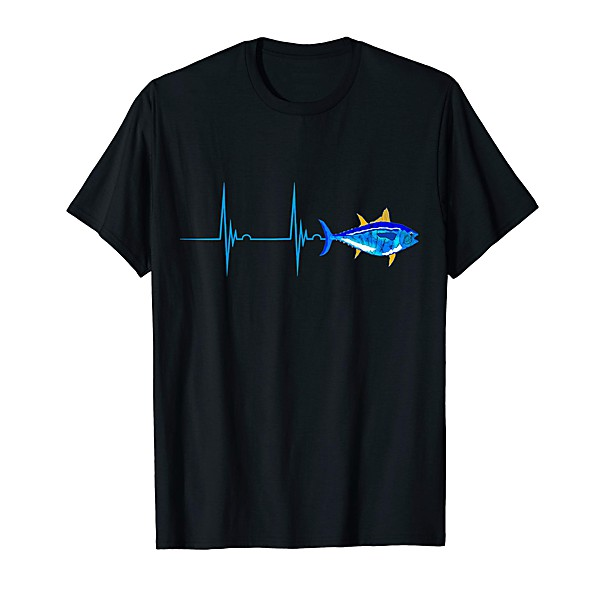

# 3-4-88 Tuna-Airplane Reunion

By **Hot Tuna**

## Album Data

- **Catalog:** Beets
- **Format:** Digital, Album
- **Album:** 3-4-88 Tuna-Airplane Reunion
- **Artist:** Hot Tuna
- **Albumartist:** Hot Tuna
- **Genre:** Rock
- **MusicBrainz Album Artist ID:** 
- **MusicBrainz Album ID:** 
- **MusicBrainz Release Group ID:** 
- **Year:** 1988
- **Catalog #:** 07863 66870-2
- **Label:** RCA
- **Total Tracks:** 09

## Album Tracks

### Track 01 - True Religion

- **Artist:** Hot Tuna
- **Format:** AAC
- **Genre:** Acid Rock
- **Length:** 4:43
- **MusicBrainz Track ID:** [96c2f3f9-9506-4082-89eb-c8558e515591](https://musicbrainz.org/recording/96c2f3f9-9506-4082-89eb-c8558e515591)
- **Title:** True Religion
- **Track:** 01
- **Year:** 1996

### Track 02 - Highway Song

- **Artist:** Hot Tuna
- **Format:** AAC
- **Genre:** Acid Rock
- **Length:** 3:15
- **MusicBrainz Track ID:** [91d03f17-9d3f-442b-89e4-39c0b11799b5](https://musicbrainz.org/recording/91d03f17-9d3f-442b-89e4-39c0b11799b5)
- **Title:** Highway Song
- **Track:** 02
- **Year:** 1996

### Track 03 - 99 Year Blues

- **Artist:** Hot Tuna
- **Format:** AAC
- **Genre:** Acid Rock
- **Length:** 3:59
- **MusicBrainz Track ID:** [7ca34412-110d-49eb-8331-6f9c020276f2](https://musicbrainz.org/recording/7ca34412-110d-49eb-8331-6f9c020276f2)
- **Title:** 99 Year Blues
- **Track:** 03
- **Year:** 1996

### Track 04 - Sea Child

- **Artist:** Hot Tuna
- **Format:** AAC
- **Genre:** Acid Rock
- **Length:** 5:01
- **MusicBrainz Track ID:** [6c7303a3-4a5b-4dfc-bef1-93db73b692b4](https://musicbrainz.org/recording/6c7303a3-4a5b-4dfc-bef1-93db73b692b4)
- **Title:** Sea Child
- **Track:** 04
- **Year:** 1996

### Track 05 - Keep on Truckin’

- **Artist:** Hot Tuna
- **Format:** AAC
- **Genre:** Folk Rock
- **Length:** 3:41
- **MusicBrainz Track ID:** [f9fe50a7-97d9-457e-bf49-0301eda54023](https://musicbrainz.org/recording/f9fe50a7-97d9-457e-bf49-0301eda54023)
- **Title:** Keep on Truckin’
- **Track:** 05
- **Year:** 1996

### Track 06 - Water Song

- **Artist:** Hot Tuna
- **Format:** AAC
- **Genre:** Acid Rock
- **Length:** 5:16
- **MusicBrainz Track ID:** [93ab44cf-5aab-4740-89f0-12f8dc30ee8c](https://musicbrainz.org/recording/93ab44cf-5aab-4740-89f0-12f8dc30ee8c)
- **Title:** Water Song
- **Track:** 06
- **Year:** 1996

### Track 07 - Ode for Billie Dean

- **Artist:** Hot Tuna
- **Format:** AAC
- **Genre:** Folk Rock
- **Length:** 4:50
- **MusicBrainz Track ID:** [c9197799-3fec-4052-963b-21cd7764b8ea](https://musicbrainz.org/recording/c9197799-3fec-4052-963b-21cd7764b8ea)
- **Title:** Ode for Billie Dean
- **Track:** 07
- **Year:** 1996

### Track 08 - Let Us Get Together Right Down Here

- **Artist:** Hot Tuna
- **Format:** AAC
- **Genre:** Acid Rock
- **Length:** 3:27
- **MusicBrainz Track ID:** [f713f6e7-27a0-4605-b45a-4e1e405da7f7](https://musicbrainz.org/recording/f713f6e7-27a0-4605-b45a-4e1e405da7f7)
- **Title:** Let Us Get Together Right Down Here
- **Track:** 08
- **Year:** 1996

### Track 09 - Sunny Day Strut

- **Artist:** Hot Tuna
- **Format:** AAC
- **Genre:** Acid Rock
- **Length:** 3:16
- **MusicBrainz Track ID:** [60dbb3b9-18cc-41ba-8d05-8c1b7879a99a](https://musicbrainz.org/recording/60dbb3b9-18cc-41ba-8d05-8c1b7879a99a)
- **Title:** Sunny Day Strut
- **Track:** 09
- **Year:** 1996

## See also

- [Burgers](Burgers.md)
- [Classic Hot Tuna Electric](Classic_Hot_Tuna_Electric.md)
- [Live at Sweetwater](Live_at_Sweetwater.md)
- [Live at Sweetwater Two](Live_at_Sweetwater_Two.md)
- [Live in Japan](Live_in_Japan.md)
- [Steady as She Goes](Steady_as_She_Goes.md)
- [Roon: America's Choice](../../Roon/Hot_Tuna/Americas_Choice.md)
- [Roon: Burgers](../../Roon/Hot_Tuna/Burgers.md)
- [Roon: First Pull Up, Then Pull Down](../../Roon/Hot_Tuna/First_Pull_Up__Then_Pull_Down.md)
- [Roon: Steady As She Goes](../../Roon/Hot_Tuna/Steady_As_She_Goes.md)
- [Roon: The Phosphorescent Rat (Remastered)](../../Roon/Hot_Tuna/The_Phosphorescent_Rat_Remastered.md)
