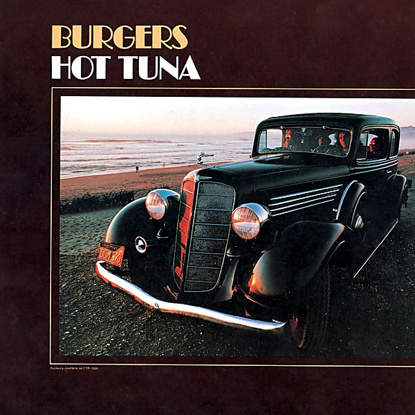

# Burgers

By **Hot Tuna**

## Album Data

- **Catalog:** Beets
- **Format:** Digital, Album
- **Album:** Burgers
- **Artist:** Hot Tuna
- **Albumartist:** Hot Tuna
- **Genre:** Folk Rock
- **MusicBrainz Album Artist ID:** [d13d9feb-b7c7-49f4-9b72-65e29a16aa24](https://musicbrainz.org/artist/d13d9feb-b7c7-49f4-9b72-65e29a16aa24)
- **MusicBrainz Album ID:** [414947fe-9411-4a04-9d4b-ee81ad309130](https://musicbrainz.org/release/414947fe-9411-4a04-9d4b-ee81ad309130)
- **MusicBrainz Release Group ID:** [cb02a4a7-3ba3-330a-a61b-c3f73ca6e017](https://musicbrainz.org/release-group/cb02a4a7-3ba3-330a-a61b-c3f73ca6e017)
- **Year:** 1996
- **Catalog #:** 
- **Label:** 
- **Total Tracks:** 08

## Album Tracks

### Track 01 - Bill Graham Intro / Never Happen No More

- **Artist:** Hot Tuna
- **Format:** ALAC
- **Genre:** Folk Rock
- **Length:** 6:24
- **MusicBrainz Track ID:** [d7bf4e33-d052-4c32-9aa6-95fe009e0d17](https://musicbrainz.org/recording/d7bf4e33-d052-4c32-9aa6-95fe009e0d17)
- **Title:** Bill Graham Intro / Never Happen No More
- **Track:** 01
- **Year:** 1996

### Track 02 - Candyman

- **Artist:** Hot Tuna
- **Format:** ALAC
- **Genre:** Folk Rock
- **Length:** 5:55
- **MusicBrainz Track ID:** [b0ccdfd9-f711-4593-b60e-bf32fccb965e](https://musicbrainz.org/recording/b0ccdfd9-f711-4593-b60e-bf32fccb965e)
- **Title:** Candyman
- **Track:** 02
- **Year:** 1996

### Track 03 - Keep Your Lamps Trimmed and Burning

- **Artist:** Hot Tuna
- **Format:** ALAC
- **Genre:** Acid Rock
- **Length:** 7:39
- **MusicBrainz Track ID:** [5efb2415-568a-44b6-83fb-97a2886e7c9b](https://musicbrainz.org/recording/5efb2415-568a-44b6-83fb-97a2886e7c9b)
- **Title:** Keep Your Lamps Trimmed and Burning
- **Track:** 03
- **Year:** 1996

### Track 04 - Uncle Sam Blues

- **Artist:** Hot Tuna
- **Format:** ALAC
- **Genre:** Acid Rock
- **Length:** 5:39
- **MusicBrainz Track ID:** [0816a9fc-be3b-43cd-baa7-e6f84d000b4d](https://musicbrainz.org/recording/0816a9fc-be3b-43cd-baa7-e6f84d000b4d)
- **Title:** Uncle Sam Blues
- **Track:** 04
- **Year:** 1996

### Track 05 - John's Other

- **Artist:** Hot Tuna
- **Format:** ALAC
- **Genre:** Acid Rock
- **Length:** 6:00
- **MusicBrainz Track ID:** [59b8571b-0346-4468-89d7-e4548c68c874](https://musicbrainz.org/recording/59b8571b-0346-4468-89d7-e4548c68c874)
- **Title:** John's Other
- **Track:** 05
- **Year:** 1996

### Track 06 - Rock Me Baby

- **Artist:** Hot Tuna
- **Format:** ALAC
- **Genre:** Rock
- **Length:** 8:30
- **MusicBrainz Track ID:** [6d68def5-745c-466d-bfe0-0eb30779a62d](https://musicbrainz.org/recording/6d68def5-745c-466d-bfe0-0eb30779a62d)
- **Title:** Rock Me Baby
- **Track:** 06
- **Year:** 1996

### Track 07 - I Know You Rider

- **Artist:** Hot Tuna
- **Format:** ALAC
- **Genre:** Electric Blues
- **Length:** 7:28
- **MusicBrainz Track ID:** [53d6583c-8b8a-42a0-935a-63e582234c93](https://musicbrainz.org/recording/53d6583c-8b8a-42a0-935a-63e582234c93)
- **Title:** I Know You Rider
- **Track:** 07
- **Year:** 1996

### Track 08 - Come Back Baby

- **Artist:** Hot Tuna
- **Format:** ALAC
- **Genre:** Acid Rock
- **Length:** 8:44
- **MusicBrainz Track ID:** [ee895a6a-3949-407a-81c2-1b99c1a48d46](https://musicbrainz.org/recording/ee895a6a-3949-407a-81c2-1b99c1a48d46)
- **Title:** Come Back Baby
- **Track:** 08
- **Year:** 1996

## See also

- [3-4-88 Tuna-Airplane Reunion](3-4-88_Tuna-Airplane_Reunion.md)
- [Classic Hot Tuna Electric](Classic_Hot_Tuna_Electric.md)
- [Live at Sweetwater](Live_at_Sweetwater.md)
- [Live at Sweetwater Two](Live_at_Sweetwater_Two.md)
- [Live in Japan](Live_in_Japan.md)
- [Steady as She Goes](Steady_as_She_Goes.md)
- [Roon: America's Choice](../../Roon/Hot_Tuna/Americas_Choice.md)
- [Roon: Burgers](../../Roon/Hot_Tuna/Burgers.md)
- [Roon: First Pull Up, Then Pull Down](../../Roon/Hot_Tuna/First_Pull_Up__Then_Pull_Down.md)
- [Roon: Steady As She Goes](../../Roon/Hot_Tuna/Steady_As_She_Goes.md)
- [Roon: The Phosphorescent Rat (Remastered)](../../Roon/Hot_Tuna/The_Phosphorescent_Rat_Remastered.md)
