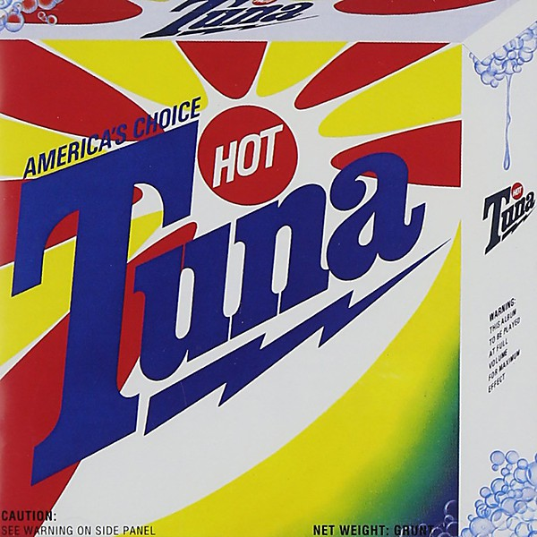

# Classic Hot Tuna Electric

By **Hot Tuna**

## Album Data

- **Catalog:** Beets
- **Format:** Digital, Album
- **Album:** Classic Hot Tuna Electric
- **Artist:** Hot Tuna
- **Albumartist:** Hot Tuna
- **Genre:** Folk Rock
- **MusicBrainz Album Artist ID:** [d13d9feb-b7c7-49f4-9b72-65e29a16aa24](https://musicbrainz.org/artist/d13d9feb-b7c7-49f4-9b72-65e29a16aa24)
- **MusicBrainz Album ID:** [1964e201-9b62-4a61-91a6-7be9494e8be8](https://musicbrainz.org/release/1964e201-9b62-4a61-91a6-7be9494e8be8)
- **MusicBrainz Release Group ID:** [6ec71572-9aeb-37fa-971c-e3e36dca51dd](https://musicbrainz.org/release-group/6ec71572-9aeb-37fa-971c-e3e36dca51dd)
- **Year:** 1996
- **Catalog #:** RRCD 2058
- **Label:** Relix Records
- **Total Tracks:** 13

## Album Tracks

### Track 01 - Whinin' Boy Blues

- **Artist:** Hot Tuna
- **Format:** ALAC
- **Genre:** Blues
- **Length:** 5:29
- **MusicBrainz Track ID:** [2423a9db-c827-4af2-b3c8-46423e386374](https://musicbrainz.org/recording/2423a9db-c827-4af2-b3c8-46423e386374)
- **Title:** Whinin' Boy Blues
- **Track:** 01
- **Year:** 1992

### Track 02 - Great Change

- **Artist:** Hot Tuna
- **Format:** ALAC
- **Genre:** Blues
- **Length:** 2:54
- **MusicBrainz Track ID:** [c51e1c7d-c200-4633-a2d6-6dd80feee9d6](https://musicbrainz.org/recording/c51e1c7d-c200-4633-a2d6-6dd80feee9d6)
- **Title:** Great Change
- **Track:** 02
- **Year:** 1992

### Track 03 - Down and Out

- **Artist:** Hot Tuna
- **Format:** ALAC
- **Genre:** Blues
- **Length:** 3:15
- **MusicBrainz Track ID:** [71af3681-f118-41e1-a8c1-6bb271de87da](https://musicbrainz.org/recording/71af3681-f118-41e1-a8c1-6bb271de87da)
- **Title:** Down and Out
- **Track:** 03
- **Year:** 1992

### Track 04 - Embryonic Journey

- **Artist:** Hot Tuna
- **Format:** ALAC
- **Genre:** Folk Rock
- **Length:** 2:15
- **MusicBrainz Track ID:** [47d8160f-8ad4-4320-88ff-252ddcd2ea64](https://musicbrainz.org/recording/47d8160f-8ad4-4320-88ff-252ddcd2ea64)
- **Title:** Embryonic Journey
- **Track:** 04
- **Year:** 1992

### Track 05 - Trouble in Mind

- **Artist:** Hot Tuna
- **Format:** ALAC
- **Genre:** Blues
- **Length:** 3:20
- **MusicBrainz Track ID:** [802e9844-b25a-4571-9282-bfc6ea2996dc](https://musicbrainz.org/recording/802e9844-b25a-4571-9282-bfc6ea2996dc)
- **Title:** Trouble in Mind
- **Track:** 05
- **Year:** 1992

### Track 06 - Bank Robber

- **Artist:** Hot Tuna
- **Format:** ALAC
- **Genre:** Blues
- **Length:** 4:30
- **MusicBrainz Track ID:** [436cb6a6-6b28-4e4d-8f1d-6b8f20c288e6](https://musicbrainz.org/recording/436cb6a6-6b28-4e4d-8f1d-6b8f20c288e6)
- **Title:** Bank Robber
- **Track:** 06
- **Year:** 1992

### Track 07 - I See the Light

- **Artist:** Hot Tuna
- **Format:** ALAC
- **Genre:** Rock
- **Length:** 6:37
- **MusicBrainz Track ID:** [40fb5647-4169-4688-8314-b52ce4542d3f](https://musicbrainz.org/recording/40fb5647-4169-4688-8314-b52ce4542d3f)
- **Title:** I See the Light
- **Track:** 07
- **Year:** 1992

### Track 08 - I'll Be There for You

- **Artist:** Hot Tuna
- **Format:** ALAC
- **Genre:** Rock
- **Length:** 3:23
- **MusicBrainz Track ID:** [d010f27c-7702-4cae-a7b0-c1f0009fe48e](https://musicbrainz.org/recording/d010f27c-7702-4cae-a7b0-c1f0009fe48e)
- **Title:** I'll Be There for You
- **Track:** 08
- **Year:** 1992

### Track 09 - I Belong to the Band

- **Artist:** Hot Tuna
- **Format:** ALAC
- **Genre:** Blues
- **Length:** 4:00
- **MusicBrainz Track ID:** [c758c676-9124-43c5-94c8-109b5eef634c](https://musicbrainz.org/recording/c758c676-9124-43c5-94c8-109b5eef634c)
- **Title:** I Belong to the Band
- **Track:** 09
- **Year:** 1992

### Track 10 - Maggies Farm

- **Artist:** Hot Tuna
- **Format:** ALAC
- **Genre:** Blues
- **Length:** 6:05
- **MusicBrainz Track ID:** [c8a41d65-ef26-4042-a72a-eafb4935e117](https://musicbrainz.org/recording/c8a41d65-ef26-4042-a72a-eafb4935e117)
- **Title:** Maggies Farm
- **Track:** 10
- **Year:** 1992

### Track 11 - Genesis

- **Artist:** Hot Tuna
- **Format:** ALAC
- **Genre:** Folk Rock
- **Length:** 5:20
- **MusicBrainz Track ID:** [6515bcaf-6536-4d78-a3c8-9d365176e0ee](https://musicbrainz.org/recording/6515bcaf-6536-4d78-a3c8-9d365176e0ee)
- **Title:** Genesis
- **Track:** 11
- **Year:** 1992

### Track 12 - Ice Age

- **Artist:** Hot Tuna
- **Format:** ALAC
- **Genre:** Blues
- **Length:** 6:17
- **MusicBrainz Track ID:** [9bafb10e-18ac-454c-ac4f-792b6fd817dd](https://musicbrainz.org/recording/9bafb10e-18ac-454c-ac4f-792b6fd817dd)
- **Title:** Ice Age
- **Track:** 12
- **Year:** 1992

### Track 13 - Pass the Snakes

- **Artist:** Hot Tuna
- **Format:** ALAC
- **Genre:** Blues
- **Length:** 6:29
- **MusicBrainz Track ID:** [46343937-5f4f-443b-9fb1-2859320b639c](https://musicbrainz.org/recording/46343937-5f4f-443b-9fb1-2859320b639c)
- **Title:** Pass the Snakes
- **Track:** 13
- **Year:** 1992

## See also

- [3-4-88 Tuna-Airplane Reunion](3-4-88_Tuna-Airplane_Reunion.md)
- [Burgers](Burgers.md)
- [Live at Sweetwater](Live_at_Sweetwater.md)
- [Live at Sweetwater Two](Live_at_Sweetwater_Two.md)
- [Live in Japan](Live_in_Japan.md)
- [Steady as She Goes](Steady_as_She_Goes.md)
- [Roon: America's Choice](../../Roon/Hot_Tuna/Americas_Choice.md)
- [Roon: Burgers](../../Roon/Hot_Tuna/Burgers.md)
- [Roon: First Pull Up, Then Pull Down](../../Roon/Hot_Tuna/First_Pull_Up__Then_Pull_Down.md)
- [Roon: Steady As She Goes](../../Roon/Hot_Tuna/Steady_As_She_Goes.md)
- [Roon: The Phosphorescent Rat (Remastered)](../../Roon/Hot_Tuna/The_Phosphorescent_Rat_Remastered.md)
