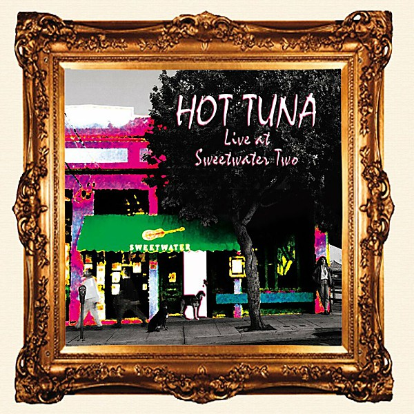

# Live at Sweetwater

By **Hot Tuna**

## Album Data

- **Catalog:** Beets
- **Format:** Digital, Album
- **Album:** Live at Sweetwater
- **Artist:** Hot Tuna
- **Albumartist:** Hot Tuna
- **Genre:** Blues
- **MusicBrainz Album Artist ID:** [d13d9feb-b7c7-49f4-9b72-65e29a16aa24](https://musicbrainz.org/artist/d13d9feb-b7c7-49f4-9b72-65e29a16aa24)
- **MusicBrainz Album ID:** [e97471b7-7781-45e2-af11-00e8ed9b69fb](https://musicbrainz.org/release/e97471b7-7781-45e2-af11-00e8ed9b69fb)
- **MusicBrainz Release Group ID:** [6a1e8b29-5c2f-397d-8186-ad7eb0405624](https://musicbrainz.org/release-group/6a1e8b29-5c2f-397d-8186-ad7eb0405624)
- **Year:** 1992
- **Catalog #:** RRCD 2062
- **Label:** Relix Records
- **Total Tracks:** 12

## Album Tracks

### Track 01 - Hesitation Blues

- **Artist:** Hot Tuna
- **Format:** ALAC
- **Genre:** Folk Rock
- **Length:** 5:23
- **MusicBrainz Track ID:** [be5d8ebe-fd0d-4528-a305-151974aa4689](https://musicbrainz.org/recording/be5d8ebe-fd0d-4528-a305-151974aa4689)
- **Title:** Hesitation Blues
- **Track:** 01
- **Year:** 1993

### Track 02 - Dime for a Beer

- **Artist:** Hot Tuna
- **Format:** ALAC
- **Genre:** Rock
- **Length:** 3:00
- **MusicBrainz Track ID:** [61f211c5-757b-4172-aa85-6ffeb79bdc2c](https://musicbrainz.org/recording/61f211c5-757b-4172-aa85-6ffeb79bdc2c)
- **Title:** Dime for a Beer
- **Track:** 02
- **Year:** 1993

### Track 03 - Death Don't Have No Mercy

- **Artist:** Hot Tuna
- **Format:** ALAC
- **Genre:** Acid Rock
- **Length:** 5:23
- **MusicBrainz Track ID:** [31cf71a4-01a6-470c-adb5-2b3cd1d5446c](https://musicbrainz.org/recording/31cf71a4-01a6-470c-adb5-2b3cd1d5446c)
- **Title:** Death Don't Have No Mercy
- **Track:** 03
- **Year:** 1993

### Track 04 - 99 Year Blues

- **Artist:** Hot Tuna
- **Format:** ALAC
- **Genre:** Acid Rock
- **Length:** 4:54
- **MusicBrainz Track ID:** [5bad642a-0206-42b6-afa8-0957aea2ba0a](https://musicbrainz.org/recording/5bad642a-0206-42b6-afa8-0957aea2ba0a)
- **Title:** 99 Year Blues
- **Track:** 04
- **Year:** 1993

### Track 05 - San Francisco Bay Blues

- **Artist:** Hot Tuna
- **Format:** ALAC
- **Genre:** Rock
- **Length:** 4:02
- **MusicBrainz Track ID:** [968cf743-6c89-4d33-8964-81d18fb7d46d](https://musicbrainz.org/recording/968cf743-6c89-4d33-8964-81d18fb7d46d)
- **Title:** San Francisco Bay Blues
- **Track:** 05
- **Year:** 1993

### Track 06 - Blue Moon of Kentucky

- **Artist:** Hot Tuna
- **Format:** ALAC
- **Genre:** Rock
- **Length:** 4:44
- **MusicBrainz Track ID:** [ac450685-7d2b-491a-ba59-2e6f7c228eb1](https://musicbrainz.org/recording/ac450685-7d2b-491a-ba59-2e6f7c228eb1)
- **Title:** Blue Moon of Kentucky
- **Track:** 06
- **Year:** 1993

### Track 07 - Ain't Got No Home

- **Artist:** Hot Tuna
- **Format:** ALAC
- **Genre:** Rock
- **Length:** 4:20
- **MusicBrainz Track ID:** [d2db98fa-1869-4745-976b-d084eecc1e6c](https://musicbrainz.org/recording/d2db98fa-1869-4745-976b-d084eecc1e6c)
- **Title:** Ain't Got No Home
- **Track:** 07
- **Year:** 1993

### Track 08 - Good Morning Little Schoolgirl

- **Artist:** Hot Tuna
- **Format:** ALAC
- **Genre:** Rock
- **Length:** 5:20
- **MusicBrainz Track ID:** [1d82e42f-a22b-4ba7-bf84-ae1889a7ec1e](https://musicbrainz.org/recording/1d82e42f-a22b-4ba7-bf84-ae1889a7ec1e)
- **Title:** Good Morning Little Schoolgirl
- **Track:** 08
- **Year:** 1993

### Track 09 - Third Week in the Chelsea

- **Artist:** Hot Tuna
- **Format:** ALAC
- **Genre:** Blues
- **Length:** 4:34
- **MusicBrainz Track ID:** [95e18baa-b403-45db-8ae5-a18ca7529d3f](https://musicbrainz.org/recording/95e18baa-b403-45db-8ae5-a18ca7529d3f)
- **Title:** Third Week in the Chelsea
- **Track:** 09
- **Year:** 1993

### Track 10 - AK-47

- **Artist:** Hot Tuna
- **Format:** ALAC
- **Genre:** Electric Blues
- **Length:** 5:29
- **MusicBrainz Track ID:** [d255b49f-722b-47d1-bbea-cd5b3c22f94d](https://musicbrainz.org/recording/d255b49f-722b-47d1-bbea-cd5b3c22f94d)
- **Title:** AK-47
- **Track:** 10
- **Year:** 1993

### Track 11 - Parchman Farm

- **Artist:** Hot Tuna
- **Format:** ALAC
- **Genre:** Rock
- **Length:** 9:13
- **MusicBrainz Track ID:** [c9d861f8-98f2-4e2b-ac4c-2d68d6656047](https://musicbrainz.org/recording/c9d861f8-98f2-4e2b-ac4c-2d68d6656047)
- **Title:** Parchman Farm
- **Track:** 11
- **Year:** 1993

### Track 12 - Endless Sleep

- **Artist:** Hot Tuna
- **Format:** ALAC
- **Genre:** Rock
- **Length:** 3:13
- **MusicBrainz Track ID:** [b9231de5-121d-44d2-a37b-d51156d147cf](https://musicbrainz.org/recording/b9231de5-121d-44d2-a37b-d51156d147cf)
- **Title:** Endless Sleep
- **Track:** 12
- **Year:** 1993

## See also

- [3-4-88 Tuna-Airplane Reunion](3-4-88_Tuna-Airplane_Reunion.md)
- [Burgers](Burgers.md)
- [Classic Hot Tuna Electric](Classic_Hot_Tuna_Electric.md)
- [Live at Sweetwater Two](Live_at_Sweetwater_Two.md)
- [Live in Japan](Live_in_Japan.md)
- [Steady as She Goes](Steady_as_She_Goes.md)
- [Roon: America's Choice](../../Roon/Hot_Tuna/Americas_Choice.md)
- [Roon: Burgers](../../Roon/Hot_Tuna/Burgers.md)
- [Roon: First Pull Up, Then Pull Down](../../Roon/Hot_Tuna/First_Pull_Up__Then_Pull_Down.md)
- [Roon: Steady As She Goes](../../Roon/Hot_Tuna/Steady_As_She_Goes.md)
- [Roon: The Phosphorescent Rat (Remastered)](../../Roon/Hot_Tuna/The_Phosphorescent_Rat_Remastered.md)
