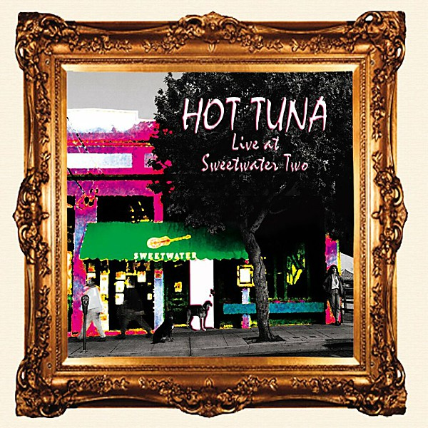

# Live at Sweetwater Two

By **Hot Tuna**

## Album Data

- **Catalog:** Beets
- **Format:** Digital, Album
- **Album:** Live at Sweetwater Two
- **Artist:** Hot Tuna
- **Albumartist:** Hot Tuna
- **Genre:** Rock
- **MusicBrainz Album Artist ID:** [d13d9feb-b7c7-49f4-9b72-65e29a16aa24](https://musicbrainz.org/artist/d13d9feb-b7c7-49f4-9b72-65e29a16aa24)
- **MusicBrainz Album ID:** [e6895acc-ed64-4ab7-8f5e-3035e926b170](https://musicbrainz.org/release/e6895acc-ed64-4ab7-8f5e-3035e926b170)
- **MusicBrainz Release Group ID:** [c11c3b73-72bd-34f2-8efd-f1461804b73c](https://musicbrainz.org/release-group/c11c3b73-72bd-34f2-8efd-f1461804b73c)
- **Year:** 1993
- **Catalog #:** RRCD2093
- **Label:** Relix Records
- **Total Tracks:** 14

## Album Tracks

### Track 01 - Hesitation Blues

- **Artist:** Hot Tuna
- **Format:** ALAC
- **Genre:** Folk Rock
- **Length:** 5:33
- **MusicBrainz Track ID:** [691e82d8-a605-4194-b005-a8e6aee48a89](https://musicbrainz.org/recording/691e82d8-a605-4194-b005-a8e6aee48a89)
- **Title:** Hesitation Blues
- **Track:** 01
- **Year:** 1997

### Track 02 - Walkin' Blues

- **Artist:** Hot Tuna
- **Format:** ALAC
- **Genre:** Blues
- **Length:** 5:02
- **MusicBrainz Track ID:** [4979f32c-e26a-4c6d-8e31-3c6d8c7162a3](https://musicbrainz.org/recording/4979f32c-e26a-4c6d-8e31-3c6d8c7162a3)
- **Title:** Walkin' Blues
- **Track:** 02
- **Year:** 1997

### Track 03 - True Religion

- **Artist:** Hot Tuna
- **Format:** ALAC
- **Genre:** Acid Rock
- **Length:** 5:43
- **MusicBrainz Track ID:** [8e414fc2-971e-4010-8392-06b31f72b9ab](https://musicbrainz.org/recording/8e414fc2-971e-4010-8392-06b31f72b9ab)
- **Title:** True Religion
- **Track:** 03
- **Year:** 1997

### Track 04 - Been So Long

- **Artist:** Hot Tuna
- **Format:** ALAC
- **Genre:** Acid Rock
- **Length:** 3:52
- **MusicBrainz Track ID:** [4e9182a4-2842-4a95-8c17-603a7c866a4d](https://musicbrainz.org/recording/4e9182a4-2842-4a95-8c17-603a7c866a4d)
- **Title:** Been So Long
- **Track:** 04
- **Year:** 1997

### Track 05 - Uncle Sam Blues

- **Artist:** Hot Tuna
- **Format:** ALAC
- **Genre:** Acid Rock
- **Length:** 5:42
- **MusicBrainz Track ID:** [6f4f7cd5-aabd-4b66-9e82-90f8725a8ba8](https://musicbrainz.org/recording/6f4f7cd5-aabd-4b66-9e82-90f8725a8ba8)
- **Title:** Uncle Sam Blues
- **Track:** 05
- **Year:** 1997

### Track 06 - Vampire Woman

- **Artist:** Hot Tuna
- **Format:** ALAC
- **Genre:** Rock
- **Length:** 2:54
- **MusicBrainz Track ID:** [98f2d2ba-305f-4ded-a94f-ec17f2f6dff0](https://musicbrainz.org/recording/98f2d2ba-305f-4ded-a94f-ec17f2f6dff0)
- **Title:** Vampire Woman
- **Track:** 06
- **Year:** 1997

### Track 07 - Candy Man

- **Artist:** Hot Tuna
- **Format:** ALAC
- **Genre:** Acid Rock
- **Length:** 7:57
- **MusicBrainz Track ID:** [e04065a0-f241-4c14-92e8-90fd8d53046c](https://musicbrainz.org/recording/e04065a0-f241-4c14-92e8-90fd8d53046c)
- **Title:** Candy Man
- **Track:** 07
- **Year:** 1997

### Track 08 - Let Us Get Together

- **Artist:** Hot Tuna
- **Format:** ALAC
- **Genre:** Rock
- **Length:** 2:59
- **MusicBrainz Track ID:** [37ef8198-5f34-4342-b147-9262ffaac279](https://musicbrainz.org/recording/37ef8198-5f34-4342-b147-9262ffaac279)
- **Title:** Let Us Get Together
- **Track:** 08
- **Year:** 1997

### Track 09 - Third Week in the Chelsea

- **Artist:** Hot Tuna
- **Format:** ALAC
- **Genre:** Blues
- **Length:** 5:05
- **MusicBrainz Track ID:** [4236aa93-e66d-470b-b92f-19735e8977cc](https://musicbrainz.org/recording/4236aa93-e66d-470b-b92f-19735e8977cc)
- **Title:** Third Week in the Chelsea
- **Track:** 09
- **Year:** 1997

### Track 10 - 99 Year Blues

- **Artist:** Hot Tuna
- **Format:** ALAC
- **Genre:** Acid Rock
- **Length:** 7:02
- **MusicBrainz Track ID:** [da24a504-e4c2-4577-922a-4a8fd9f5a705](https://musicbrainz.org/recording/da24a504-e4c2-4577-922a-4a8fd9f5a705)
- **Title:** 99 Year Blues
- **Track:** 10
- **Year:** 1997

### Track 11 - Ice Age

- **Artist:** Hot Tuna
- **Format:** ALAC
- **Genre:** Blues
- **Length:** 6:38
- **MusicBrainz Track ID:** [8365fed7-693d-4a87-9d1a-17d552e05385](https://musicbrainz.org/recording/8365fed7-693d-4a87-9d1a-17d552e05385)
- **Title:** Ice Age
- **Track:** 11
- **Year:** 1997

### Track 12 - San Francisco Bay Blues

- **Artist:** Hot Tuna
- **Format:** ALAC
- **Genre:** Rock
- **Length:** 4:24
- **MusicBrainz Track ID:** [58002388-4706-4913-bd41-5daba9b08775](https://musicbrainz.org/recording/58002388-4706-4913-bd41-5daba9b08775)
- **Title:** San Francisco Bay Blues
- **Track:** 12
- **Year:** 1997

### Track 13 - Mann's Fate

- **Artist:** Hot Tuna
- **Format:** ALAC
- **Genre:** Acid Rock
- **Length:** 6:08
- **MusicBrainz Track ID:** [aeeaa5f6-b882-41bc-a1da-6d68494da742](https://musicbrainz.org/recording/aeeaa5f6-b882-41bc-a1da-6d68494da742)
- **Title:** Mann's Fate
- **Track:** 13
- **Year:** 1997

### Track 14 - Keep on Truckin'

- **Artist:** Hot Tuna
- **Format:** ALAC
- **Genre:** Acid Rock
- **Length:** 4:29
- **MusicBrainz Track ID:** [95924cb5-8b89-4532-bb55-ad5237777bbb](https://musicbrainz.org/recording/95924cb5-8b89-4532-bb55-ad5237777bbb)
- **Title:** Keep on Truckin'
- **Track:** 14
- **Year:** 1997

## See also

- [3-4-88 Tuna-Airplane Reunion](3-4-88_Tuna-Airplane_Reunion.md)
- [Burgers](Burgers.md)
- [Classic Hot Tuna Electric](Classic_Hot_Tuna_Electric.md)
- [Live at Sweetwater](Live_at_Sweetwater.md)
- [Live in Japan](Live_in_Japan.md)
- [Steady as She Goes](Steady_as_She_Goes.md)
- [Roon: America's Choice](../../Roon/Hot_Tuna/Americas_Choice.md)
- [Roon: Burgers](../../Roon/Hot_Tuna/Burgers.md)
- [Roon: First Pull Up, Then Pull Down](../../Roon/Hot_Tuna/First_Pull_Up__Then_Pull_Down.md)
- [Roon: Steady As She Goes](../../Roon/Hot_Tuna/Steady_As_She_Goes.md)
- [Roon: The Phosphorescent Rat (Remastered)](../../Roon/Hot_Tuna/The_Phosphorescent_Rat_Remastered.md)
