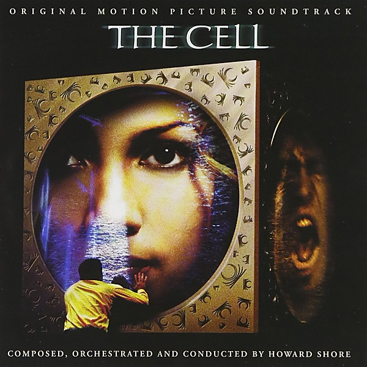

# The Cell Soundtrack

By **Howard Shore**

## Album Data

- **Catalog:** Beets
- **Format:** Digital, Album
- **Album:** The Cell Soundtrack
- **Artist:** Howard Shore
- **Albumartist:** Howard Shore
- **Genre:** Classical
- **MusicBrainz Album Artist ID:** 
- **MusicBrainz Album ID:** 
- **MusicBrainz Release Group ID:** 
- **Year:** 2000
- **Catalog #:** 
- **Label:** 
- **Total Tracks:** 00

## Album Tracks

### Track 19 - Vital Signs

- **Artist:** Howard Shore
- **Format:** AAC
- **Genre:** Classical
- **Length:** 2:02
- **MusicBrainz Track ID:** 
- **Title:** Vital Signs
- **Track:** 19
- **Year:** 2000

