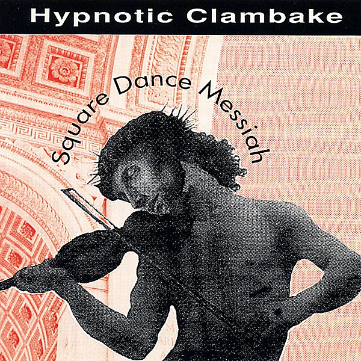

# Square Dance Messiah

By **Hypnotic Clambake**

## Album Data

- **Catalog:** Beets
- **Format:** Digital, Album
- **Album:** Square Dance Messiah
- **Artist:** Hypnotic Clambake
- **Albumartist:** Hypnotic Clambake
- **Genre:** Country
- **MusicBrainz Album Artist ID:** [ca148a82-61e9-4034-8ff3-ad170b8266e6](https://musicbrainz.org/artist/ca148a82-61e9-4034-8ff3-ad170b8266e6)
- **MusicBrainz Album ID:** [c1e27814-79e1-483e-b4fe-88b47a83b354](https://musicbrainz.org/release/c1e27814-79e1-483e-b4fe-88b47a83b354)
- **MusicBrainz Release Group ID:** [4f44107e-9be7-3bc4-9396-748f504a9212](https://musicbrainz.org/release-group/4f44107e-9be7-3bc4-9396-748f504a9212)
- **Year:** 1991
- **Catalog #:** 
- **Label:** Blue Button
- **Total Tracks:** 16

## Album Tracks

### Track 01 - Square Dance Messiah

- **Artist:** Hypnotic Clambake
- **Format:** MP3
- **Genre:** Country
- **Length:** 3:16
- **MusicBrainz Track ID:** [8e6bc596-62b7-45d8-a66c-3517dba664cf](https://musicbrainz.org/recording/8e6bc596-62b7-45d8-a66c-3517dba664cf)
- **Title:** Square Dance Messiah
- **Track:** 01
- **Year:** 1991

### Track 02 - Chef Mobie's Gumbo Gator

- **Artist:** Hypnotic Clambake
- **Format:** MP3
- **Genre:** Country
- **Length:** 4:24
- **MusicBrainz Track ID:** [993b8756-a555-43ac-b80c-9c3b664dd597](https://musicbrainz.org/recording/993b8756-a555-43ac-b80c-9c3b664dd597)
- **Title:** Chef Mobie's Gumbo Gator
- **Track:** 02
- **Year:** 1991

### Track 03 - Fate

- **Artist:** Hypnotic Clambake
- **Format:** MP3
- **Genre:** Country
- **Length:** 3:38
- **MusicBrainz Track ID:** [d50b06bb-c2d5-4a18-9ea7-2ba0fd3969c9](https://musicbrainz.org/recording/d50b06bb-c2d5-4a18-9ea7-2ba0fd3969c9)
- **Title:** Fate
- **Track:** 03
- **Year:** 1991

### Track 04 - Ozone

- **Artist:** Hypnotic Clambake
- **Format:** MP3
- **Genre:** Country
- **Length:** 4:32
- **MusicBrainz Track ID:** [e84ae7c8-f04f-41dd-a09b-ad17f3b12b95](https://musicbrainz.org/recording/e84ae7c8-f04f-41dd-a09b-ad17f3b12b95)
- **Title:** Ozone
- **Track:** 04
- **Year:** 1991

### Track 05 - Old Dan Tucker

- **Artist:** Hypnotic Clambake
- **Format:** MP3
- **Genre:** Country
- **Length:** 1:39
- **MusicBrainz Track ID:** [2d6aa142-5a54-4a90-ab2c-3128a37d9ea6](https://musicbrainz.org/recording/2d6aa142-5a54-4a90-ab2c-3128a37d9ea6)
- **Title:** Old Dan Tucker
- **Track:** 05
- **Year:** 1991

### Track 06 - Reverence

- **Artist:** Hypnotic Clambake
- **Format:** MP3
- **Genre:** Country
- **Length:** 4:30
- **MusicBrainz Track ID:** [df03d2bd-5b03-4715-a00c-f3c00511af2a](https://musicbrainz.org/recording/df03d2bd-5b03-4715-a00c-f3c00511af2a)
- **Title:** Reverence
- **Track:** 06
- **Year:** 1991

### Track 07 - Russian Ballerina

- **Artist:** Hypnotic Clambake
- **Format:** MP3
- **Genre:** Country
- **Length:** 4:34
- **MusicBrainz Track ID:** [a255716f-0b8f-4097-9415-376289fc1bd3](https://musicbrainz.org/recording/a255716f-0b8f-4097-9415-376289fc1bd3)
- **Title:** Russian Ballerina
- **Track:** 07
- **Year:** 1991

### Track 08 - Ant Man

- **Artist:** Hypnotic Clambake
- **Format:** MP3
- **Genre:** Country
- **Length:** 3:26
- **MusicBrainz Track ID:** [b9c3f595-d6fd-449f-8947-5ca26fb9baff](https://musicbrainz.org/recording/b9c3f595-d6fd-449f-8947-5ca26fb9baff)
- **Title:** Ant Man
- **Track:** 08
- **Year:** 1991

### Track 09 - Cut Out the Pain

- **Artist:** Hypnotic Clambake
- **Format:** MP3
- **Genre:** Country
- **Length:** 3:17
- **MusicBrainz Track ID:** [47c89638-8d26-4676-a7f3-25951ca3e1f0](https://musicbrainz.org/recording/47c89638-8d26-4676-a7f3-25951ca3e1f0)
- **Title:** Cut Out the Pain
- **Track:** 09
- **Year:** 1991

### Track 10 - Rasta Cyborg

- **Artist:** Hypnotic Clambake
- **Format:** MP3
- **Genre:** Country
- **Length:** 4:26
- **MusicBrainz Track ID:** [8b523799-4e5b-4208-969a-0d9b0e492e25](https://musicbrainz.org/recording/8b523799-4e5b-4208-969a-0d9b0e492e25)
- **Title:** Rasta Cyborg
- **Track:** 10
- **Year:** 1991

### Track 11 - In the Middle

- **Artist:** Hypnotic Clambake
- **Format:** MP3
- **Genre:** Country
- **Length:** 3:19
- **MusicBrainz Track ID:** [1262fb6e-1699-403a-b300-15b5892fb1a7](https://musicbrainz.org/recording/1262fb6e-1699-403a-b300-15b5892fb1a7)
- **Title:** In the Middle
- **Track:** 11
- **Year:** 1991

### Track 12 - Bulgarian Boogie

- **Artist:** Hypnotic Clambake
- **Format:** MP3
- **Genre:** Country
- **Length:** 3:27
- **MusicBrainz Track ID:** [aeae71d1-a289-4445-8a4e-97671796331a](https://musicbrainz.org/recording/aeae71d1-a289-4445-8a4e-97671796331a)
- **Title:** Bulgarian Boogie
- **Track:** 12
- **Year:** 1991

### Track 13 - Past Lives

- **Artist:** Hypnotic Clambake
- **Format:** MP3
- **Genre:** Country
- **Length:** 7:09
- **MusicBrainz Track ID:** [1566867d-dde0-4312-ba35-0cd8b38952db](https://musicbrainz.org/recording/1566867d-dde0-4312-ba35-0cd8b38952db)
- **Title:** Past Lives
- **Track:** 13
- **Year:** 1991

### Track 14 - Old Joe Clark

- **Artist:** Hypnotic Clambake
- **Format:** MP3
- **Genre:** Country
- **Length:** 3:53
- **MusicBrainz Track ID:** [4eab3bb4-a641-48b0-a07a-467fd460e20c](https://musicbrainz.org/recording/4eab3bb4-a641-48b0-a07a-467fd460e20c)
- **Title:** Old Joe Clark
- **Track:** 14
- **Year:** 1991

### Track 15 - A Message from Mother

- **Artist:** Hypnotic Clambake
- **Format:** MP3
- **Genre:** Country
- **Length:** 0:27
- **MusicBrainz Track ID:** [3006d682-b900-4350-8e5e-558fdf6f5b30](https://musicbrainz.org/recording/3006d682-b900-4350-8e5e-558fdf6f5b30)
- **Title:** A Message from Mother
- **Track:** 15
- **Year:** 1991

### Track 16 - The Feldmans

- **Artist:** Hypnotic Clambake
- **Format:** MP3
- **Genre:** Country
- **Length:** 3:10
- **MusicBrainz Track ID:** [ffda97d7-8b59-4fb0-b707-5237a7410cb3](https://musicbrainz.org/recording/ffda97d7-8b59-4fb0-b707-5237a7410cb3)
- **Title:** The Feldmans
- **Track:** 16
- **Year:** 1991

