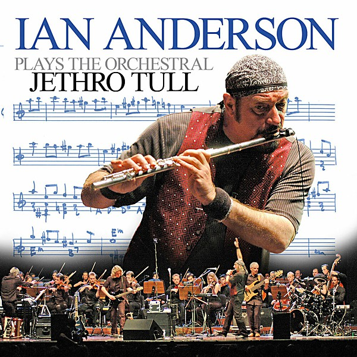

# Ian Anderson Plays The Orchestral Jethro Tull

By **Ian Anderson**

## Album Data

- **Catalog:** Beets
- **Format:** Digital, Album
- **Album:** Ian Anderson Plays The Orchestral Jethro Tull
- **Artist:** Ian Anderson
- **Albumartist:** Ian Anderson
- **Genre:** Progressive Rock
- **MusicBrainz Album Artist ID:** 
- **MusicBrainz Album ID:** 
- **MusicBrainz Release Group ID:** 
- **Year:** 2005
- **Catalog #:** 
- **Label:** 
- **Total Tracks:** 06

## Album Tracks

### Track 05 - Budapest

- **Artist:** Ian Anderson
- **Format:** AAC
- **Genre:** Progressive Rock
- **Length:** 14:04
- **MusicBrainz Track ID:** 
- **Title:** Budapest
- **Track:** 05
- **Year:** 2005

## See also

- [Roon: Thick As A Brick (Live In Iceland)](../../Roon/Ian_Anderson/Thick_As_A_Brick_Live_In_Iceland.md)
