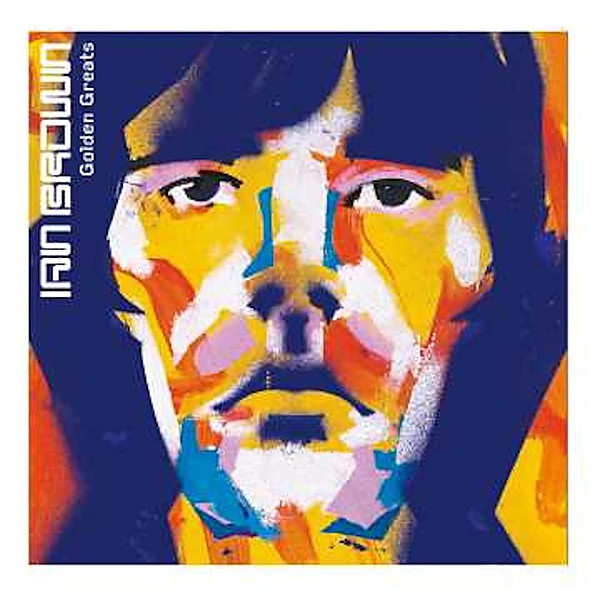

# Golden Greats

By **Ian Brown**

## Album Data

- **Catalog:** Beets
- **Format:** Digital, Album
- **Album:** Golden Greats
- **Artist:** Ian Brown
- **Albumartist:** Ian Brown
- **Genre:** Electronic
- **MusicBrainz Album Artist ID:** [182d5d8a-94c7-4ef4-8222-a1838353a37b](https://musicbrainz.org/artist/182d5d8a-94c7-4ef4-8222-a1838353a37b)
- **MusicBrainz Album ID:** [50841f86-db9e-4e7d-9f59-e0fc824305e3](https://musicbrainz.org/release/50841f86-db9e-4e7d-9f59-e0fc824305e3)
- **MusicBrainz Release Group ID:** [5a695d1a-7c7b-3d42-898e-207a74b12c8c](https://musicbrainz.org/release-group/5a695d1a-7c7b-3d42-898e-207a74b12c8c)
- **Year:** 1999
- **Catalog #:** 
- **Label:** 
- **Total Tracks:** 10

## Album Tracks

### Track 01 - F.E.A.R.

- **Artist:** Ian Brown
- **Format:** ALAC
- **Genre:** Indie Rock
- **Length:** 4:30
- **MusicBrainz Track ID:** [83c79994-32b7-421e-8c6f-b3de8ee98a93](https://musicbrainz.org/recording/83c79994-32b7-421e-8c6f-b3de8ee98a93)
- **Title:** F.E.A.R.
- **Track:** 01
- **Year:** 2005

### Track 02 - Stardust

- **Artist:** Ian Brown
- **Format:** ALAC
- **Genre:** Madchester
- **Length:** 4:30
- **MusicBrainz Track ID:** [a278b45a-abe9-450a-867c-4c9a88122207](https://musicbrainz.org/recording/a278b45a-abe9-450a-867c-4c9a88122207)
- **Title:** Stardust
- **Track:** 02
- **Year:** 2005

### Track 03 - The Gravy Train

- **Artist:** Ian Brown
- **Format:** ALAC
- **Genre:** Madchester
- **Length:** 4:24
- **MusicBrainz Track ID:** [e3a71003-d13e-4092-8d0c-28cc5fad4ee8](https://musicbrainz.org/recording/e3a71003-d13e-4092-8d0c-28cc5fad4ee8)
- **Title:** The Gravy Train
- **Track:** 03
- **Year:** 2005

### Track 04 - Bubbles

- **Artist:** Ian Brown
- **Format:** ALAC
- **Genre:** Space Rock
- **Length:** 4:34
- **MusicBrainz Track ID:** [3c7532cf-eacd-4c64-afb0-b2176e75b6c6](https://musicbrainz.org/recording/3c7532cf-eacd-4c64-afb0-b2176e75b6c6)
- **Title:** Bubbles
- **Track:** 04
- **Year:** 2005

### Track 05 - Hear No See No

- **Artist:** Ian Brown
- **Format:** ALAC
- **Genre:** Rock
- **Length:** 3:29
- **MusicBrainz Track ID:** [6cdde1df-f637-4914-9861-4b0f2062aabd](https://musicbrainz.org/recording/6cdde1df-f637-4914-9861-4b0f2062aabd)
- **Title:** Hear No See No
- **Track:** 05
- **Year:** 2005

### Track 06 - Northern Lights

- **Artist:** Ian Brown
- **Format:** ALAC
- **Genre:** Madchester
- **Length:** 4:14
- **MusicBrainz Track ID:** [62b71848-7a32-4350-ae48-6ffa672a0a46](https://musicbrainz.org/recording/62b71848-7a32-4350-ae48-6ffa672a0a46)
- **Title:** Northern Lights
- **Track:** 06
- **Year:** 2005

### Track 07 - Whispers

- **Artist:** Ian Brown
- **Format:** ALAC
- **Genre:** Britpop
- **Length:** 3:56
- **MusicBrainz Track ID:** [32137665-405b-407d-bd67-a12a664cdb07](https://musicbrainz.org/recording/32137665-405b-407d-bd67-a12a664cdb07)
- **Title:** Whispers
- **Track:** 07
- **Year:** 2005

### Track 08 - El Mundo Pequeño

- **Artist:** Ian Brown
- **Format:** ALAC
- **Genre:** Trip Hop
- **Length:** 4:01
- **MusicBrainz Track ID:** [d716d366-9f15-458f-a48b-79abeb9e46f9](https://musicbrainz.org/recording/d716d366-9f15-458f-a48b-79abeb9e46f9)
- **Title:** El Mundo Pequeño
- **Track:** 08
- **Year:** 2005

### Track 09 - Forever and a Day

- **Artist:** Ian Brown
- **Format:** ALAC
- **Genre:** Indie Rock
- **Length:** 2:45
- **MusicBrainz Track ID:** [d98382f1-ea1e-4427-8c18-04f040c5a345](https://musicbrainz.org/recording/d98382f1-ea1e-4427-8c18-04f040c5a345)
- **Title:** Forever and a Day
- **Track:** 09
- **Year:** 2005

### Track 10 - Shadow of a Saint

- **Artist:** Ian Brown
- **Format:** ALAC
- **Genre:** Madchester
- **Length:** 4:45
- **MusicBrainz Track ID:** [98b88726-d463-42ac-853e-53bf334315d4](https://musicbrainz.org/recording/98b88726-d463-42ac-853e-53bf334315d4)
- **Title:** Shadow of a Saint
- **Track:** 10
- **Year:** 2005

## See also

- [Music of the Spheres](Music_of_the_Spheres.md)
- [My Way](My_Way.md)
- [Remixes of the Spheres](Remixes_of_the_Spheres.md)
- [Solarized](Solarized.md)
- [The World Is Yours](The_World_Is_Yours.md)
