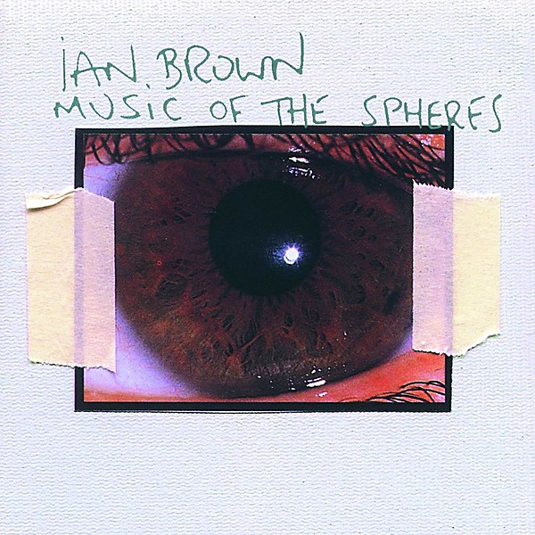

# Music of the Spheres

By **Ian Brown**

## Album Data

- **Catalog:** Beets
- **Format:** Digital, Album
- **Album:** Music of the Spheres
- **Artist:** Ian Brown
- **Albumartist:** Ian Brown
- **Genre:** Trip Hop
- **MusicBrainz Album Artist ID:** [182d5d8a-94c7-4ef4-8222-a1838353a37b](https://musicbrainz.org/artist/182d5d8a-94c7-4ef4-8222-a1838353a37b)
- **MusicBrainz Album ID:** [c13c88ee-2a67-4d3b-9fb3-bfba628a98ab](https://musicbrainz.org/release/c13c88ee-2a67-4d3b-9fb3-bfba628a98ab)
- **MusicBrainz Release Group ID:** [9c87646d-6a02-379c-a886-4cf653ae47ae](https://musicbrainz.org/release-group/9c87646d-6a02-379c-a886-4cf653ae47ae)
- **Year:** 2005
- **Catalog #:** 
- **Label:** Polydor
- **Total Tracks:** 12

## Album Tracks

### Track 01 - Stellify

- **Artist:** Ian Brown
- **Format:** ALAC
- **Genre:** Madchester
- **Length:** 4:58
- **MusicBrainz Track ID:** [bf3d070d-3880-4e10-8d4a-cfaec5e9494d](https://musicbrainz.org/recording/bf3d070d-3880-4e10-8d4a-cfaec5e9494d)
- **Title:** Stellify
- **Track:** 01
- **Year:** 2009

### Track 02 - Crowning of the Poor

- **Artist:** Ian Brown
- **Format:** ALAC
- **Genre:** Madchester
- **Length:** 3:18
- **MusicBrainz Track ID:** [1f30d9d3-3811-41e6-85fb-b95d9b95f2a4](https://musicbrainz.org/recording/1f30d9d3-3811-41e6-85fb-b95d9b95f2a4)
- **Title:** Crowning of the Poor
- **Track:** 02
- **Year:** 2009

### Track 03 - Just Like You

- **Artist:** Ian Brown
- **Format:** ALAC
- **Genre:** Madchester
- **Length:** 3:22
- **MusicBrainz Track ID:** [f1063e2e-d6ca-47cb-a64c-dfa3726a5ba4](https://musicbrainz.org/recording/f1063e2e-d6ca-47cb-a64c-dfa3726a5ba4)
- **Title:** Just Like You
- **Track:** 03
- **Year:** 2009

### Track 04 - In the Year 2525

- **Artist:** Ian Brown
- **Format:** ALAC
- **Genre:** Madchester
- **Length:** 2:52
- **MusicBrainz Track ID:** [5ed79c75-1b0d-40eb-8755-4eef7aa1bb35](https://musicbrainz.org/recording/5ed79c75-1b0d-40eb-8755-4eef7aa1bb35)
- **Title:** In the Year 2525
- **Track:** 04
- **Year:** 2009

### Track 05 - Always Remember Me

- **Artist:** Ian Brown
- **Format:** ALAC
- **Genre:** Madchester
- **Length:** 4:49
- **MusicBrainz Track ID:** [192330b7-78f8-475d-bdb4-f462f5dc801f](https://musicbrainz.org/recording/192330b7-78f8-475d-bdb4-f462f5dc801f)
- **Title:** Always Remember Me
- **Track:** 05
- **Year:** 2009

### Track 06 - Vanity Kills

- **Artist:** Ian Brown
- **Format:** ALAC
- **Genre:** Madchester
- **Length:** 3:35
- **MusicBrainz Track ID:** [ac6c40f3-395d-4bc2-b86c-4382e54fa3f3](https://musicbrainz.org/recording/ac6c40f3-395d-4bc2-b86c-4382e54fa3f3)
- **Title:** Vanity Kills
- **Track:** 06
- **Year:** 2009

### Track 07 - For the Glory

- **Artist:** Ian Brown
- **Format:** ALAC
- **Genre:** Madchester
- **Length:** 3:11
- **MusicBrainz Track ID:** [c4c7d446-f327-418c-864c-d3d3e3968ab9](https://musicbrainz.org/recording/c4c7d446-f327-418c-864c-d3d3e3968ab9)
- **Title:** For the Glory
- **Track:** 07
- **Year:** 2009

### Track 08 - Marathon Man

- **Artist:** Ian Brown
- **Format:** ALAC
- **Genre:** Madchester
- **Length:** 3:39
- **MusicBrainz Track ID:** [5375c472-9932-4fee-a346-7fdc4e503544](https://musicbrainz.org/recording/5375c472-9932-4fee-a346-7fdc4e503544)
- **Title:** Marathon Man
- **Track:** 08
- **Year:** 2009

### Track 09 - Own Brain

- **Artist:** Ian Brown
- **Format:** ALAC
- **Genre:** Indie Rock
- **Length:** 2:56
- **MusicBrainz Track ID:** [fcaa33fc-41f8-4efc-9759-2100acf4fc86](https://musicbrainz.org/recording/fcaa33fc-41f8-4efc-9759-2100acf4fc86)
- **Title:** Own Brain
- **Track:** 09
- **Year:** 2009

### Track 10 - Laugh Now

- **Artist:** Ian Brown
- **Format:** ALAC
- **Genre:** Madchester
- **Length:** 3:53
- **MusicBrainz Track ID:** [ffe66296-a263-4b00-ac52-8494bffe04b6](https://musicbrainz.org/recording/ffe66296-a263-4b00-ac52-8494bffe04b6)
- **Title:** Laugh Now
- **Track:** 10
- **Year:** 2009

### Track 11 - By All Means Necessary

- **Artist:** Ian Brown
- **Format:** ALAC
- **Genre:** Indie Rock
- **Length:** 3:42
- **MusicBrainz Track ID:** [041c3aa8-5d48-4b0d-83f2-91fe633bbefb](https://musicbrainz.org/recording/041c3aa8-5d48-4b0d-83f2-91fe633bbefb)
- **Title:** By All Means Necessary
- **Track:** 11
- **Year:** 2009

### Track 12 - So High

- **Artist:** Ian Brown
- **Format:** ALAC
- **Genre:** Britpop
- **Length:** 2:54
- **MusicBrainz Track ID:** [4a1b9bf1-6d91-4847-8a12-1de94ac29998](https://musicbrainz.org/recording/4a1b9bf1-6d91-4847-8a12-1de94ac29998)
- **Title:** So High
- **Track:** 12
- **Year:** 2009

## See also

- [Golden Greats](Golden_Greats.md)
- [My Way](My_Way.md)
- [Remixes of the Spheres](Remixes_of_the_Spheres.md)
- [Solarized](Solarized.md)
- [The World Is Yours](The_World_Is_Yours.md)
