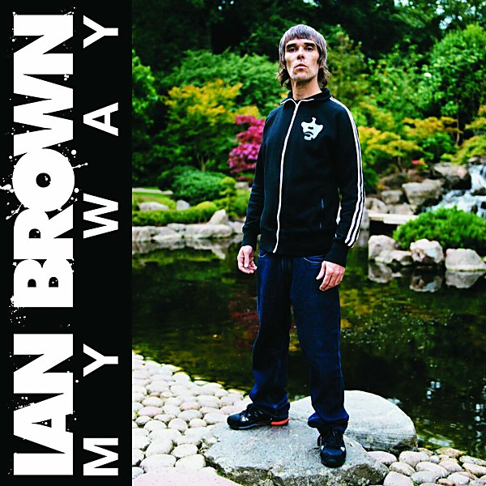

# My Way

By **Ian Brown**

## Album Data

- **Catalog:** Beets
- **Format:** Digital, Album
- **Album:** My Way
- **Artist:** Ian Brown
- **Albumartist:** Ian Brown
- **Genre:** Indie Rock
- **MusicBrainz Album Artist ID:** [182d5d8a-94c7-4ef4-8222-a1838353a37b](https://musicbrainz.org/artist/182d5d8a-94c7-4ef4-8222-a1838353a37b)
- **MusicBrainz Album ID:** [d85f556b-be70-4430-8af3-4a9b17ed5927](https://musicbrainz.org/release/d85f556b-be70-4430-8af3-4a9b17ed5927)
- **MusicBrainz Release Group ID:** [34c68d40-14bc-463c-a58c-65c09e060152](https://musicbrainz.org/release-group/34c68d40-14bc-463c-a58c-65c09e060152)
- **Year:** 2009
- **Catalog #:** 
- **Label:** 
- **Total Tracks:** 13

## Album Tracks

### Track 01 - F.E.A.R. (U.N.K.L.E. mix)

- **Artist:** Ian Brown
- **Format:** ALAC
- **Genre:** Electronic
- **Length:** 5:54
- **MusicBrainz Track ID:** [3e4d2c38-ceaf-4520-b36d-5f55f0fa607c](https://musicbrainz.org/recording/3e4d2c38-ceaf-4520-b36d-5f55f0fa607c)
- **Title:** F.E.A.R. (U.N.K.L.E. mix)
- **Track:** 01
- **Year:** 2005

### Track 02 - Northern Lights (The Freelance Hellraiser mix)

- **Artist:** Ian Brown
- **Format:** ALAC
- **Genre:** Electronic
- **Length:** 5:42
- **MusicBrainz Track ID:** [841a127a-913b-4292-9146-98e24ec39350](https://musicbrainz.org/recording/841a127a-913b-4292-9146-98e24ec39350)
- **Title:** Northern Lights (The Freelance Hellraiser mix)
- **Track:** 02
- **Year:** 2005

### Track 03 - The Gravy Train (Nightmare on Wax mix)

- **Artist:** Ian Brown
- **Format:** ALAC
- **Genre:** Electronic
- **Length:** 5:00
- **MusicBrainz Track ID:** [a81c82c3-fd0f-4a07-bc8b-d019ebee9ac0](https://musicbrainz.org/recording/a81c82c3-fd0f-4a07-bc8b-d019ebee9ac0)
- **Title:** The Gravy Train (Nightmare on Wax mix)
- **Track:** 03
- **Year:** 2005

### Track 04 - Forever and a Day (CedarBlue mix)

- **Artist:** Ian Brown
- **Format:** ALAC
- **Genre:** Electronic
- **Length:** 4:12
- **MusicBrainz Track ID:** [4e5326bc-74fc-4cad-bf61-8c2b7944b49d](https://musicbrainz.org/recording/4e5326bc-74fc-4cad-bf61-8c2b7944b49d)
- **Title:** Forever and a Day (CedarBlue mix)
- **Track:** 04
- **Year:** 2005

### Track 05 - Shadow of a Saint (The Boy Bierton mix)

- **Artist:** Ian Brown
- **Format:** ALAC
- **Genre:** Electronic
- **Length:** 6:26
- **MusicBrainz Track ID:** [45f3f167-ec79-4da0-a3f9-d73d4c401698](https://musicbrainz.org/recording/45f3f167-ec79-4da0-a3f9-d73d4c401698)
- **Title:** Shadow of a Saint (The Boy Bierton mix)
- **Track:** 05
- **Year:** 2005

### Track 06 - Superstar

- **Artist:** Ian Brown
- **Format:** ALAC
- **Genre:** Britpop
- **Length:** 4:50
- **MusicBrainz Track ID:** [e59eba00-89ac-4004-9e43-0e940de72e91](https://musicbrainz.org/recording/e59eba00-89ac-4004-9e43-0e940de72e91)
- **Title:** Superstar
- **Track:** 06
- **Year:** 2005

### Track 07 - My Star 2002

- **Artist:** Ian Brown
- **Format:** ALAC
- **Genre:** Electronic
- **Length:** 4:05
- **MusicBrainz Track ID:** [e8dc8f40-1f4e-4285-9132-efb534bc1a1c](https://musicbrainz.org/recording/e8dc8f40-1f4e-4285-9132-efb534bc1a1c)
- **Title:** My Star 2002
- **Track:** 07
- **Year:** 2005

### Track 08 - Hear No See No Speak No

- **Artist:** Ian Brown
- **Format:** ALAC
- **Genre:** Dub
- **Length:** 5:26
- **MusicBrainz Track ID:** [04663067-a558-42aa-b841-ffe77087663a](https://musicbrainz.org/recording/04663067-a558-42aa-b841-ffe77087663a)
- **Title:** Hear No See No Speak No
- **Track:** 08
- **Year:** 2005

### Track 09 - Cokane in My Brain (DJ Mek Numburg Scratch mix)

- **Artist:** Ian Brown
- **Format:** ALAC
- **Genre:** Electronic
- **Length:** 1:45
- **MusicBrainz Track ID:** [cda79cc6-4ffa-4c87-8e09-9d3aac23a07a](https://musicbrainz.org/recording/cda79cc6-4ffa-4c87-8e09-9d3aac23a07a)
- **Title:** Cokane in My Brain (DJ Mek Numburg Scratch mix)
- **Track:** 09
- **Year:** 2005

### Track 10 - The Gravy Brain (Nightmare on Wax instrumental)

- **Artist:** Ian Brown
- **Format:** ALAC
- **Genre:** Electronic
- **Length:** 5:03
- **MusicBrainz Track ID:** [c3fb1844-0b2a-49a2-b380-64dbb399d394](https://musicbrainz.org/recording/c3fb1844-0b2a-49a2-b380-64dbb399d394)
- **Title:** The Gravy Brain (Nightmare on Wax instrumental)
- **Track:** 10
- **Year:** 2005

### Track 11 - Stardust (instrumental)

- **Artist:** Ian Brown
- **Format:** ALAC
- **Genre:** Madchester
- **Length:** 4:34
- **MusicBrainz Track ID:** [37ab89eb-5b69-4e53-8d50-e5a885161bf4](https://musicbrainz.org/recording/37ab89eb-5b69-4e53-8d50-e5a885161bf4)
- **Title:** Stardust (instrumental)
- **Track:** 11
- **Year:** 2005

### Track 12 - El mundo pequeño (live acoustic version)

- **Artist:** Ian Brown
- **Format:** ALAC
- **Genre:** Electronic
- **Length:** 2:47
- **MusicBrainz Track ID:** [91792cd1-c2ff-4848-ad63-6b3b198b9604](https://musicbrainz.org/recording/91792cd1-c2ff-4848-ad63-6b3b198b9604)
- **Title:** El mundo pequeño (live acoustic version)
- **Track:** 12
- **Year:** 2005

### Track 13 - F.E.A.R. (U.N.K.L.E. instrumental)

- **Artist:** Ian Brown
- **Format:** ALAC
- **Genre:** Electronic
- **Length:** 5:51
- **MusicBrainz Track ID:** [5b930565-f1e7-429e-a166-66a0d81face6](https://musicbrainz.org/recording/5b930565-f1e7-429e-a166-66a0d81face6)
- **Title:** F.E.A.R. (U.N.K.L.E. instrumental)
- **Track:** 13
- **Year:** 2005

## See also

- [Golden Greats](Golden_Greats.md)
- [Music of the Spheres](Music_of_the_Spheres.md)
- [Remixes of the Spheres](Remixes_of_the_Spheres.md)
- [Solarized](Solarized.md)
- [The World Is Yours](The_World_Is_Yours.md)
