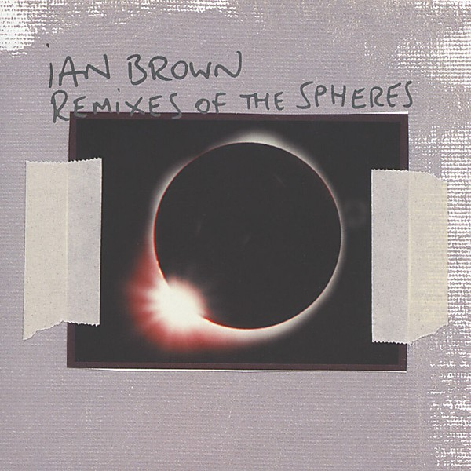

# Remixes of the Spheres

By **Ian Brown**

## Album Data

- **Catalog:** Beets
- **Format:** Digital, Album
- **Album:** Remixes of the Spheres
- **Artist:** Ian Brown
- **Albumartist:** Ian Brown
- **Genre:** Electronic
- **MusicBrainz Album Artist ID:** [182d5d8a-94c7-4ef4-8222-a1838353a37b](https://musicbrainz.org/artist/182d5d8a-94c7-4ef4-8222-a1838353a37b)
- **MusicBrainz Album ID:** [7719bd26-1085-315c-a3a1-5eff9fc77fa7](https://musicbrainz.org/release/7719bd26-1085-315c-a3a1-5eff9fc77fa7)
- **MusicBrainz Release Group ID:** [9449592c-5eb2-39ba-b305-f8d84e96c0ed](https://musicbrainz.org/release-group/9449592c-5eb2-39ba-b305-f8d84e96c0ed)
- **Year:** 2005
- **Catalog #:** KOC-CD-9671
- **Label:** KOCH Records
- **Total Tracks:** 12

## Album Tracks

### Track 01 - Longsight M13

- **Artist:** Ian Brown
- **Format:** ALAC
- **Genre:** Britpop
- **Length:** 3:12
- **MusicBrainz Track ID:** [1e451992-d6fe-4cd3-a350-c52cc172715e](https://musicbrainz.org/recording/1e451992-d6fe-4cd3-a350-c52cc172715e)
- **Title:** Longsight M13
- **Track:** 01
- **Year:** 2005

### Track 02 - Time Is My Everything

- **Artist:** Ian Brown
- **Format:** ALAC
- **Genre:** Madchester
- **Length:** 3:52
- **MusicBrainz Track ID:** [4d111e32-d763-47ff-ab2b-8b856eec62ae](https://musicbrainz.org/recording/4d111e32-d763-47ff-ab2b-8b856eec62ae)
- **Title:** Time Is My Everything
- **Track:** 02
- **Year:** 2005

### Track 03 - Destiny or Circumstance

- **Artist:** Ian Brown
- **Format:** ALAC
- **Genre:** Indie Rock
- **Length:** 2:35
- **MusicBrainz Track ID:** [f23d9d64-73d7-4a40-9805-67e0b7ac9f54](https://musicbrainz.org/recording/f23d9d64-73d7-4a40-9805-67e0b7ac9f54)
- **Title:** Destiny or Circumstance
- **Track:** 03
- **Year:** 2005

### Track 04 - Upside Down

- **Artist:** Ian Brown
- **Format:** ALAC
- **Genre:** Madchester
- **Length:** 3:12
- **MusicBrainz Track ID:** [64f93aca-b1ea-4217-b418-06262603c809](https://musicbrainz.org/recording/64f93aca-b1ea-4217-b418-06262603c809)
- **Title:** Upside Down
- **Track:** 04
- **Year:** 2005

### Track 05 - Solarized

- **Artist:** Ian Brown
- **Format:** ALAC
- **Genre:** Madchester
- **Length:** 3:47
- **MusicBrainz Track ID:** [811cd9a8-8e42-4445-87c4-7b73a133e0e7](https://musicbrainz.org/recording/811cd9a8-8e42-4445-87c4-7b73a133e0e7)
- **Title:** Solarized
- **Track:** 05
- **Year:** 2005

### Track 06 - The Sweet Fantastic

- **Artist:** Ian Brown
- **Format:** ALAC
- **Genre:** Trip Hop
- **Length:** 3:52
- **MusicBrainz Track ID:** [ca26f8b3-b669-4e07-b614-520969495596](https://musicbrainz.org/recording/ca26f8b3-b669-4e07-b614-520969495596)
- **Title:** The Sweet Fantastic
- **Track:** 06
- **Year:** 2005

### Track 07 - Keep What Ya Got

- **Artist:** Ian Brown
- **Format:** ALAC
- **Genre:** Madchester
- **Length:** 4:28
- **MusicBrainz Track ID:** [7a5dfaab-6ad4-41e0-9ab3-4539a5c37c61](https://musicbrainz.org/recording/7a5dfaab-6ad4-41e0-9ab3-4539a5c37c61)
- **Title:** Keep What Ya Got
- **Track:** 07
- **Year:** 2005

### Track 08 - Home is Where the Heart Is

- **Artist:** Ian Brown
- **Format:** ALAC
- **Genre:** Indie Pop
- **Length:** 3:06
- **MusicBrainz Track ID:** [ac2063af-6bdf-4659-9c22-0723f57bdc45](https://musicbrainz.org/recording/ac2063af-6bdf-4659-9c22-0723f57bdc45)
- **Title:** Home is Where the Heart Is
- **Track:** 08
- **Year:** 2005

### Track 09 - One Way Ticket to Paradise

- **Artist:** Ian Brown
- **Format:** ALAC
- **Genre:** Indie Rock
- **Length:** 4:15
- **MusicBrainz Track ID:** [cc817d29-d1e2-4c83-9868-0a54e448516b](https://musicbrainz.org/recording/cc817d29-d1e2-4c83-9868-0a54e448516b)
- **Title:** One Way Ticket to Paradise
- **Track:** 09
- **Year:** 2005

### Track 10 - Kiss Ya Lips (No I.D.)

- **Artist:** Ian Brown
- **Format:** ALAC
- **Genre:** Madchester
- **Length:** 3:56
- **MusicBrainz Track ID:** [8559a939-b30d-4be9-a870-96e15a453f6c](https://musicbrainz.org/recording/8559a939-b30d-4be9-a870-96e15a453f6c)
- **Title:** Kiss Ya Lips (No I.D.)
- **Track:** 10
- **Year:** 2005

### Track 11 - Happy Ever After

- **Artist:** Ian Brown
- **Format:** ALAC
- **Genre:** Electronica
- **Length:** 2:46
- **MusicBrainz Track ID:** [dd42f7c4-e3f8-4999-88fb-681521f8b25b](https://musicbrainz.org/recording/dd42f7c4-e3f8-4999-88fb-681521f8b25b)
- **Title:** Happy Ever After
- **Track:** 11
- **Year:** 2005

### Track 12 - Lovebug

- **Artist:** Ian Brown
- **Format:** ALAC
- **Genre:** Indie Rock
- **Length:** 3:04
- **MusicBrainz Track ID:** [8881077c-cc6f-4ff0-a362-0f5235e8ec66](https://musicbrainz.org/recording/8881077c-cc6f-4ff0-a362-0f5235e8ec66)
- **Title:** Lovebug
- **Track:** 12
- **Year:** 2005

## See also

- [Golden Greats](Golden_Greats.md)
- [Music of the Spheres](Music_of_the_Spheres.md)
- [My Way](My_Way.md)
- [Solarized](Solarized.md)
- [The World Is Yours](The_World_Is_Yours.md)
