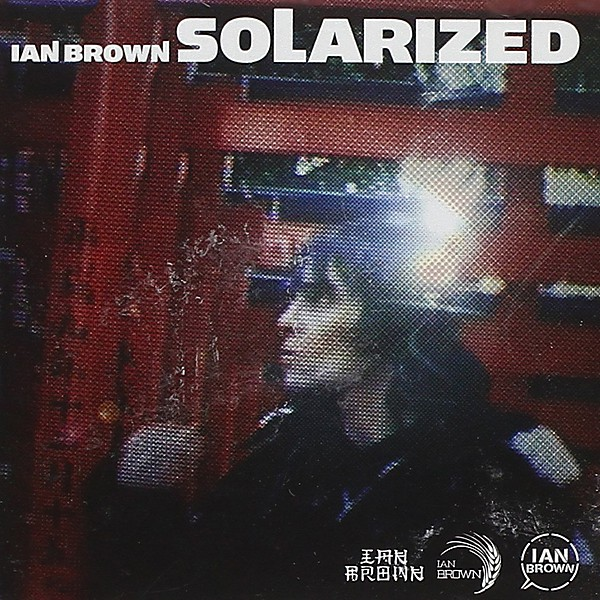

# Solarized

By **Ian Brown**

## Album Data

- **Catalog:** Beets
- **Format:** Digital, Album
- **Album:** Solarized
- **Artist:** Ian Brown
- **Albumartist:** Ian Brown
- **Genre:** Indie Rock
- **MusicBrainz Album Artist ID:** [182d5d8a-94c7-4ef4-8222-a1838353a37b](https://musicbrainz.org/artist/182d5d8a-94c7-4ef4-8222-a1838353a37b)
- **MusicBrainz Album ID:** [9142e654-74a2-49ea-aa62-e48b012b8296](https://musicbrainz.org/release/9142e654-74a2-49ea-aa62-e48b012b8296)
- **MusicBrainz Release Group ID:** [e2cc3845-4e3a-3fad-8e7b-5cc8c9cb5743](https://musicbrainz.org/release-group/e2cc3845-4e3a-3fad-8e7b-5cc8c9cb5743)
- **Year:** 2005
- **Catalog #:** [none]
- **Label:** Fiction Records
- **Total Tracks:** 12

## Album Tracks

### Track 01 - The World Is Yours

- **Artist:** Ian Brown
- **Format:** ALAC
- **Genre:** Madchester
- **Length:** 4:31
- **MusicBrainz Track ID:** [da514a7b-e3ac-4525-929a-12bf74f14418](https://musicbrainz.org/recording/da514a7b-e3ac-4525-929a-12bf74f14418)
- **Title:** The World Is Yours
- **Track:** 01
- **Year:** 2007

### Track 02 - On Track

- **Artist:** Ian Brown
- **Format:** ALAC
- **Genre:** Indie Rock
- **Length:** 4:21
- **MusicBrainz Track ID:** [fc3db03a-4e2e-4067-818a-09ac5ad4fcee](https://musicbrainz.org/recording/fc3db03a-4e2e-4067-818a-09ac5ad4fcee)
- **Title:** On Track
- **Track:** 02
- **Year:** 2007

### Track 03 - Sister Rose

- **Artist:** Ian Brown
- **Format:** ALAC
- **Genre:** Madchester
- **Length:** 3:52
- **MusicBrainz Track ID:** [b4e1b847-fbd7-4f5c-9e3e-86e7f5086086](https://musicbrainz.org/recording/b4e1b847-fbd7-4f5c-9e3e-86e7f5086086)
- **Title:** Sister Rose
- **Track:** 03
- **Year:** 2007

### Track 04 - Save Us

- **Artist:** Ian Brown
- **Format:** ALAC
- **Genre:** Madchester
- **Length:** 4:57
- **MusicBrainz Track ID:** [13184147-727c-48a2-9e0e-1b9d1c394fac](https://musicbrainz.org/recording/13184147-727c-48a2-9e0e-1b9d1c394fac)
- **Title:** Save Us
- **Track:** 04
- **Year:** 2007

### Track 05 - Eternal Flame

- **Artist:** Ian Brown
- **Format:** ALAC
- **Genre:** Britpop
- **Length:** 4:16
- **MusicBrainz Track ID:** [662cb15c-183d-45db-82c6-f0ad5072d95f](https://musicbrainz.org/recording/662cb15c-183d-45db-82c6-f0ad5072d95f)
- **Title:** Eternal Flame
- **Track:** 05
- **Year:** 2007

### Track 06 - The Feeding of the 5000

- **Artist:** Ian Brown
- **Format:** ALAC
- **Genre:** Madchester
- **Length:** 3:58
- **MusicBrainz Track ID:** [00851fa9-c26e-4294-8558-740a167ec85c](https://musicbrainz.org/recording/00851fa9-c26e-4294-8558-740a167ec85c)
- **Title:** The Feeding of the 5000
- **Track:** 06
- **Year:** 2007

### Track 07 - Street Children

- **Artist:** Ian Brown
- **Format:** ALAC
- **Genre:** Alternative Rock
- **Length:** 3:52
- **MusicBrainz Track ID:** [debb2e17-0025-4477-986f-8a02e973e338](https://musicbrainz.org/recording/debb2e17-0025-4477-986f-8a02e973e338)
- **Title:** Street Children
- **Track:** 07
- **Year:** 2007

### Track 08 - Some Folks Are Hollow

- **Artist:** Ian Brown
- **Format:** ALAC
- **Genre:** Madchester
- **Length:** 3:48
- **MusicBrainz Track ID:** [118233d9-2ec3-4e46-9ffc-0f5ea2130549](https://musicbrainz.org/recording/118233d9-2ec3-4e46-9ffc-0f5ea2130549)
- **Title:** Some Folks Are Hollow
- **Track:** 08
- **Year:** 2007

### Track 09 - Goodbye to the Broken

- **Artist:** Ian Brown
- **Format:** ALAC
- **Genre:** Pop Punk
- **Length:** 3:52
- **MusicBrainz Track ID:** [ccad8659-2b38-4701-9eca-a4f3b44ae8db](https://musicbrainz.org/recording/ccad8659-2b38-4701-9eca-a4f3b44ae8db)
- **Title:** Goodbye to the Broken
- **Track:** 09
- **Year:** 2007

### Track 10 - Me and You Forever

- **Artist:** Ian Brown
- **Format:** ALAC
- **Genre:** Indie Rock
- **Length:** 4:11
- **MusicBrainz Track ID:** [7680cb67-167b-4f20-8023-f5bba704c153](https://musicbrainz.org/recording/7680cb67-167b-4f20-8023-f5bba704c153)
- **Title:** Me and You Forever
- **Track:** 10
- **Year:** 2007

### Track 11 - Illegal Attacks

- **Artist:** Ian Brown
- **Format:** ALAC
- **Genre:** Madchester
- **Length:** 5:27
- **MusicBrainz Track ID:** [7d2b2d19-84aa-4738-b5de-09673e379b81](https://musicbrainz.org/recording/7d2b2d19-84aa-4738-b5de-09673e379b81)
- **Title:** Illegal Attacks
- **Track:** 11
- **Year:** 2007

### Track 12 - The World Is Yours (reprise)

- **Artist:** Ian Brown
- **Format:** ALAC
- **Genre:** Madchester
- **Length:** 1:23
- **MusicBrainz Track ID:** [3ac09da6-1802-43a7-846e-157cf20d6c21](https://musicbrainz.org/recording/3ac09da6-1802-43a7-846e-157cf20d6c21)
- **Title:** The World Is Yours (reprise)
- **Track:** 12
- **Year:** 2007

## See also

- [Golden Greats](Golden_Greats.md)
- [Music of the Spheres](Music_of_the_Spheres.md)
- [My Way](My_Way.md)
- [Remixes of the Spheres](Remixes_of_the_Spheres.md)
- [The World Is Yours](The_World_Is_Yours.md)
