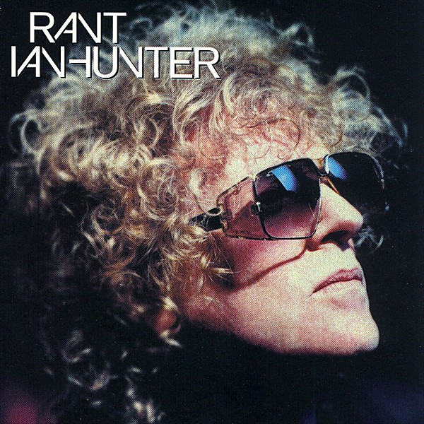

# Rant

By **Ian Hunter**

## Album Data

- **Catalog:** Beets
- **Format:** Digital, Album
- **Album:** Rant
- **Artist:** Ian Hunter
- **Albumartist:** Ian Hunter
- **Genre:** Rock
- **MusicBrainz Album Artist ID:** [09a67d90-b221-4d15-9bcf-707218108690](https://musicbrainz.org/artist/09a67d90-b221-4d15-9bcf-707218108690)
- **MusicBrainz Album ID:** [139e0e23-7699-4b2a-9b41-eb86bea20c47](https://musicbrainz.org/release/139e0e23-7699-4b2a-9b41-eb86bea20c47)
- **MusicBrainz Release Group ID:** [3f06548d-02a9-3164-8c7d-ecbf63be2f36](https://musicbrainz.org/release-group/3f06548d-02a9-3164-8c7d-ecbf63be2f36)
- **Year:** 2001
- **Catalog #:** 302 061 116 2
- **Label:** Fuel 2000 Records
- **Total Tracks:** 12

## Album Tracks

### Track 01 - Still Love Rock and Roll

- **Artist:** Ian Hunter
- **Format:** MP3
- **Genre:** Rock
- **Length:** 4:35
- **MusicBrainz Track ID:** [705c13c5-b274-4c34-a3d3-ce1ea978ad9f](https://musicbrainz.org/recording/705c13c5-b274-4c34-a3d3-ce1ea978ad9f)
- **Title:** Still Love Rock and Roll
- **Track:** 01
- **Year:** 2001

### Track 02 - Wash Us Away

- **Artist:** Ian Hunter
- **Format:** MP3
- **Genre:** Rock
- **Length:** 3:59
- **MusicBrainz Track ID:** [69b422c2-b7ef-41a1-aa13-a8e0b1a352e7](https://musicbrainz.org/recording/69b422c2-b7ef-41a1-aa13-a8e0b1a352e7)
- **Title:** Wash Us Away
- **Track:** 02
- **Year:** 2001

### Track 03 - Death of a Nation

- **Artist:** Ian Hunter
- **Format:** MP3
- **Genre:** Rock
- **Length:** 5:37
- **MusicBrainz Track ID:** [7e29fc20-2c7d-4a48-b2c4-64889f34eac3](https://musicbrainz.org/recording/7e29fc20-2c7d-4a48-b2c4-64889f34eac3)
- **Title:** Death of a Nation
- **Track:** 03
- **Year:** 2001

### Track 04 - Morons

- **Artist:** Ian Hunter
- **Format:** MP3
- **Genre:** Rock
- **Length:** 5:34
- **MusicBrainz Track ID:** [2961ba0e-c7d6-4ed2-af4b-bc0888bcbad8](https://musicbrainz.org/recording/2961ba0e-c7d6-4ed2-af4b-bc0888bcbad8)
- **Title:** Morons
- **Track:** 04
- **Year:** 2001

### Track 05 - Purgatory

- **Artist:** Ian Hunter
- **Format:** MP3
- **Genre:** Rock
- **Length:** 4:48
- **MusicBrainz Track ID:** [aac6e02e-b077-47c0-9f59-4949bce968bf](https://musicbrainz.org/recording/aac6e02e-b077-47c0-9f59-4949bce968bf)
- **Title:** Purgatory
- **Track:** 05
- **Year:** 2001

### Track 06 - American Spy

- **Artist:** Ian Hunter
- **Format:** MP3
- **Genre:** Rock
- **Length:** 4:32
- **MusicBrainz Track ID:** [680e685b-6963-4ffe-8a53-1522eb782e84](https://musicbrainz.org/recording/680e685b-6963-4ffe-8a53-1522eb782e84)
- **Title:** American Spy
- **Track:** 06
- **Year:** 2001

### Track 07 - Dead Man Walkin’ (East Enders)

- **Artist:** Ian Hunter
- **Format:** MP3
- **Genre:** Rock
- **Length:** 6:22
- **MusicBrainz Track ID:** [1427eede-6d5b-47f3-958e-5d499dc380c6](https://musicbrainz.org/recording/1427eede-6d5b-47f3-958e-5d499dc380c6)
- **Title:** Dead Man Walkin’ (East Enders)
- **Track:** 07
- **Year:** 2001

### Track 08 - Good Samaritan

- **Artist:** Ian Hunter
- **Format:** MP3
- **Genre:** Rock
- **Length:** 4:09
- **MusicBrainz Track ID:** [d4c61662-e61b-4fd6-a8f1-f980b0df9960](https://musicbrainz.org/recording/d4c61662-e61b-4fd6-a8f1-f980b0df9960)
- **Title:** Good Samaritan
- **Track:** 08
- **Year:** 2001

### Track 09 - Soap ’n’ Water

- **Artist:** Ian Hunter
- **Format:** MP3
- **Genre:** Rock
- **Length:** 5:20
- **MusicBrainz Track ID:** [9e558393-2f01-4084-a33f-36c59df74329](https://musicbrainz.org/recording/9e558393-2f01-4084-a33f-36c59df74329)
- **Title:** Soap ’n’ Water
- **Track:** 09
- **Year:** 2001

### Track 10 - Ripoff

- **Artist:** Ian Hunter
- **Format:** MP3
- **Genre:** Rock
- **Length:** 4:52
- **MusicBrainz Track ID:** [9f52e852-6623-4920-907e-6afa6d9fffb0](https://musicbrainz.org/recording/9f52e852-6623-4920-907e-6afa6d9fffb0)
- **Title:** Ripoff
- **Track:** 10
- **Year:** 2001

### Track 11 - Knees of My Heart

- **Artist:** Ian Hunter
- **Format:** MP3
- **Genre:** Rock
- **Length:** 3:37
- **MusicBrainz Track ID:** [3f03b520-096c-445f-b130-4add068b60bf](https://musicbrainz.org/recording/3f03b520-096c-445f-b130-4add068b60bf)
- **Title:** Knees of My Heart
- **Track:** 11
- **Year:** 2001

### Track 12 - No One

- **Artist:** Ian Hunter
- **Format:** MP3
- **Genre:** Rock
- **Length:** 3:35
- **MusicBrainz Track ID:** [19dca308-f957-4149-a946-d7b30c8b5691](https://musicbrainz.org/recording/19dca308-f957-4149-a946-d7b30c8b5691)
- **Title:** No One
- **Track:** 12
- **Year:** 2001

## See also

- [Roon: Ian Hunter - 30th Anniversary Edition](../../Roon/Ian_Hunter/Ian_Hunter_-_30th_Anniversary_Edition.md)
- [Roon: Rant](../../Roon/Ian_Hunter/Rant.md)
- [Roon: You're Never Alone with a Schizophrenic (Deluxe Version)](../../Roon/Ian_Hunter/Youre_Never_Alone_with_a_Schizophrenic_Deluxe_Version.md)
