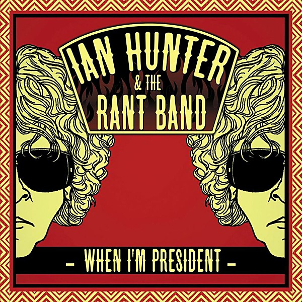

# When I'm President

By **Ian Hunter & The Rant Band**

## Album Data

- **Catalog:** Beets
- **Format:** Digital, Album
- **Album:** When I'm President
- **Artist:** Ian Hunter & The Rant Band
- **Albumartist:** Ian Hunter & The Rant Band
- **Genre:** Glam Rock
- **MusicBrainz Album Artist ID:** [1ec6f019-dfe2-4ae8-b1da-27d6195a1dce](https://musicbrainz.org/artist/1ec6f019-dfe2-4ae8-b1da-27d6195a1dce)
- **MusicBrainz Album ID:** [36212aef-2b6e-4337-8e9f-f1abb79c5304](https://musicbrainz.org/release/36212aef-2b6e-4337-8e9f-f1abb79c5304)
- **MusicBrainz Release Group ID:** [e791ea4a-cebc-4ca6-a6a6-e6cf3ae8bb1a](https://musicbrainz.org/release-group/e791ea4a-cebc-4ca6-a6a6-e6cf3ae8bb1a)
- **Year:** 2012
- **Catalog #:** THIN0054
- **Label:** Slimstyle Records
- **Total Tracks:** 11

## Album Tracks

### Track 01 - Comfortable (Flyin' Scotsman)

- **Artist:** Ian Hunter & The Rant Band
- **Format:** AAC
- **Genre:** Glam Rock
- **Length:** 3:02
- **MusicBrainz Track ID:** [2c370140-d172-4997-8625-d007a41a8d10](https://musicbrainz.org/recording/2c370140-d172-4997-8625-d007a41a8d10)
- **Title:** Comfortable (Flyin' Scotsman)
- **Track:** 01
- **Year:** 2012

### Track 02 - Fatally Flawed

- **Artist:** Ian Hunter & The Rant Band
- **Format:** AAC
- **Genre:** Glam Rock
- **Length:** 5:03
- **MusicBrainz Track ID:** [e2a65d54-9810-4cd8-916f-c3d15d1ff905](https://musicbrainz.org/recording/e2a65d54-9810-4cd8-916f-c3d15d1ff905)
- **Title:** Fatally Flawed
- **Track:** 02
- **Year:** 2012

### Track 03 - When I'm President

- **Artist:** Ian Hunter & The Rant Band
- **Format:** AAC
- **Genre:** Glam Rock
- **Length:** 4:21
- **MusicBrainz Track ID:** [1c078f50-9509-4254-a4d4-fb2b050c41fe](https://musicbrainz.org/recording/1c078f50-9509-4254-a4d4-fb2b050c41fe)
- **Title:** When I'm President
- **Track:** 03
- **Year:** 2012

### Track 04 - What For

- **Artist:** Ian Hunter & The Rant Band
- **Format:** AAC
- **Genre:** Glam Rock
- **Length:** 4:22
- **MusicBrainz Track ID:** [8d8c2d72-1242-4705-bfb7-85119fb07b61](https://musicbrainz.org/recording/8d8c2d72-1242-4705-bfb7-85119fb07b61)
- **Title:** What For
- **Track:** 04
- **Year:** 2012

### Track 05 - Black Tears

- **Artist:** Ian Hunter & The Rant Band
- **Format:** AAC
- **Genre:** Glam Rock
- **Length:** 3:37
- **MusicBrainz Track ID:** [40cabc57-67a3-479a-8fea-1608c25dc0fd](https://musicbrainz.org/recording/40cabc57-67a3-479a-8fea-1608c25dc0fd)
- **Title:** Black Tears
- **Track:** 05
- **Year:** 2012

### Track 06 - Saint

- **Artist:** Ian Hunter & The Rant Band
- **Format:** AAC
- **Genre:** Glam Rock
- **Length:** 3:35
- **MusicBrainz Track ID:** [6179ea37-e6fe-4c5f-af3b-9e0cf5300835](https://musicbrainz.org/recording/6179ea37-e6fe-4c5f-af3b-9e0cf5300835)
- **Title:** Saint
- **Track:** 06
- **Year:** 2012

### Track 07 - Just the Way You Look Tonight

- **Artist:** Ian Hunter & The Rant Band
- **Format:** AAC
- **Genre:** Glam Rock
- **Length:** 3:34
- **MusicBrainz Track ID:** [126a724c-30f3-4497-8cae-66ee8da3677b](https://musicbrainz.org/recording/126a724c-30f3-4497-8cae-66ee8da3677b)
- **Title:** Just the Way You Look Tonight
- **Track:** 07
- **Year:** 2012

### Track 08 - Wild Bunch

- **Artist:** Ian Hunter & The Rant Band
- **Format:** AAC
- **Genre:** Glam Rock
- **Length:** 3:54
- **MusicBrainz Track ID:** [23633993-b5cc-4035-9f9a-fae8814da018](https://musicbrainz.org/recording/23633993-b5cc-4035-9f9a-fae8814da018)
- **Title:** Wild Bunch
- **Track:** 08
- **Year:** 2012

### Track 09 - Ta Shunka Witco (Crazy Horse)

- **Artist:** Ian Hunter & The Rant Band
- **Format:** AAC
- **Genre:** Glam Rock
- **Length:** 5:47
- **MusicBrainz Track ID:** [29786592-f5b0-46b1-a2f8-7ab8cbd7ee4f](https://musicbrainz.org/recording/29786592-f5b0-46b1-a2f8-7ab8cbd7ee4f)
- **Title:** Ta Shunka Witco (Crazy Horse)
- **Track:** 09
- **Year:** 2012

### Track 10 - I Don't Know What You Want

- **Artist:** Ian Hunter & The Rant Band
- **Format:** AAC
- **Genre:** Glam Rock
- **Length:** 3:47
- **MusicBrainz Track ID:** [c59dc2b9-9795-4192-83d2-7a4fb940be31](https://musicbrainz.org/recording/c59dc2b9-9795-4192-83d2-7a4fb940be31)
- **Title:** I Don't Know What You Want
- **Track:** 10
- **Year:** 2012

### Track 11 - Life

- **Artist:** Ian Hunter & The Rant Band
- **Format:** AAC
- **Genre:** Glam Rock
- **Length:** 4:58
- **MusicBrainz Track ID:** [eff63ed9-1d07-4965-9d20-f6903f481615](https://musicbrainz.org/recording/eff63ed9-1d07-4965-9d20-f6903f481615)
- **Title:** Life
- **Track:** 11
- **Year:** 2012

