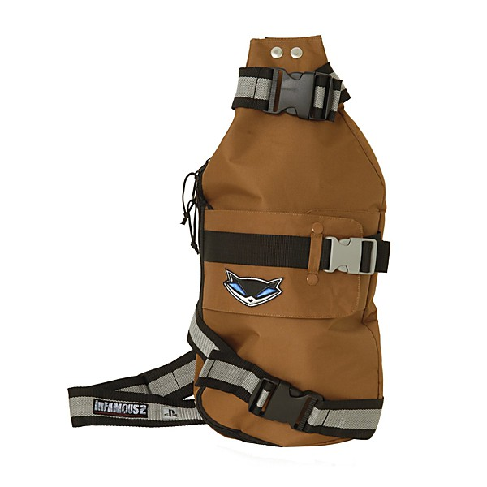

# Changing the Game

By **Infamous Syndicate**

## Album Data

- **Catalog:** Beets
- **Format:** Digital, Album
- **Album:** Changing the Game
- **Artist:** Infamous Syndicate
- **Albumartist:** Infamous Syndicate
- **Genre:** Unknown
- **MusicBrainz Album Artist ID:** [2a31a3db-0ee6-4f94-9f8b-7725250b0f96](https://musicbrainz.org/artist/2a31a3db-0ee6-4f94-9f8b-7725250b0f96)
- **MusicBrainz Album ID:** [7ddaa33b-c66d-4f73-8d7d-407ade94d440](https://musicbrainz.org/release/7ddaa33b-c66d-4f73-8d7d-407ade94d440)
- **MusicBrainz Release Group ID:** [c283da6b-a41e-3619-ba52-b916b4e10ef4](https://musicbrainz.org/release-group/c283da6b-a41e-3619-ba52-b916b4e10ef4)
- **Year:** 1999
- **Catalog #:** 
- **Label:** Relativity
- **Total Tracks:** 14

## Album Tracks

### Track 01 - Intro

- **Artist:** Infamous Syndicate
- **Format:** MP3
- **Genre:** Unknown
- **Length:** 0:29
- **MusicBrainz Track ID:** [07b19931-6514-4153-8415-91b5cc666256](https://musicbrainz.org/recording/07b19931-6514-4153-8415-91b5cc666256)
- **Title:** Intro
- **Track:** 01
- **Year:** 1999

### Track 02 - Here I Go

- **Artist:** Infamous Syndicate
- **Format:** MP3
- **Genre:** Unknown
- **Length:** 3:55
- **MusicBrainz Track ID:** [dcf6e479-4872-4f2a-9552-bfee1003319c](https://musicbrainz.org/recording/dcf6e479-4872-4f2a-9552-bfee1003319c)
- **Title:** Here I Go
- **Track:** 02
- **Year:** 1999

### Track 03 - Bouncer (skit)

- **Artist:** Infamous Syndicate
- **Format:** MP3
- **Genre:** Unknown
- **Length:** 0:49
- **MusicBrainz Track ID:** [ac11d63f-d51b-406e-9505-328806aca57c](https://musicbrainz.org/recording/ac11d63f-d51b-406e-9505-328806aca57c)
- **Title:** Bouncer (skit)
- **Track:** 03
- **Year:** 1999

### Track 04 - Hold It Down

- **Artist:** Infamous Syndicate
- **Format:** MP3
- **Genre:** Unknown
- **Length:** 4:12
- **MusicBrainz Track ID:** [4df40ebb-7281-4aca-8f79-7c85beb1116d](https://musicbrainz.org/recording/4df40ebb-7281-4aca-8f79-7c85beb1116d)
- **Title:** Hold It Down
- **Track:** 04
- **Year:** 1999

### Track 05 - I Gave You Me

- **Artist:** Infamous Syndicate
- **Format:** MP3
- **Genre:** Unknown
- **Length:** 4:57
- **MusicBrainz Track ID:** [b87f0693-9ba1-49d4-8d22-9a170faf02a3](https://musicbrainz.org/recording/b87f0693-9ba1-49d4-8d22-9a170faf02a3)
- **Title:** I Gave You Me
- **Track:** 05
- **Year:** 1999

### Track 06 - What You Do to Me (feat. Kanye West)

- **Artist:** Infamous Syndicate
- **Format:** MP3
- **Genre:** Unknown
- **Length:** 5:00
- **MusicBrainz Track ID:** [dff458ec-58c3-4d6f-9863-68004f7b88c9](https://musicbrainz.org/recording/dff458ec-58c3-4d6f-9863-68004f7b88c9)
- **Title:** What You Do to Me (feat. Kanye West)
- **Track:** 06
- **Year:** 1999

### Track 07 - What That Boy Like (feat. Big Nasty)

- **Artist:** Infamous Syndicate
- **Format:** MP3
- **Genre:** Unknown
- **Length:** 4:49
- **MusicBrainz Track ID:** [b85953e0-415a-4ace-9f01-8015cb9d1df1](https://musicbrainz.org/recording/b85953e0-415a-4ace-9f01-8015cb9d1df1)
- **Title:** What That Boy Like (feat. Big Nasty)
- **Track:** 07
- **Year:** 1999

### Track 08 - Clock Strikes (feat. Fatal)

- **Artist:** Infamous Syndicate
- **Format:** MP3
- **Genre:** Unknown
- **Length:** 4:18
- **MusicBrainz Track ID:** [64943596-fab6-4df7-8cc1-592b28560a2e](https://musicbrainz.org/recording/64943596-fab6-4df7-8cc1-592b28560a2e)
- **Title:** Clock Strikes (feat. Fatal)
- **Track:** 08
- **Year:** 1999

### Track 09 - West Side

- **Artist:** Infamous Syndicate
- **Format:** MP3
- **Genre:** Unknown
- **Length:** 3:36
- **MusicBrainz Track ID:** [b0aa014b-1a4a-4ac9-965d-6a78cd05806b](https://musicbrainz.org/recording/b0aa014b-1a4a-4ac9-965d-6a78cd05806b)
- **Title:** West Side
- **Track:** 09
- **Year:** 1999

### Track 10 - It's Alright

- **Artist:** Infamous Syndicate
- **Format:** MP3
- **Genre:** Unknown
- **Length:** 3:28
- **MusicBrainz Track ID:** [d71bf1a1-5f6b-4017-9637-07e9e27277aa](https://musicbrainz.org/recording/d71bf1a1-5f6b-4017-9637-07e9e27277aa)
- **Title:** It's Alright
- **Track:** 10
- **Year:** 1999

### Track 11 - You Are Falling Off (skit)

- **Artist:** Infamous Syndicate
- **Format:** MP3
- **Genre:** Unknown
- **Length:** 0:28
- **MusicBrainz Track ID:** [8abc4a9f-3b7b-4e45-b828-1b90f48ec43b](https://musicbrainz.org/recording/8abc4a9f-3b7b-4e45-b828-1b90f48ec43b)
- **Title:** You Are Falling Off (skit)
- **Track:** 11
- **Year:** 1999

### Track 12 - It's on You

- **Artist:** Infamous Syndicate
- **Format:** MP3
- **Genre:** Unknown
- **Length:** 3:58
- **MusicBrainz Track ID:** [43a069be-c9e7-4028-acb8-3219972646f6](https://musicbrainz.org/recording/43a069be-c9e7-4028-acb8-3219972646f6)
- **Title:** It's on You
- **Track:** 12
- **Year:** 1999

### Track 13 - City of Hustlas

- **Artist:** Infamous Syndicate
- **Format:** MP3
- **Genre:** Unknown
- **Length:** 5:48
- **MusicBrainz Track ID:** [41db5d79-ad9c-48b9-86e3-6e630dfbf440](https://musicbrainz.org/recording/41db5d79-ad9c-48b9-86e3-6e630dfbf440)
- **Title:** City of Hustlas
- **Track:** 13
- **Year:** 1999

### Track 14 - Jenny Jonez

- **Artist:** Infamous Syndicate
- **Format:** MP3
- **Genre:** Unknown
- **Length:** 3:59
- **MusicBrainz Track ID:** [b9f8844d-e9ba-491d-a5b3-3e5e2d1cef0d](https://musicbrainz.org/recording/b9f8844d-e9ba-491d-a5b3-3e5e2d1cef0d)
- **Title:** Jenny Jonez
- **Track:** 14
- **Year:** 1999

