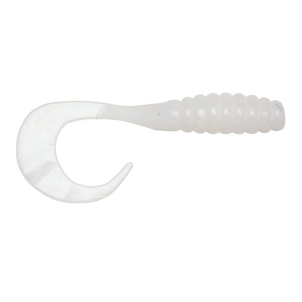

# Helpless White Grub

By **Infested**

## Album Data

- **Catalog:** Beets
- **Format:** Digital, Album
- **Album:** Helpless White Grub
- **Artist:** Infested
- **Albumartist:** Infested
- **Genre:** Technical Death Metal
- **MusicBrainz Album Artist ID:** 
- **MusicBrainz Album ID:** 
- **MusicBrainz Release Group ID:** 
- **Year:** 0000
- **Catalog #:** 
- **Label:** 
- **Total Tracks:** 10

## Album Tracks

### Track 01 - Pain Is Red

- **Artist:** Infested
- **Format:** ALAC
- **Genre:** Technical Death Metal
- **Length:** 2:45
- **MusicBrainz Track ID:** 
- **Title:** Pain Is Red
- **Track:** 01
- **Year:** 0000

### Track 02 - Helpless White Grub

- **Artist:** Infested
- **Format:** ALAC
- **Genre:** Technical Death Metal
- **Length:** 3:02
- **MusicBrainz Track ID:** 
- **Title:** Helpless White Grub
- **Track:** 02
- **Year:** 0000

### Track 03 - Who They Are

- **Artist:** Infested
- **Format:** ALAC
- **Genre:** Technical Death Metal
- **Length:** 3:22
- **MusicBrainz Track ID:** 
- **Title:** Who They Are
- **Track:** 03
- **Year:** 0000

### Track 04 - Ant Orgy

- **Artist:** Infested
- **Format:** ALAC
- **Genre:** Technical Death Metal
- **Length:** 4:12
- **MusicBrainz Track ID:** 
- **Title:** Ant Orgy
- **Track:** 04
- **Year:** 0000

### Track 05 - Dogman

- **Artist:** Infested
- **Format:** ALAC
- **Genre:** Technical Death Metal
- **Length:** 3:15
- **MusicBrainz Track ID:** 
- **Title:** Dogman
- **Track:** 05
- **Year:** 0000

### Track 06 - See The Effect

- **Artist:** Infested
- **Format:** ALAC
- **Genre:** Technical Death Metal
- **Length:** 3:29
- **MusicBrainz Track ID:** 
- **Title:** See The Effect
- **Track:** 06
- **Year:** 0000

### Track 07 - In The Catacombs

- **Artist:** Infested
- **Format:** ALAC
- **Genre:** Technical Death Metal
- **Length:** 5:55
- **MusicBrainz Track ID:** 
- **Title:** In The Catacombs
- **Track:** 07
- **Year:** 0000

### Track 08 - Saltlick

- **Artist:** Infested
- **Format:** ALAC
- **Genre:** Technical Death Metal
- **Length:** 3:26
- **MusicBrainz Track ID:** 
- **Title:** Saltlick
- **Track:** 08
- **Year:** 0000

### Track 09 - He's Owning

- **Artist:** Infested
- **Format:** ALAC
- **Genre:** Technical Death Metal
- **Length:** 3:11
- **MusicBrainz Track ID:** 
- **Title:** He's Owning
- **Track:** 09
- **Year:** 0000

### Track 10 - Swollen

- **Artist:** Infested
- **Format:** ALAC
- **Genre:** Technical Death Metal
- **Length:** 1:08
- **MusicBrainz Track ID:** 
- **Title:** Swollen
- **Track:** 10
- **Year:** 0000

