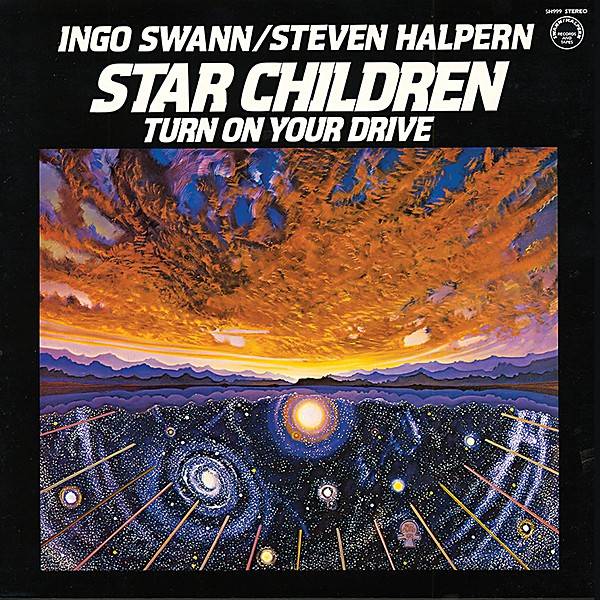

# Star Children

By **Ingo Swann and Steven Halpern**

## Album Data

- **Catalog:** Beets
- **Format:** Digital, Album
- **Album:** Star Children
- **Artist:** Ingo Swann And Steven Halpern
- **Albumartist:** Ingo Swann and Steven Halpern
- **Genre:** Unknown
- **MusicBrainz Album Artist ID:** 
- **MusicBrainz Album ID:** 
- **MusicBrainz Release Group ID:** 
- **Year:** 0000
- **Catalog #:** 
- **Label:** 
- **Total Tracks:** 00

## Album Tracks

### Track 00 - 01-First Movement - Supergalaxy

- **Artist:** Ingo Swann and Steven Halpern
- **Format:** ALAC
- **Genre:** Unknown
- **Length:** 6:04
- **MusicBrainz Track ID:** 
- **Title:** 01-First Movement - Supergalaxy
- **Track:** 00
- **Year:** 0000

### Track 00 - 02-Interlude - Between the Stars

- **Artist:** Ingo Swann and Steven Halpern
- **Format:** ALAC
- **Genre:** Unknown
- **Length:** 3:13
- **MusicBrainz Track ID:** 
- **Title:** 02-Interlude - Between the Stars
- **Track:** 00
- **Year:** 0000

### Track 00 - 03-Second Movement - Catch Life Again

- **Artist:** Ingo Swann and Steven Halpern
- **Format:** ALAC
- **Genre:** Unknown
- **Length:** 4:48
- **MusicBrainz Track ID:** 
- **Title:** 03-Second Movement - Catch Life Again
- **Track:** 00
- **Year:** 0000

### Track 00 - 04-Interlude - Non-mechanical Reality

- **Artist:** Ingo Swann and Steven Halpern
- **Format:** ALAC
- **Genre:** Unknown
- **Length:** 3:08
- **MusicBrainz Track ID:** 
- **Title:** 04-Interlude - Non-mechanical Reality
- **Track:** 00
- **Year:** 0000

### Track 00 - 05-Third Movement - The Psychic Starship

- **Artist:** Ingo Swann and Steven Halpern
- **Format:** ALAC
- **Genre:** Unknown
- **Length:** 6:54
- **MusicBrainz Track ID:** 
- **Title:** 05-Third Movement - The Psychic Starship
- **Track:** 00
- **Year:** 0000

### Track 00 - 06-Interlude - At the Heart of the Universe

- **Artist:** Ingo Swann and Steven Halpern
- **Format:** ALAC
- **Genre:** Unknown
- **Length:** 4:42
- **MusicBrainz Track ID:** 
- **Title:** 06-Interlude - At the Heart of the Universe
- **Track:** 00
- **Year:** 0000

### Track 00 - 07-Fourth Movement - Star Fire

- **Artist:** Ingo Swann and Steven Halpern
- **Format:** ALAC
- **Genre:** Unknown
- **Length:** 8:43
- **MusicBrainz Track ID:** 
- **Title:** 07-Fourth Movement - Star Fire
- **Track:** 00
- **Year:** 0000

