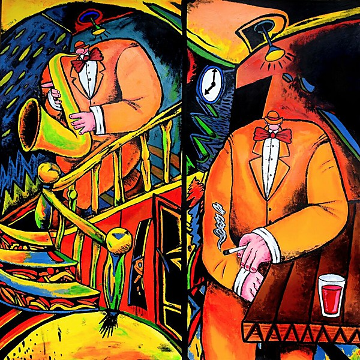

# It’s a Beautiful Day

By **It’s a Beautiful Day**

## Album Data

- **Catalog:** Beets
- **Format:** Digital, Album
- **Album:** It’s a Beautiful Day
- **Artist:** It’s A Beautiful Day
- **Albumartist:** It’s a Beautiful Day
- **Genre:** Rock
- **MusicBrainz Album Artist ID:** [2759051a-b7e2-4a10-8201-e036a10e5a63](https://musicbrainz.org/artist/2759051a-b7e2-4a10-8201-e036a10e5a63)
- **MusicBrainz Album ID:** [23942a38-6041-3b01-99a0-9d099d3f1f33](https://musicbrainz.org/release/23942a38-6041-3b01-99a0-9d099d3f1f33)
- **MusicBrainz Release Group ID:** [80a35034-1779-3a40-85a9-af7d9acc5cd0](https://musicbrainz.org/release-group/80a35034-1779-3a40-85a9-af7d9acc5cd0)
- **Year:** 2001
- **Catalog #:** SFS 11790
- **Label:** San Francisco Sound
- **Total Tracks:** 07

## Album Tracks

### Track 01 - White Bird

- **Artist:** It’s a Beautiful Day
- **Format:** AAC
- **Genre:** Rock
- **Length:** 6:08
- **MusicBrainz Track ID:** [1a8208a7-be54-44b4-bc82-51f410fb04a3](https://musicbrainz.org/recording/1a8208a7-be54-44b4-bc82-51f410fb04a3)
- **Title:** White Bird
- **Track:** 01
- **Year:** 2001

### Track 02 - Hot Summer Day

- **Artist:** It’s a Beautiful Day
- **Format:** AAC
- **Genre:** Rock
- **Length:** 5:47
- **MusicBrainz Track ID:** [5b052fa3-7031-4d0b-a818-11fd8c6e6cba](https://musicbrainz.org/recording/5b052fa3-7031-4d0b-a818-11fd8c6e6cba)
- **Title:** Hot Summer Day
- **Track:** 02
- **Year:** 2001

### Track 03 - Wasted Union Blues

- **Artist:** It’s a Beautiful Day
- **Format:** AAC
- **Genre:** Rock
- **Length:** 4:05
- **MusicBrainz Track ID:** [c7c2b000-d366-43d0-9d3e-55636acd1595](https://musicbrainz.org/recording/c7c2b000-d366-43d0-9d3e-55636acd1595)
- **Title:** Wasted Union Blues
- **Track:** 03
- **Year:** 2001

### Track 04 - Girl With No Eyes

- **Artist:** It’s a Beautiful Day
- **Format:** AAC
- **Genre:** Rock
- **Length:** 3:48
- **MusicBrainz Track ID:** [fc51f248-88fb-4c80-96e6-154b2ac33ac4](https://musicbrainz.org/recording/fc51f248-88fb-4c80-96e6-154b2ac33ac4)
- **Title:** Girl With No Eyes
- **Track:** 04
- **Year:** 2001

### Track 05 - Bombay Calling

- **Artist:** It’s a Beautiful Day
- **Format:** AAC
- **Genre:** Rock
- **Length:** 4:30
- **MusicBrainz Track ID:** [be70e76a-5ea6-44b9-a4e5-7e42cc7bae6e](https://musicbrainz.org/recording/be70e76a-5ea6-44b9-a4e5-7e42cc7bae6e)
- **Title:** Bombay Calling
- **Track:** 05
- **Year:** 2001

### Track 06 - Bulgaria

- **Artist:** It’s a Beautiful Day
- **Format:** AAC
- **Genre:** Rock
- **Length:** 6:13
- **MusicBrainz Track ID:** [439f5fd4-de2a-4fc6-bbe9-b0482d10e2cb](https://musicbrainz.org/recording/439f5fd4-de2a-4fc6-bbe9-b0482d10e2cb)
- **Title:** Bulgaria
- **Track:** 06
- **Year:** 2001

### Track 07 - Time Is

- **Artist:** It’s a Beautiful Day
- **Format:** AAC
- **Genre:** Rock
- **Length:** 9:34
- **MusicBrainz Track ID:** [6585a056-08ac-4893-9c59-f59d0a43ff2f](https://musicbrainz.org/recording/6585a056-08ac-4893-9c59-f59d0a43ff2f)
- **Title:** Time Is
- **Track:** 07
- **Year:** 2001

