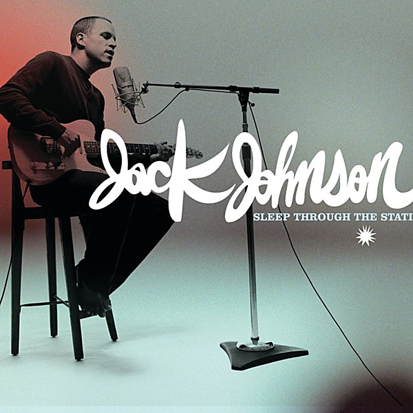

# Sleep Through the Static

By **Jack Johnson**

## Album Data

- **Catalog:** Beets
- **Format:** Digital, Album
- **Album:** Sleep Through the Static
- **Artist:** Jack Johnson
- **Albumartist:** Jack Johnson
- **Genre:** Rock
- **MusicBrainz Album Artist ID:** 
- **MusicBrainz Album ID:** 
- **MusicBrainz Release Group ID:** 
- **Year:** 0000
- **Catalog #:** 422 860 994-2
- **Label:** Everloving Records
- **Total Tracks:** 13

## Album Tracks

### Track 01 - Inaudible Melodies

- **Artist:** Jack Johnson
- **Format:** ALAC
- **Genre:** Rock
- **Length:** 3:35
- **MusicBrainz Track ID:** [a82556c3-d31a-4094-ad73-db154e486b85](https://musicbrainz.org/recording/a82556c3-d31a-4094-ad73-db154e486b85)
- **Title:** Inaudible Melodies
- **Track:** 01
- **Year:** 2000

### Track 02 - Middle Man

- **Artist:** Jack Johnson
- **Format:** ALAC
- **Genre:** Rock
- **Length:** 3:14
- **MusicBrainz Track ID:** [4fe04c9b-dd32-4ef6-8b3d-c52cce245c0b](https://musicbrainz.org/recording/4fe04c9b-dd32-4ef6-8b3d-c52cce245c0b)
- **Title:** Middle Man
- **Track:** 02
- **Year:** 2000

### Track 03 - Posters

- **Artist:** Jack Johnson
- **Format:** ALAC
- **Genre:** Rock
- **Length:** 3:13
- **MusicBrainz Track ID:** [583208ef-df11-45be-8bc5-33a5aca20a67](https://musicbrainz.org/recording/583208ef-df11-45be-8bc5-33a5aca20a67)
- **Title:** Posters
- **Track:** 03
- **Year:** 2000

### Track 04 - Sexy Plexi

- **Artist:** Jack Johnson
- **Format:** ALAC
- **Genre:** Rock
- **Length:** 2:07
- **MusicBrainz Track ID:** [3b73686b-353a-4afa-a565-1e82c3c9a6c4](https://musicbrainz.org/recording/3b73686b-353a-4afa-a565-1e82c3c9a6c4)
- **Title:** Sexy Plexi
- **Track:** 04
- **Year:** 2000

### Track 05 - Flake

- **Artist:** Jack Johnson
- **Format:** ALAC
- **Genre:** Rock
- **Length:** 4:40
- **MusicBrainz Track ID:** [1c51ff2d-3a11-477e-afb9-5b115af35a1f](https://musicbrainz.org/recording/1c51ff2d-3a11-477e-afb9-5b115af35a1f)
- **Title:** Flake
- **Track:** 05
- **Year:** 2000

### Track 06 - Bubble Toes

- **Artist:** Jack Johnson
- **Format:** ALAC
- **Genre:** Rock
- **Length:** 3:56
- **MusicBrainz Track ID:** [c29b752c-7b77-49a5-911e-91e420365d2f](https://musicbrainz.org/recording/c29b752c-7b77-49a5-911e-91e420365d2f)
- **Title:** Bubble Toes
- **Track:** 06
- **Year:** 2000

### Track 07 - Fortunate Fool

- **Artist:** Jack Johnson
- **Format:** ALAC
- **Genre:** Rock
- **Length:** 3:48
- **MusicBrainz Track ID:** [40a8f101-e80d-466b-9c50-756d5896af0c](https://musicbrainz.org/recording/40a8f101-e80d-466b-9c50-756d5896af0c)
- **Title:** Fortunate Fool
- **Track:** 07
- **Year:** 2000

### Track 08 - The News

- **Artist:** Jack Johnson
- **Format:** ALAC
- **Genre:** Rock
- **Length:** 2:26
- **MusicBrainz Track ID:** [5159bd0c-c2b7-4a1d-b3a5-1ba3b7b3d7a1](https://musicbrainz.org/recording/5159bd0c-c2b7-4a1d-b3a5-1ba3b7b3d7a1)
- **Title:** The News
- **Track:** 08
- **Year:** 2000

### Track 09 - Drink the Water

- **Artist:** Jack Johnson
- **Format:** ALAC
- **Genre:** Rock
- **Length:** 3:21
- **MusicBrainz Track ID:** [e3adcd5b-c3ff-4860-bcde-9e92ef0967ad](https://musicbrainz.org/recording/e3adcd5b-c3ff-4860-bcde-9e92ef0967ad)
- **Title:** Drink the Water
- **Track:** 09
- **Year:** 2000

### Track 10 - Mudfootball (For Moe Lerner)

- **Artist:** Jack Johnson
- **Format:** ALAC
- **Genre:** Rock
- **Length:** 3:03
- **MusicBrainz Track ID:** [8e45b5b0-cd1e-47ec-b51f-7606c0e015f9](https://musicbrainz.org/recording/8e45b5b0-cd1e-47ec-b51f-7606c0e015f9)
- **Title:** Mudfootball (For Moe Lerner)
- **Track:** 10
- **Year:** 2000

### Track 11 - F-Stop Blues

- **Artist:** Jack Johnson
- **Format:** ALAC
- **Genre:** Rock
- **Length:** 3:10
- **MusicBrainz Track ID:** [bb50867a-e2aa-412b-b38f-07203e6dc203](https://musicbrainz.org/recording/bb50867a-e2aa-412b-b38f-07203e6dc203)
- **Title:** F-Stop Blues
- **Track:** 11
- **Year:** 2000

### Track 12 - Losing Hope

- **Artist:** Jack Johnson
- **Format:** ALAC
- **Genre:** Rock
- **Length:** 3:52
- **MusicBrainz Track ID:** [6c12f8d5-6a49-4c0b-ae29-8a0afe1e9114](https://musicbrainz.org/recording/6c12f8d5-6a49-4c0b-ae29-8a0afe1e9114)
- **Title:** Losing Hope
- **Track:** 12
- **Year:** 2000

### Track 13 - It's All Understood

- **Artist:** Jack Johnson
- **Format:** ALAC
- **Genre:** Rock
- **Length:** 5:28
- **MusicBrainz Track ID:** [b4dbe4e0-55a0-42ee-abbc-02acb8e401b1](https://musicbrainz.org/recording/b4dbe4e0-55a0-42ee-abbc-02acb8e401b1)
- **Title:** It's All Understood
- **Track:** 13
- **Year:** 2000

## See also

- [Brushfire Fairytales](Brushfire_Fairytales.md)
- [From Here to Now to You](From_Here_to_Now_to_You.md)
- [Roon: Brushfire Fairytales (Remastered (Bonus Version))](../../Roon/Jack_Johnson/Brushfire_Fairytales_Remastered_Bonus_Version.md)
- [Roon: In Between Dreams](../../Roon/Jack_Johnson/In_Between_Dreams.md)
