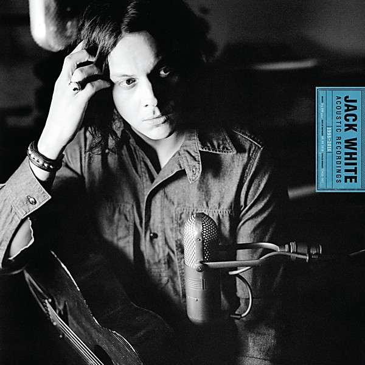

# Acoustic Recordings 1998–2016

By **Jack White**

## Album Data

- **Catalog:** Beets
- **Format:** Digital, Album
- **Album:** Acoustic Recordings 1998–2016
- **Artist:** Jack White
- **Albumartist:** Jack White
- **Genre:** Indie Rock
- **MusicBrainz Album Artist ID:** [3ae2fb37-8a23-429d-9920-bac811c4fc22](https://musicbrainz.org/artist/3ae2fb37-8a23-429d-9920-bac811c4fc22)
- **MusicBrainz Album ID:** [1c4dbd2d-efb6-4a90-886b-c6c26de3f466](https://musicbrainz.org/release/1c4dbd2d-efb6-4a90-886b-c6c26de3f466)
- **MusicBrainz Release Group ID:** [d733d9b8-d5ea-4227-8629-5d7184f8f6ab](https://musicbrainz.org/release-group/d733d9b8-d5ea-4227-8629-5d7184f8f6ab)
- **Year:** 2016
- **Catalog #:** 
- **Label:** Third Man Records
- **Total Tracks:** 13

## Album Tracks

### Track 01 - Missing Pieces

- **Artist:** Jack White
- **Format:** AAC
- **Genre:** Garage Rock
- **Length:** 3:26
- **MusicBrainz Track ID:** [abdc74ce-db96-434b-b15f-3ebb33810ea7](https://musicbrainz.org/recording/abdc74ce-db96-434b-b15f-3ebb33810ea7)
- **Title:** Missing Pieces
- **Track:** 01
- **Year:** 2012

### Track 02 - Sixteen Saltines

- **Artist:** Jack White
- **Format:** AAC
- **Genre:** Indie Rock
- **Length:** 2:37
- **MusicBrainz Track ID:** [85080888-12ba-4e95-8431-92e48991684e](https://musicbrainz.org/recording/85080888-12ba-4e95-8431-92e48991684e)
- **Title:** Sixteen Saltines
- **Track:** 02
- **Year:** 2012

### Track 03 - Freedom at 21

- **Artist:** Jack White
- **Format:** AAC
- **Genre:** Indie Rock
- **Length:** 2:51
- **MusicBrainz Track ID:** [dd1e81ad-bc57-4ca0-b9de-6fcd4426087b](https://musicbrainz.org/recording/dd1e81ad-bc57-4ca0-b9de-6fcd4426087b)
- **Title:** Freedom at 21
- **Track:** 03
- **Year:** 2012

### Track 04 - Love Interruption

- **Artist:** Jack White
- **Format:** AAC
- **Genre:** Indie Rock
- **Length:** 2:36
- **MusicBrainz Track ID:** [1ba99c41-e43c-472b-891d-f72cf1b48b49](https://musicbrainz.org/recording/1ba99c41-e43c-472b-891d-f72cf1b48b49)
- **Title:** Love Interruption
- **Track:** 04
- **Year:** 2012

### Track 05 - Blunderbuss

- **Artist:** Jack White
- **Format:** AAC
- **Genre:** Alternative Rock
- **Length:** 3:06
- **MusicBrainz Track ID:** [c37b16c6-0b0c-42f8-8aa0-636f04984c26](https://musicbrainz.org/recording/c37b16c6-0b0c-42f8-8aa0-636f04984c26)
- **Title:** Blunderbuss
- **Track:** 05
- **Year:** 2012

### Track 06 - Hypocritical Kiss

- **Artist:** Jack White
- **Format:** AAC
- **Genre:** Indie Rock
- **Length:** 2:50
- **MusicBrainz Track ID:** [0d8dda28-feef-4555-bec1-e3150470bc7a](https://musicbrainz.org/recording/0d8dda28-feef-4555-bec1-e3150470bc7a)
- **Title:** Hypocritical Kiss
- **Track:** 06
- **Year:** 2012

### Track 07 - Weep Themselves to Sleep

- **Artist:** Jack White
- **Format:** AAC
- **Genre:** Indie Rock
- **Length:** 4:19
- **MusicBrainz Track ID:** [09bf527b-976c-42bf-ad5f-ca4f8742705d](https://musicbrainz.org/recording/09bf527b-976c-42bf-ad5f-ca4f8742705d)
- **Title:** Weep Themselves to Sleep
- **Track:** 07
- **Year:** 2012

### Track 08 - I'm Shakin'

- **Artist:** Jack White
- **Format:** AAC
- **Genre:** Indie Rock
- **Length:** 3:00
- **MusicBrainz Track ID:** [f602e84c-4236-43d4-a1a9-589a12d939ec](https://musicbrainz.org/recording/f602e84c-4236-43d4-a1a9-589a12d939ec)
- **Title:** I'm Shakin'
- **Track:** 08
- **Year:** 2012

### Track 09 - Trash Tongue Talker

- **Artist:** Jack White
- **Format:** AAC
- **Genre:** Southern Rock
- **Length:** 3:20
- **MusicBrainz Track ID:** [2388d4bc-0968-4243-b2c1-8ea62fdb59b0](https://musicbrainz.org/recording/2388d4bc-0968-4243-b2c1-8ea62fdb59b0)
- **Title:** Trash Tongue Talker
- **Track:** 09
- **Year:** 2012

### Track 10 - Hip (Eponymous) Poor Boy

- **Artist:** Jack White
- **Format:** AAC
- **Genre:** Rock
- **Length:** 3:03
- **MusicBrainz Track ID:** [a6c28c10-3e1e-4687-9c50-bb79cbe52424](https://musicbrainz.org/recording/a6c28c10-3e1e-4687-9c50-bb79cbe52424)
- **Title:** Hip (Eponymous) Poor Boy
- **Track:** 10
- **Year:** 2012

### Track 11 - I Guess I Should Go to Sleep

- **Artist:** Jack White
- **Format:** AAC
- **Genre:** Indie Rock
- **Length:** 2:37
- **MusicBrainz Track ID:** [36674655-9c4e-40d8-bcf8-edb045b83d0d](https://musicbrainz.org/recording/36674655-9c4e-40d8-bcf8-edb045b83d0d)
- **Title:** I Guess I Should Go to Sleep
- **Track:** 11
- **Year:** 2012

### Track 12 - On and on and On

- **Artist:** Jack White
- **Format:** AAC
- **Genre:** Garage Rock
- **Length:** 3:55
- **MusicBrainz Track ID:** [19084a0d-5a62-462c-ba14-9a11a20e3f5c](https://musicbrainz.org/recording/19084a0d-5a62-462c-ba14-9a11a20e3f5c)
- **Title:** On and on and On
- **Track:** 12
- **Year:** 2012

### Track 13 - Take Me With You When You Go

- **Artist:** Jack White
- **Format:** AAC
- **Genre:** Garage Rock
- **Length:** 4:08
- **MusicBrainz Track ID:** [7b2c5c0f-7ded-4f4a-8ff9-2d144a3f9f73](https://musicbrainz.org/recording/7b2c5c0f-7ded-4f4a-8ff9-2d144a3f9f73)
- **Title:** Take Me With You When You Go
- **Track:** 13
- **Year:** 2012

## See also

- [Blunderbuss](Blunderbuss.md)
- [Bonnaroo 2014](Bonnaroo_2014.md)
- [Lazaretto](Lazaretto.md)
- [CD: Blunderbuss](../../CD/Jack_White/Blunderbuss.md)
- [CD: ](../../CD/Jack_White/Jack_White.md)
- [Roon: Blunderbuss](../../Roon/Jack_White/Blunderbuss.md)
- [Roon: Fear Of The Dawn](../../Roon/Jack_White/Fear_Of_The_Dawn.md)
- [Roon: Jack White Acoustic Recordings 1998 - 2016](../../Roon/Jack_White/Jack_White_Acoustic_Recordings_1998_-_2016.md)
- [Roon: Lazaretto](../../Roon/Jack_White/Lazaretto.md)
- [Vinyl: Acoustic Recordings 1998-2016](../../Vinyl/Jack_White/Acoustic_Recordings_1998-2016.md)
- [Vinyl: ](../../Vinyl/Jack_White/Jack_White.md)
- [Vinyl: Lazaretto](../../Vinyl/Jack_White/Lazaretto.md)
