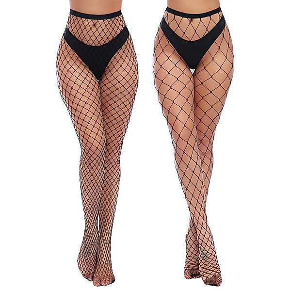

# Bonnaroo 2014

By **Jack White**

## Album Data

- **Catalog:** Beets
- **Format:** Digital, Album
- **Album:** Bonnaroo 2014
- **Artist:** Jack White
- **Albumartist:** Jack White
- **Genre:** Indie Rock
- **MusicBrainz Album Artist ID:** 
- **MusicBrainz Album ID:** 
- **MusicBrainz Release Group ID:** 
- **Year:** 2014
- **Catalog #:** 
- **Label:** Columbia
- **Total Tracks:** 26

## Album Tracks

### Track 16 - Top Yourself (bluegrass version)

- **Artist:** The Raconteurs
- **Format:** MP3
- **Genre:** Blues
- **Length:** 4:36
- **MusicBrainz Track ID:** [7d65789b-03cd-49fb-b4dc-ee7e4eaa47ac](https://musicbrainz.org/recording/7d65789b-03cd-49fb-b4dc-ee7e4eaa47ac)
- **Title:** Top Yourself (bluegrass version)
- **Track:** 16
- **Year:** 2016

### Track 17 - Carolina Drama (acoustic mix)

- **Artist:** The Raconteurs
- **Format:** MP3
- **Genre:** Indie Rock
- **Length:** 5:52
- **MusicBrainz Track ID:** [cbc69e6a-5e58-4df7-ac91-d0dd39a031e6](https://musicbrainz.org/recording/cbc69e6a-5e58-4df7-ac91-d0dd39a031e6)
- **Title:** Carolina Drama (acoustic mix)
- **Track:** 17
- **Year:** 2016

### Track 01 - Sugar Never Tasted So Good

- **Artist:** The White Stripes
- **Format:** MP3
- **Genre:** Indie Rock
- **Length:** 2:55
- **MusicBrainz Track ID:** [0f9648ce-2be4-4949-aa82-9635a9af9c8f](https://musicbrainz.org/recording/0f9648ce-2be4-4949-aa82-9635a9af9c8f)
- **Title:** Sugar Never Tasted So Good
- **Track:** 01
- **Year:** 2016

### Track 02 - Apple Blossom (remixed)

- **Artist:** The White Stripes
- **Format:** MP3
- **Genre:** Garage Rock
- **Length:** 2:13
- **MusicBrainz Track ID:** [58415b12-8e5c-436e-bfa2-04d9c4f8ff86](https://musicbrainz.org/recording/58415b12-8e5c-436e-bfa2-04d9c4f8ff86)
- **Title:** Apple Blossom (remixed)
- **Track:** 02
- **Year:** 2016

### Track 03 - I’m Bound to Pack It Up (remixed)

- **Artist:** The White Stripes
- **Format:** MP3
- **Genre:** Indie Rock
- **Length:** 3:08
- **MusicBrainz Track ID:** [930c1500-33be-4758-98ab-8b8f67d182fd](https://musicbrainz.org/recording/930c1500-33be-4758-98ab-8b8f67d182fd)
- **Title:** I’m Bound to Pack It Up (remixed)
- **Track:** 03
- **Year:** 2016

### Track 04 - Hotel Yorba

- **Artist:** The White Stripes
- **Format:** MP3
- **Genre:** Indie Rock
- **Length:** 2:10
- **MusicBrainz Track ID:** [1eadd3de-044f-4901-8c0e-3ff4f944e197](https://musicbrainz.org/recording/1eadd3de-044f-4901-8c0e-3ff4f944e197)
- **Title:** Hotel Yorba
- **Track:** 04
- **Year:** 2016

### Track 05 - We’re Going to Be Friends

- **Artist:** The White Stripes
- **Format:** MP3
- **Genre:** Garage Rock
- **Length:** 2:21
- **MusicBrainz Track ID:** [0dcd21fc-fbd6-415f-a2f3-69c1bad432ab](https://musicbrainz.org/recording/0dcd21fc-fbd6-415f-a2f3-69c1bad432ab)
- **Title:** We’re Going to Be Friends
- **Track:** 05
- **Year:** 2016

### Track 06 - You’ve Got Her in Your Pocket

- **Artist:** The White Stripes
- **Format:** MP3
- **Genre:** Progressive Rock
- **Length:** 3:39
- **MusicBrainz Track ID:** [53081db0-d8ed-49fe-97f6-a1bdae8721ea](https://musicbrainz.org/recording/53081db0-d8ed-49fe-97f6-a1bdae8721ea)
- **Title:** You’ve Got Her in Your Pocket
- **Track:** 06
- **Year:** 2016

### Track 07 - Well It’s True That We Love One Another

- **Artist:** The White Stripes
- **Format:** MP3
- **Genre:** Indie Rock
- **Length:** 2:39
- **MusicBrainz Track ID:** [ab7e7735-2021-48bc-b943-568a8e216a2a](https://musicbrainz.org/recording/ab7e7735-2021-48bc-b943-568a8e216a2a)
- **Title:** Well It’s True That We Love One Another
- **Track:** 07
- **Year:** 2016

### Track 09 - Forever for Her (Is Over for Me)

- **Artist:** The White Stripes
- **Format:** MP3
- **Genre:** Indie Rock
- **Length:** 3:16
- **MusicBrainz Track ID:** [346826e2-86ee-42e3-901d-583d978cc85f](https://musicbrainz.org/recording/346826e2-86ee-42e3-901d-583d978cc85f)
- **Title:** Forever for Her (Is Over for Me)
- **Track:** 09
- **Year:** 2016

### Track 10 - White Moon

- **Artist:** The White Stripes
- **Format:** MP3
- **Genre:** Indie Rock
- **Length:** 4:01
- **MusicBrainz Track ID:** [0b748ec8-4953-4371-a48e-96b7eda9d730](https://musicbrainz.org/recording/0b748ec8-4953-4371-a48e-96b7eda9d730)
- **Title:** White Moon
- **Track:** 10
- **Year:** 2016

### Track 11 - As Ugly as I Seem

- **Artist:** The White Stripes
- **Format:** MP3
- **Genre:** Indie Rock
- **Length:** 4:10
- **MusicBrainz Track ID:** [17121abb-3460-4370-b101-ac0a03c76a47](https://musicbrainz.org/recording/17121abb-3460-4370-b101-ac0a03c76a47)
- **Title:** As Ugly as I Seem
- **Track:** 11
- **Year:** 2016

### Track 12 - City Lights

- **Artist:** The White Stripes
- **Format:** MP3
- **Genre:** Indie Rock
- **Length:** 4:50
- **MusicBrainz Track ID:** [9fb5c8d2-64d5-4788-a4ef-b530d5d64926](https://musicbrainz.org/recording/9fb5c8d2-64d5-4788-a4ef-b530d5d64926)
- **Title:** City Lights
- **Track:** 12
- **Year:** 2016

### Track 13 - Honey, We Can’t Afford to Look This Cheap

- **Artist:** The White Stripes
- **Format:** MP3
- **Genre:** Indie Rock
- **Length:** 3:55
- **MusicBrainz Track ID:** [7fb2abae-45da-4a6d-b924-7ea547caf6d1](https://musicbrainz.org/recording/7fb2abae-45da-4a6d-b924-7ea547caf6d1)
- **Title:** Honey, We Can’t Afford to Look This Cheap
- **Track:** 13
- **Year:** 2016

### Track 14 - Effect and Cause

- **Artist:** The White Stripes
- **Format:** MP3
- **Genre:** Indie Rock
- **Length:** 3:00
- **MusicBrainz Track ID:** [180bad2c-0119-4fb0-9686-81d782e07e54](https://musicbrainz.org/recording/180bad2c-0119-4fb0-9686-81d782e07e54)
- **Title:** Effect and Cause
- **Track:** 14
- **Year:** 2016

### Track 08 - Never Far Away

- **Artist:** Jack White
- **Format:** MP3
- **Genre:** Indie Rock
- **Length:** 3:39
- **MusicBrainz Track ID:** [a8d7f7ad-3554-4209-bedc-90bd9f17074a](https://musicbrainz.org/recording/a8d7f7ad-3554-4209-bedc-90bd9f17074a)
- **Title:** Never Far Away
- **Track:** 08
- **Year:** 2016

### Track 15 - Love Is the Truth (acoustic mix)

- **Artist:** Jack White
- **Format:** MP3
- **Genre:** Indie Rock
- **Length:** 1:37
- **MusicBrainz Track ID:** [2749d3e2-0bce-4666-8ae1-ac06226d43e7](https://musicbrainz.org/recording/2749d3e2-0bce-4666-8ae1-ac06226d43e7)
- **Title:** Love Is the Truth (acoustic mix)
- **Track:** 15
- **Year:** 2016

### Track 18 - Love Interruption

- **Artist:** Jack White
- **Format:** MP3
- **Genre:** Indie Rock
- **Length:** 2:37
- **MusicBrainz Track ID:** [1ba99c41-e43c-472b-891d-f72cf1b48b49](https://musicbrainz.org/recording/1ba99c41-e43c-472b-891d-f72cf1b48b49)
- **Title:** Love Interruption
- **Track:** 18
- **Year:** 2016

### Track 19 - On and On and On

- **Artist:** Jack White
- **Format:** MP3
- **Genre:** Garage Rock
- **Length:** 3:55
- **MusicBrainz Track ID:** [19084a0d-5a62-462c-ba14-9a11a20e3f5c](https://musicbrainz.org/recording/19084a0d-5a62-462c-ba14-9a11a20e3f5c)
- **Title:** On and On and On
- **Track:** 19
- **Year:** 2016

### Track 20 - Machine Gun Silhouette (acoustic mix)

- **Artist:** Jack White
- **Format:** MP3
- **Genre:** Indie Rock
- **Length:** 3:00
- **MusicBrainz Track ID:** [d48ef3ed-40c2-45df-b9c8-e90a88dfe75d](https://musicbrainz.org/recording/d48ef3ed-40c2-45df-b9c8-e90a88dfe75d)
- **Title:** Machine Gun Silhouette (acoustic mix)
- **Track:** 20
- **Year:** 2016

### Track 21 - Blunderbuss

- **Artist:** Jack White
- **Format:** MP3
- **Genre:** Alternative Rock
- **Length:** 3:06
- **MusicBrainz Track ID:** [c37b16c6-0b0c-42f8-8aa0-636f04984c26](https://musicbrainz.org/recording/c37b16c6-0b0c-42f8-8aa0-636f04984c26)
- **Title:** Blunderbuss
- **Track:** 21
- **Year:** 2016

### Track 22 - Hip (Eponymous) Poor Boy (alternate mix)

- **Artist:** Jack White
- **Format:** MP3
- **Genre:** Indie Rock
- **Length:** 3:02
- **MusicBrainz Track ID:** [307a3e74-83b2-495d-8b8a-511f9567d9dc](https://musicbrainz.org/recording/307a3e74-83b2-495d-8b8a-511f9567d9dc)
- **Title:** Hip (Eponymous) Poor Boy (alternate mix)
- **Track:** 22
- **Year:** 2016

### Track 23 - I Guess I Should Go to Sleep (alternate mix)

- **Artist:** Jack White
- **Format:** MP3
- **Genre:** Indie Rock
- **Length:** 2:36
- **MusicBrainz Track ID:** [b342c586-bd7d-4c7e-9886-46723dfacaa0](https://musicbrainz.org/recording/b342c586-bd7d-4c7e-9886-46723dfacaa0)
- **Title:** I Guess I Should Go to Sleep (alternate mix)
- **Track:** 23
- **Year:** 2016

### Track 24 - Just One Drink (acoustic mix)

- **Artist:** Jack White
- **Format:** MP3
- **Genre:** Indie Rock
- **Length:** 2:32
- **MusicBrainz Track ID:** [4d0a7fc9-3224-4207-ac4a-751ef0e81432](https://musicbrainz.org/recording/4d0a7fc9-3224-4207-ac4a-751ef0e81432)
- **Title:** Just One Drink (acoustic mix)
- **Track:** 24
- **Year:** 2016

### Track 25 - Entitlement

- **Artist:** Jack White
- **Format:** MP3
- **Genre:** Country Rock
- **Length:** 4:07
- **MusicBrainz Track ID:** [fe3e6729-36e5-45a5-ac39-81831f4cc616](https://musicbrainz.org/recording/fe3e6729-36e5-45a5-ac39-81831f4cc616)
- **Title:** Entitlement
- **Track:** 25
- **Year:** 2016

### Track 26 - Want and Able

- **Artist:** Jack White
- **Format:** MP3
- **Genre:** Folk Rock
- **Length:** 2:35
- **MusicBrainz Track ID:** [463e22ef-56f4-4312-a6f9-19fe8f515053](https://musicbrainz.org/recording/463e22ef-56f4-4312-a6f9-19fe8f515053)
- **Title:** Want and Able
- **Track:** 26
- **Year:** 2016

## See also

- [Acoustic Recordings 1998–2016](Acoustic_Recordings_1998–2016.md)
- [Blunderbuss](Blunderbuss.md)
- [Lazaretto](Lazaretto.md)
- [CD: Blunderbuss](../../CD/Jack_White/Blunderbuss.md)
- [CD: ](../../CD/Jack_White/Jack_White.md)
- [Roon: Blunderbuss](../../Roon/Jack_White/Blunderbuss.md)
- [Roon: Fear Of The Dawn](../../Roon/Jack_White/Fear_Of_The_Dawn.md)
- [Roon: Jack White Acoustic Recordings 1998 - 2016](../../Roon/Jack_White/Jack_White_Acoustic_Recordings_1998_-_2016.md)
- [Roon: Lazaretto](../../Roon/Jack_White/Lazaretto.md)
- [Vinyl: Acoustic Recordings 1998-2016](../../Vinyl/Jack_White/Acoustic_Recordings_1998-2016.md)
- [Vinyl: ](../../Vinyl/Jack_White/Jack_White.md)
- [Vinyl: Lazaretto](../../Vinyl/Jack_White/Lazaretto.md)
