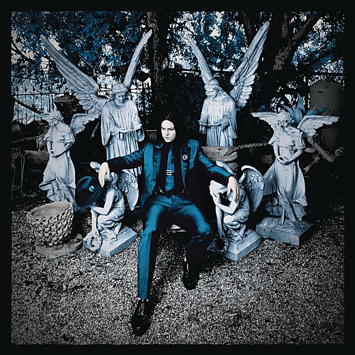

# Lazaretto

By **Jack White**

## Album Data

- **Catalog:** Beets
- **Format:** Digital, Album
- **Album:** Lazaretto
- **Artist:** Jack White
- **Albumartist:** Jack White
- **Genre:** Garage Rock
- **MusicBrainz Album Artist ID:** [3ae2fb37-8a23-429d-9920-bac811c4fc22](https://musicbrainz.org/artist/3ae2fb37-8a23-429d-9920-bac811c4fc22)
- **MusicBrainz Album ID:** [33f25592-3940-410d-b2dd-73fbd790c9ff](https://musicbrainz.org/release/33f25592-3940-410d-b2dd-73fbd790c9ff)
- **MusicBrainz Release Group ID:** [67e28d5b-f68e-4349-8e43-76189c90be65](https://musicbrainz.org/release-group/67e28d5b-f68e-4349-8e43-76189c90be65)
- **Year:** 2014
- **Catalog #:** [none]
- **Label:** Columbia
- **Total Tracks:** 11

## Album Tracks

### Track 01 - Three Women

- **Artist:** Jack White
- **Format:** AAC
- **Genre:** Garage Rock
- **Length:** 3:49
- **MusicBrainz Track ID:** [48750ff2-8261-49e3-9df6-7a7ae1a4aa1e](https://musicbrainz.org/recording/48750ff2-8261-49e3-9df6-7a7ae1a4aa1e)
- **Title:** Three Women
- **Track:** 01
- **Year:** 2014

### Track 02 - Lazaretto

- **Artist:** Jack White
- **Format:** AAC
- **Genre:** Alternative Rock
- **Length:** 3:36
- **MusicBrainz Track ID:** [b5224d83-6c8f-4530-af13-e99b3c785a48](https://musicbrainz.org/recording/b5224d83-6c8f-4530-af13-e99b3c785a48)
- **Title:** Lazaretto
- **Track:** 02
- **Year:** 2014

### Track 03 - Temporary Ground

- **Artist:** Jack White
- **Format:** AAC
- **Genre:** Garage Rock
- **Length:** 3:10
- **MusicBrainz Track ID:** [55c3d483-0327-4618-b787-54c45ce9f452](https://musicbrainz.org/recording/55c3d483-0327-4618-b787-54c45ce9f452)
- **Title:** Temporary Ground
- **Track:** 03
- **Year:** 2014

### Track 04 - Would You Fight for My Love?

- **Artist:** Jack White
- **Format:** AAC
- **Genre:** Indie Rock
- **Length:** 4:06
- **MusicBrainz Track ID:** [fba9f2f6-5204-4942-99e1-5c0dfae99a4c](https://musicbrainz.org/recording/fba9f2f6-5204-4942-99e1-5c0dfae99a4c)
- **Title:** Would You Fight for My Love?
- **Track:** 04
- **Year:** 2014

### Track 05 - High Ball Stepper

- **Artist:** Jack White
- **Format:** AAC
- **Genre:** Hard Rock
- **Length:** 4:01
- **MusicBrainz Track ID:** [f28aa92c-4017-481f-aa9b-cbbb273f390b](https://musicbrainz.org/recording/f28aa92c-4017-481f-aa9b-cbbb273f390b)
- **Title:** High Ball Stepper
- **Track:** 05
- **Year:** 2014

### Track 06 - Just One Drink

- **Artist:** Jack White
- **Format:** AAC
- **Genre:** Post-Punk
- **Length:** 2:54
- **MusicBrainz Track ID:** [9d687222-6437-48a5-9a41-e5a09724ebc8](https://musicbrainz.org/recording/9d687222-6437-48a5-9a41-e5a09724ebc8)
- **Title:** Just One Drink
- **Track:** 06
- **Year:** 2014

### Track 07 - Alone in My Home

- **Artist:** Jack White
- **Format:** AAC
- **Genre:** Folk Rock
- **Length:** 3:27
- **MusicBrainz Track ID:** [5047a64f-d4df-4afa-90dd-50454b3633cb](https://musicbrainz.org/recording/5047a64f-d4df-4afa-90dd-50454b3633cb)
- **Title:** Alone in My Home
- **Track:** 07
- **Year:** 2014

### Track 08 - Entitlement

- **Artist:** Jack White
- **Format:** AAC
- **Genre:** Country Rock
- **Length:** 4:03
- **MusicBrainz Track ID:** [fe3e6729-36e5-45a5-ac39-81831f4cc616](https://musicbrainz.org/recording/fe3e6729-36e5-45a5-ac39-81831f4cc616)
- **Title:** Entitlement
- **Track:** 08
- **Year:** 2014

### Track 09 - That Black Bat Licorice

- **Artist:** Jack White
- **Format:** AAC
- **Genre:** Psychedelic Rock
- **Length:** 3:47
- **MusicBrainz Track ID:** [31cd2d5e-15c3-47fe-97d3-7ca584290292](https://musicbrainz.org/recording/31cd2d5e-15c3-47fe-97d3-7ca584290292)
- **Title:** That Black Bat Licorice
- **Track:** 09
- **Year:** 2014

### Track 10 - I Think I Found the Culprit

- **Artist:** Jack White
- **Format:** AAC
- **Genre:** Indie Rock
- **Length:** 3:48
- **MusicBrainz Track ID:** [71caf088-5d38-461f-967f-1b1b2d1d19ca](https://musicbrainz.org/recording/71caf088-5d38-461f-967f-1b1b2d1d19ca)
- **Title:** I Think I Found the Culprit
- **Track:** 10
- **Year:** 2014

### Track 11 - Want and Able

- **Artist:** Jack White
- **Format:** AAC
- **Genre:** Folk Rock
- **Length:** 2:50
- **MusicBrainz Track ID:** [463e22ef-56f4-4312-a6f9-19fe8f515053](https://musicbrainz.org/recording/463e22ef-56f4-4312-a6f9-19fe8f515053)
- **Title:** Want and Able
- **Track:** 11
- **Year:** 2014

## See also

- [Acoustic Recordings 1998–2016](Acoustic_Recordings_1998–2016.md)
- [Blunderbuss](Blunderbuss.md)
- [Bonnaroo 2014](Bonnaroo_2014.md)
- [CD: Blunderbuss](../../CD/Jack_White/Blunderbuss.md)
- [CD: ](../../CD/Jack_White/Jack_White.md)
- [Roon: Blunderbuss](../../Roon/Jack_White/Blunderbuss.md)
- [Roon: Fear Of The Dawn](../../Roon/Jack_White/Fear_Of_The_Dawn.md)
- [Roon: Jack White Acoustic Recordings 1998 - 2016](../../Roon/Jack_White/Jack_White_Acoustic_Recordings_1998_-_2016.md)
- [Roon: Lazaretto](../../Roon/Jack_White/Lazaretto.md)
- [Vinyl: Acoustic Recordings 1998-2016](../../Vinyl/Jack_White/Acoustic_Recordings_1998-2016.md)
- [Vinyl: ](../../Vinyl/Jack_White/Jack_White.md)
- [Vinyl: Lazaretto](../../Vinyl/Jack_White/Lazaretto.md)
