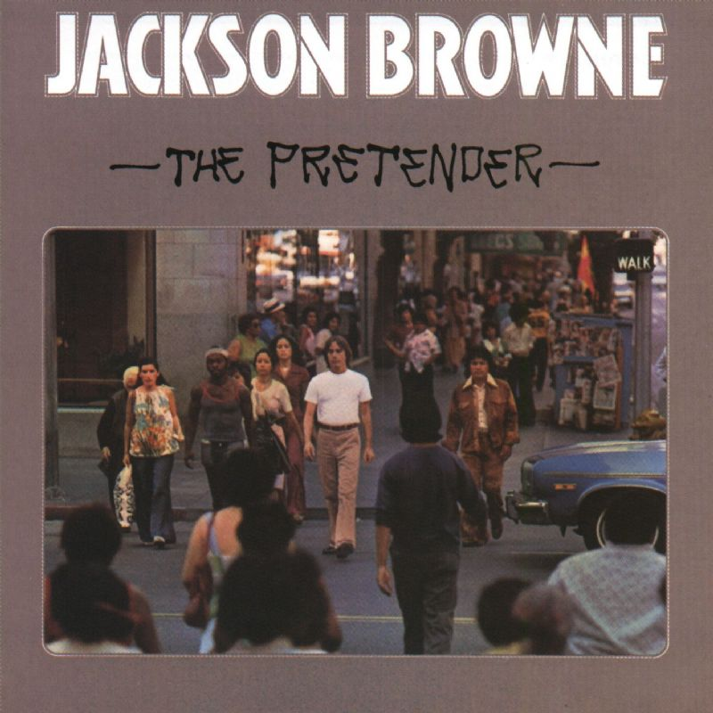

# The Pretender

By **Jackson Browne**

## Album Data

- **Catalog:** Beets
- **Format:** Digital, Album
- **Album:** The Pretender
- **Artist:** Jackson Browne
- **Albumartist:** Jackson Browne
- **Genre:** Soft Rock
- **MusicBrainz Album Artist ID:** [88527d26-7496-47c5-8358-ebdb1868a90f](https://musicbrainz.org/artist/88527d26-7496-47c5-8358-ebdb1868a90f)
- **MusicBrainz Album ID:** [f912c792-0168-3696-88ec-4b8684ab4db0](https://musicbrainz.org/release/f912c792-0168-3696-88ec-4b8684ab4db0)
- **MusicBrainz Release Group ID:** [ac41c72a-7b6a-3822-9384-d4972123490f](https://musicbrainz.org/release-group/ac41c72a-7b6a-3822-9384-d4972123490f)
- **Year:** 1993
- **Catalog #:** GZS-1047
- **Label:** DCC Compact Classics
- **Total Tracks:** 08

## Album Tracks

### Track 01 - The Fuse

- **Artist:** Jackson Browne
- **Format:** MP3
- **Genre:** Soft Rock
- **Length:** 5:46
- **MusicBrainz Track ID:** [49e00b00-585d-499e-82c4-e3c3e0d085a4](https://musicbrainz.org/recording/49e00b00-585d-499e-82c4-e3c3e0d085a4)
- **Title:** The Fuse
- **Track:** 01
- **Year:** 1993

### Track 02 - Your Bright Baby Blues

- **Artist:** Jackson Browne
- **Format:** MP3
- **Genre:** Soft Rock
- **Length:** 6:03
- **MusicBrainz Track ID:** [2c4b6b3e-ce49-47c3-a163-3c315632a134](https://musicbrainz.org/recording/2c4b6b3e-ce49-47c3-a163-3c315632a134)
- **Title:** Your Bright Baby Blues
- **Track:** 02
- **Year:** 1993

### Track 03 - Linda Paloma

- **Artist:** Jackson Browne
- **Format:** MP3
- **Genre:** Mariachi
- **Length:** 4:06
- **MusicBrainz Track ID:** [68211e61-dace-4a5c-8d71-ba79fbed7c44](https://musicbrainz.org/recording/68211e61-dace-4a5c-8d71-ba79fbed7c44)
- **Title:** Linda Paloma
- **Track:** 03
- **Year:** 1993

### Track 04 - Here Come Those Tears Again

- **Artist:** Jackson Browne
- **Format:** MP3
- **Genre:** Soft Rock
- **Length:** 3:31
- **MusicBrainz Track ID:** [9fb59fe0-5f2c-4dfb-b130-8cd9bd590b8a](https://musicbrainz.org/recording/9fb59fe0-5f2c-4dfb-b130-8cd9bd590b8a)
- **Title:** Here Come Those Tears Again
- **Track:** 04
- **Year:** 1993

### Track 05 - The Only Child

- **Artist:** Jackson Browne
- **Format:** MP3
- **Genre:** Soft Rock
- **Length:** 3:42
- **MusicBrainz Track ID:** [dd7c538f-7f4c-417b-bd31-bdcffe8fff9a](https://musicbrainz.org/recording/dd7c538f-7f4c-417b-bd31-bdcffe8fff9a)
- **Title:** The Only Child
- **Track:** 05
- **Year:** 1993

### Track 06 - Daddy's Tune

- **Artist:** Jackson Browne
- **Format:** MP3
- **Genre:** Rock
- **Length:** 3:35
- **MusicBrainz Track ID:** [e9f0e3d8-7305-4a65-9d3a-ec4647745118](https://musicbrainz.org/recording/e9f0e3d8-7305-4a65-9d3a-ec4647745118)
- **Title:** Daddy's Tune
- **Track:** 06
- **Year:** 1993

### Track 07 - Sleep's Dark and Silent Gate

- **Artist:** Jackson Browne
- **Format:** MP3
- **Genre:** Soft Rock
- **Length:** 2:35
- **MusicBrainz Track ID:** [c73a903c-815a-4269-875f-1a38e69b8a86](https://musicbrainz.org/recording/c73a903c-815a-4269-875f-1a38e69b8a86)
- **Title:** Sleep's Dark and Silent Gate
- **Track:** 07
- **Year:** 1993

### Track 08 - The Pretender

- **Artist:** Jackson Browne
- **Format:** MP3
- **Genre:** Soft Rock
- **Length:** 5:50
- **MusicBrainz Track ID:** [d1432d9a-2f98-4005-be82-bf230f43cb36](https://musicbrainz.org/recording/d1432d9a-2f98-4005-be82-bf230f43cb36)
- **Title:** The Pretender
- **Track:** 08
- **Year:** 1993

## See also

- [Roon: For Everyman](../../Roon/Jackson_Browne/For_Everyman.md)
- [Roon: Jackson Browne (Saturate Before Using)](../../Roon/Jackson_Browne/Jackson_Browne_Saturate_Before_Using.md)
- [Roon: Late for the Sky](../../Roon/Jackson_Browne/Late_for_the_Sky.md)
- [Roon: Running On Empty](../../Roon/Jackson_Browne/Running_On_Empty.md)
- [Roon: The Pretender](../../Roon/Jackson_Browne/The_Pretender.md)
