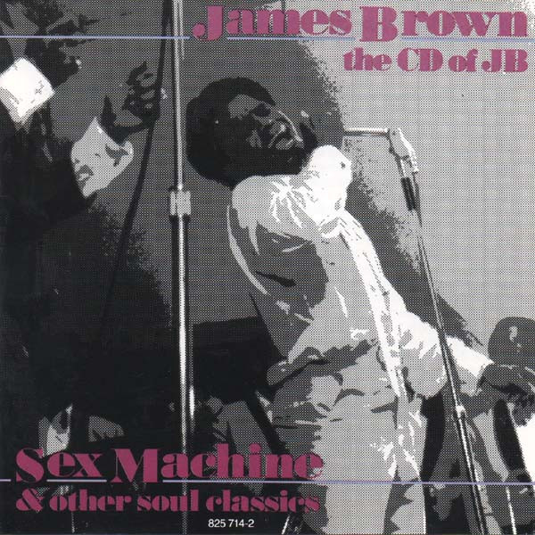

# The CD of JB

By **James Brown**

## Album Data

- **Catalog:** Beets
- **Format:** Digital, Album
- **Album:** The CD of JB
- **Artist:** James Brown
- **Albumartist:** James Brown
- **Genre:** Funk
- **MusicBrainz Album Artist ID:** [20ff3303-4fe2-4a47-a1b6-291e26aa3438](https://musicbrainz.org/artist/20ff3303-4fe2-4a47-a1b6-291e26aa3438)
- **MusicBrainz Album ID:** [b44bd792-65d6-4ffa-a74b-db8b701603a2](https://musicbrainz.org/release/b44bd792-65d6-4ffa-a74b-db8b701603a2)
- **MusicBrainz Release Group ID:** [cd40273f-65ca-35c7-823d-15f28aa1705d](https://musicbrainz.org/release-group/cd40273f-65ca-35c7-823d-15f28aa1705d)
- **Year:** 1985
- **Catalog #:** 
- **Label:** Atom
- **Total Tracks:** 15

## Album Tracks

### Track 01 - Gonna Have a Funky Good Time (Doing It to Death)

- **Artist:** James Brown
- **Format:** ALAC
- **Genre:** Soul
- **Length:** 2:53
- **MusicBrainz Track ID:** [e2ed5ef0-03cb-4ed9-8685-32b10ffbfc3e](https://musicbrainz.org/recording/e2ed5ef0-03cb-4ed9-8685-32b10ffbfc3e)
- **Title:** Gonna Have a Funky Good Time (Doing It to Death)
- **Track:** 01
- **Year:** 2009

### Track 02 - Get Up Offa That Thing

- **Artist:** James Brown
- **Format:** ALAC
- **Genre:** Soul
- **Length:** 6:06
- **MusicBrainz Track ID:** [9f744ad8-7642-4c91-902a-e25666594c8d](https://musicbrainz.org/recording/9f744ad8-7642-4c91-902a-e25666594c8d)
- **Title:** Get Up Offa That Thing
- **Track:** 02
- **Year:** 2009

### Track 03 - Body Heat

- **Artist:** James Brown
- **Format:** ALAC
- **Genre:** Uk Garage
- **Length:** 5:13
- **MusicBrainz Track ID:** [c4fd522e-6fd5-4482-9295-529c0e844d72](https://musicbrainz.org/recording/c4fd522e-6fd5-4482-9295-529c0e844d72)
- **Title:** Body Heat
- **Track:** 03
- **Year:** 2009

### Track 04 - Sex Machine

- **Artist:** James Brown
- **Format:** ALAC
- **Genre:** Uk Garage
- **Length:** 6:37
- **MusicBrainz Track ID:** [d73701f0-1182-423a-a595-a0723bf4acf2](https://musicbrainz.org/recording/d73701f0-1182-423a-a595-a0723bf4acf2)
- **Title:** Sex Machine
- **Track:** 04
- **Year:** 2009

### Track 05 - Try Me

- **Artist:** James Brown
- **Format:** ALAC
- **Genre:** Soul
- **Length:** 4:27
- **MusicBrainz Track ID:** [9f0477f5-4f0d-48b7-99c5-6a4f8b8aceef](https://musicbrainz.org/recording/9f0477f5-4f0d-48b7-99c5-6a4f8b8aceef)
- **Title:** Try Me
- **Track:** 05
- **Year:** 2009

### Track 06 - Papa's Got a Brand New Bag

- **Artist:** James Brown
- **Format:** ALAC
- **Genre:** Uk Garage
- **Length:** 2:31
- **MusicBrainz Track ID:** [c4a6e042-6e89-45c5-b21a-30d23adcbc4b](https://musicbrainz.org/recording/c4a6e042-6e89-45c5-b21a-30d23adcbc4b)
- **Title:** Papa's Got a Brand New Bag
- **Track:** 06
- **Year:** 2009

### Track 07 - Get on the Good Foot

- **Artist:** James Brown
- **Format:** ALAC
- **Genre:** Soul
- **Length:** 4:09
- **MusicBrainz Track ID:** [a87df8b3-c460-4d66-a1c7-a2524bf1fe70](https://musicbrainz.org/recording/a87df8b3-c460-4d66-a1c7-a2524bf1fe70)
- **Title:** Get on the Good Foot
- **Track:** 07
- **Year:** 2009

### Track 08 - It's a Man's, Man's, Man's World

- **Artist:** James Brown
- **Format:** ALAC
- **Genre:** Soul
- **Length:** 6:39
- **MusicBrainz Track ID:** [c5a173c2-1d05-4d8e-ae5c-893ae6cd248d](https://musicbrainz.org/recording/c5a173c2-1d05-4d8e-ae5c-893ae6cd248d)
- **Title:** It's a Man's, Man's, Man's World
- **Track:** 08
- **Year:** 2009

### Track 09 - Lost Someone

- **Artist:** James Brown
- **Format:** ALAC
- **Genre:** Soul
- **Length:** 7:37
- **MusicBrainz Track ID:** [e12213e8-9f0d-47e1-b5ed-a2dd4369641d](https://musicbrainz.org/recording/e12213e8-9f0d-47e1-b5ed-a2dd4369641d)
- **Title:** Lost Someone
- **Track:** 09
- **Year:** 2009

### Track 10 - It's a Man's, Man's, Man's World, Part 2

- **Artist:** James Brown
- **Format:** ALAC
- **Genre:** Soul
- **Length:** 0:43
- **MusicBrainz Track ID:** [fbabda82-eeb1-4419-8aab-de97a5d8fbb1](https://musicbrainz.org/recording/fbabda82-eeb1-4419-8aab-de97a5d8fbb1)
- **Title:** It's a Man's, Man's, Man's World, Part 2
- **Track:** 10
- **Year:** 2009

### Track 11 - I Got That Feeling

- **Artist:** James Brown
- **Format:** ALAC
- **Genre:** Soul
- **Length:** 2:42
- **MusicBrainz Track ID:** [7140cc19-d391-4b72-a829-3697c84c0608](https://musicbrainz.org/recording/7140cc19-d391-4b72-a829-3697c84c0608)
- **Title:** I Got That Feeling
- **Track:** 11
- **Year:** 2009

### Track 12 - Cold Sweat

- **Artist:** James Brown
- **Format:** ALAC
- **Genre:** Soul
- **Length:** 3:15
- **MusicBrainz Track ID:** [7ac8c3f4-18b7-4895-b3f0-a480d64875a7](https://musicbrainz.org/recording/7ac8c3f4-18b7-4895-b3f0-a480d64875a7)
- **Title:** Cold Sweat
- **Track:** 12
- **Year:** 2009

### Track 13 - Please, Please, Please

- **Artist:** James Brown
- **Format:** ALAC
- **Genre:** Soul
- **Length:** 2:52
- **MusicBrainz Track ID:** [73cc5f29-99ae-4820-bbe2-1beee882a4cc](https://musicbrainz.org/recording/73cc5f29-99ae-4820-bbe2-1beee882a4cc)
- **Title:** Please, Please, Please
- **Track:** 13
- **Year:** 2009

### Track 14 - The Payback

- **Artist:** James Brown
- **Format:** ALAC
- **Genre:** Uk Garage
- **Length:** 1:00
- **MusicBrainz Track ID:** [9b6946d9-7197-4937-9504-aacc866dddfc](https://musicbrainz.org/recording/9b6946d9-7197-4937-9504-aacc866dddfc)
- **Title:** The Payback
- **Track:** 14
- **Year:** 2009

### Track 15 - It's Too Funky in Here

- **Artist:** James Brown
- **Format:** ALAC
- **Genre:** Uk Garage
- **Length:** 3:14
- **MusicBrainz Track ID:** [bcba54e3-8946-478b-a527-90fde689c9fc](https://musicbrainz.org/recording/bcba54e3-8946-478b-a527-90fde689c9fc)
- **Title:** It's Too Funky in Here
- **Track:** 15
- **Year:** 2009

## See also

- [Live At The Apollo, Voume II (Deluxe Edition)](Live_At_The_Apollo__Voume_II_Deluxe_Edition.md)
- [The Payback](The_Payback.md)
- [Roon: Live at the Apollo, Vol. II](../../Roon/James_Brown/Live_at_the_Apollo__Vol_II.md)
- [Roon: The CD Of J.B](../../Roon/James_Brown/The_CD_Of_JB-_Sex_Machine_and_Other_Soul_Classics.md)
