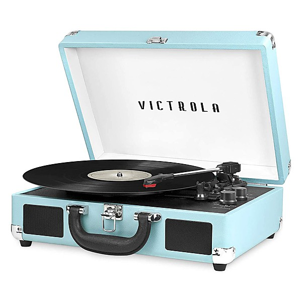

# The Payback

By **James Brown**

## Album Data

- **Catalog:** Beets
- **Format:** Digital, Album
- **Album:** The Payback
- **Artist:** James Brown
- **Albumartist:** James Brown
- **Genre:** Soul
- **MusicBrainz Album Artist ID:** [20ff3303-4fe2-4a47-a1b6-291e26aa3438](https://musicbrainz.org/artist/20ff3303-4fe2-4a47-a1b6-291e26aa3438)
- **MusicBrainz Album ID:** [ae04cf54-11f9-497a-820c-f846f81d8421](https://musicbrainz.org/release/ae04cf54-11f9-497a-820c-f846f81d8421)
- **MusicBrainz Release Group ID:** [a7797816-e1eb-3948-ad6f-6fcfa5591f26](https://musicbrainz.org/release-group/a7797816-e1eb-3948-ad6f-6fcfa5591f26)
- **Year:** 2009
- **Catalog #:** 
- **Label:** 
- **Total Tracks:** 23

## Album Tracks

### Track 01 - Introduction To The James Brown Show

- **Artist:** James Brown
- **Format:** MP3
- **Genre:** Soul
- **Length:** 0:31
- **MusicBrainz Track ID:** 
- **Title:** Introduction To The James Brown Show
- **Track:** 01
- **Year:** 2016

### Track 02 - Think

- **Artist:** James Brown
- **Format:** MP3
- **Genre:** Soul
- **Length:** 2:55
- **MusicBrainz Track ID:** 
- **Title:** Think
- **Track:** 02
- **Year:** 2016

### Track 03 - I Wanna Be Around

- **Artist:** James Brown
- **Format:** MP3
- **Genre:** Funk
- **Length:** 3:11
- **MusicBrainz Track ID:** 
- **Title:** I Wanna Be Around
- **Track:** 03
- **Year:** 2016

### Track 04 - James Brown (Thanks)

- **Artist:** James Brown
- **Format:** MP3
- **Genre:** Soul
- **Length:** 1:51
- **MusicBrainz Track ID:** 
- **Title:** James Brown (Thanks)
- **Track:** 04
- **Year:** 2016

### Track 05 - That's Life

- **Artist:** James Brown
- **Format:** MP3
- **Genre:** Soul
- **Length:** 4:40
- **MusicBrainz Track ID:** 
- **Title:** That's Life
- **Track:** 05
- **Year:** 2016

### Track 06 - Kansas City

- **Artist:** James Brown
- **Format:** MP3
- **Genre:** Soul
- **Length:** 3:52
- **MusicBrainz Track ID:** 
- **Title:** Kansas City
- **Track:** 06
- **Year:** 2016

### Track 07 - Sweet Soul Music

- **Artist:** James Brown
- **Format:** MP3
- **Genre:** Funk
- **Length:** 2:37
- **MusicBrainz Track ID:** 
- **Title:** Sweet Soul Music
- **Track:** 07
- **Year:** 2016

### Track 08 - It's A Man's Man's Man's World

- **Artist:** James Brown
- **Format:** MP3
- **Genre:** Soul
- **Length:** 19:11
- **MusicBrainz Track ID:** 
- **Title:** It's A Man's Man's Man's World
- **Track:** 08
- **Year:** 2016

### Track 09 - Caravan

- **Artist:** James Brown
- **Format:** MP3
- **Genre:** Funk
- **Length:** 3:19
- **MusicBrainz Track ID:** 
- **Title:** Caravan
- **Track:** 09
- **Year:** 2016

### Track 10 - Introduction To 'Startime'

- **Artist:** James Brown
- **Format:** MP3
- **Genre:** Soul
- **Length:** 0:34
- **MusicBrainz Track ID:** 
- **Title:** Introduction To 'Startime'
- **Track:** 10
- **Year:** 2016

### Track 11 - Money Won't Change You / Out Of Sight

- **Artist:** James Brown
- **Format:** MP3
- **Genre:** Soul
- **Length:** 0:42
- **MusicBrainz Track ID:** 
- **Title:** Money Won't Change You / Out Of Sight
- **Track:** 11
- **Year:** 2016

### Track 12 - Bring It Up

- **Artist:** James Brown
- **Format:** MP3
- **Genre:** Soul
- **Length:** 1:12
- **MusicBrainz Track ID:** 
- **Title:** Bring It Up
- **Track:** 12
- **Year:** 2016

### Track 13 - Try Me

- **Artist:** James Brown
- **Format:** MP3
- **Genre:** Soul
- **Length:** 3:13
- **MusicBrainz Track ID:** 
- **Title:** Try Me
- **Track:** 13
- **Year:** 2016

### Track 14 - Let Yourself Go

- **Artist:** James Brown
- **Format:** MP3
- **Genre:** Soul
- **Length:** 1:42
- **MusicBrainz Track ID:** 
- **Title:** Let Yourself Go
- **Track:** 14
- **Year:** 2016

### Track 15 - There Was A Time

- **Artist:** James Brown
- **Format:** MP3
- **Genre:** Soul
- **Length:** 8:52
- **MusicBrainz Track ID:** 
- **Title:** There Was A Time
- **Track:** 15
- **Year:** 2016

### Track 16 - I Feel All Right

- **Artist:** James Brown
- **Format:** MP3
- **Genre:** Funk
- **Length:** 7:05
- **MusicBrainz Track ID:** 
- **Title:** I Feel All Right
- **Track:** 16
- **Year:** 2016

### Track 17 - Cold Sweat

- **Artist:** James Brown
- **Format:** MP3
- **Genre:** Soul
- **Length:** 6:02
- **MusicBrainz Track ID:** 
- **Title:** Cold Sweat
- **Track:** 17
- **Year:** 2016

### Track 18 - Prisoner Of Love

- **Artist:** James Brown
- **Format:** MP3
- **Genre:** Soul
- **Length:** 8:16
- **MusicBrainz Track ID:** 
- **Title:** Prisoner Of Love
- **Track:** 18
- **Year:** 2016

### Track 19 - My Girl

- **Artist:** James Brown
- **Format:** MP3
- **Genre:** Funk
- **Length:** 0:23
- **MusicBrainz Track ID:** 
- **Title:** My Girl
- **Track:** 19
- **Year:** 2016

### Track 20 - Maybe The Last Time

- **Artist:** James Brown
- **Format:** MP3
- **Genre:** Soul
- **Length:** 4:36
- **MusicBrainz Track ID:** 
- **Title:** Maybe The Last Time
- **Track:** 20
- **Year:** 2016

### Track 21 - I Got You (I Feel Good)

- **Artist:** James Brown
- **Format:** MP3
- **Genre:** Soul
- **Length:** 0:28
- **MusicBrainz Track ID:** 
- **Title:** I Got You (I Feel Good)
- **Track:** 21
- **Year:** 2016

### Track 22 - Please, Please, Please

- **Artist:** James Brown
- **Format:** MP3
- **Genre:** Soul
- **Length:** 3:01
- **MusicBrainz Track ID:** 
- **Title:** Please, Please, Please
- **Track:** 22
- **Year:** 2016

### Track 23 - Bring It Up

- **Artist:** James Brown
- **Format:** MP3
- **Genre:** Soul
- **Length:** 4:40
- **MusicBrainz Track ID:** 
- **Title:** Bring It Up
- **Track:** 23
- **Year:** 2016

## See also

- [Live At The Apollo, Voume II (Deluxe Edition)](Live_At_The_Apollo__Voume_II_Deluxe_Edition.md)
- [The CD of JB](The_CD_of_JB.md)
- [Roon: Live at the Apollo, Vol. II](../../Roon/James_Brown/Live_at_the_Apollo__Vol_II.md)
- [Roon: The CD Of J.B](../../Roon/James_Brown/The_CD_Of_JB-_Sex_Machine_and_Other_Soul_Classics.md)
