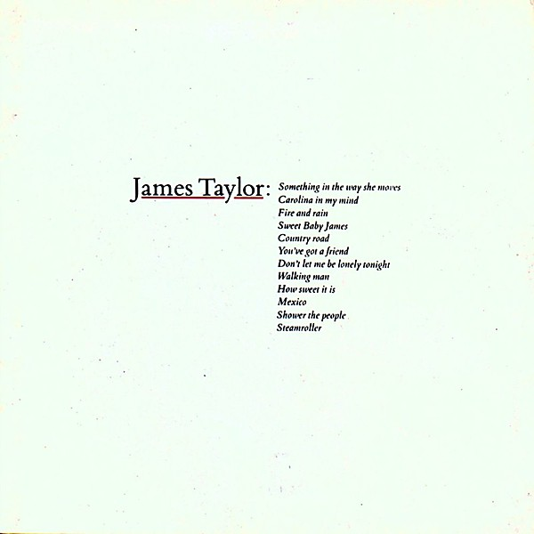

# Greatest Hits

By **James Taylor**

## Album Data

- **Catalog:** Beets
- **Format:** Digital, Album
- **Album:** Greatest Hits
- **Artist:** James Taylor
- **Albumartist:** James Taylor
- **Genre:** Soft Rock
- **MusicBrainz Album Artist ID:** 
- **MusicBrainz Album ID:** 
- **MusicBrainz Release Group ID:** 
- **Year:** 1971
- **Catalog #:** 
- **Label:** 
- **Total Tracks:** 00

## Album Tracks

### Track 00 - You've Got A Friend

- **Artist:** James Taylor
- **Format:** AAC
- **Genre:** Soft Rock
- **Length:** 4:28
- **MusicBrainz Track ID:** 
- **Title:** You've Got A Friend
- **Track:** 00
- **Year:** 1971

## See also

- [Roon: 1967 (Deluxe Edition)](../../Roon/James_Taylor/1967_Deluxe_Edition.md)
- [Roon: James Taylor Live](../../Roon/James_Taylor/James_Taylor_Live.md)
- [Roon: James Taylor](../../Roon/James_Taylor/James_Taylor.md)
- [Roon: Mud Slide Slim and the Blue Horizon (2019 Remaster)](../../Roon/James_Taylor/Mud_Slide_Slim_and_the_Blue_Horizon_2019_Remaster.md)
- [Roon: One Man Dog](../../Roon/James_Taylor/One_Man_Dog.md)
- [Roon: Sweet Baby James](../../Roon/James_Taylor/Sweet_Baby_James.md)
- [Roon: Walking Man](../../Roon/James_Taylor/Walking_Man.md)
