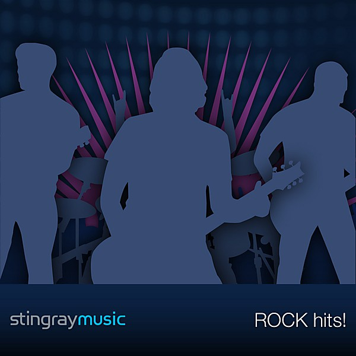

# Been Caught Stealing

By **Jane’s Addiction**

## Album Data

- **Catalog:** Beets
- **Format:** Digital, Album
- **Album:** Been Caught Stealing
- **Artist:** Jane’s Addiction
- **Albumartist:** Jane’s Addiction
- **Genre:** Grunge
- **MusicBrainz Album Artist ID:** [e3434cc7-d348-491a-9dc8-325af3d9086d](https://musicbrainz.org/artist/e3434cc7-d348-491a-9dc8-325af3d9086d)
- **MusicBrainz Album ID:** [878cda53-9483-3a65-bbf0-e6bea7217071](https://musicbrainz.org/release/878cda53-9483-3a65-bbf0-e6bea7217071)
- **MusicBrainz Release Group ID:** [dc8e8195-e469-3307-9cde-97142806789c](https://musicbrainz.org/release-group/dc8e8195-e469-3307-9cde-97142806789c)
- **Year:** 1990
- **Catalog #:** 9 40129-2
- **Label:** Warner Bros. Records
- **Total Tracks:** 05

## Album Tracks

### Track 01 - Then She Did

- **Artist:** Jane’s Addiction
- **Format:** MP3
- **Genre:** Alternative Rock
- **Length:** 8:19
- **MusicBrainz Track ID:** [f85efb36-74b2-4ade-9ee6-39ecd89714a0](https://musicbrainz.org/recording/f85efb36-74b2-4ade-9ee6-39ecd89714a0)
- **Title:** Then She Did
- **Track:** 01
- **Year:** 1991

### Track 02 - Ain’t No Right (live)

- **Artist:** Jane’s Addiction
- **Format:** MP3
- **Genre:** Grunge
- **Length:** 3:22
- **MusicBrainz Track ID:** [9e8e598f-dbf7-4422-88e1-a553f29aeec7](https://musicbrainz.org/recording/9e8e598f-dbf7-4422-88e1-a553f29aeec7)
- **Title:** Ain’t No Right (live)
- **Track:** 02
- **Year:** 1991

### Track 03 - No One’s Leaving (live)

- **Artist:** Jane’s Addiction
- **Format:** MP3
- **Genre:** Grunge
- **Length:** 3:22
- **MusicBrainz Track ID:** [73d55b4b-5eaf-4ecd-a3ad-224aa2b93bd0](https://musicbrainz.org/recording/73d55b4b-5eaf-4ecd-a3ad-224aa2b93bd0)
- **Title:** No One’s Leaving (live)
- **Track:** 03
- **Year:** 1991

### Track 04 - L.A. Medley (live)

- **Artist:** Jane’s Addiction
- **Format:** MP3
- **Genre:** Grunge
- **Length:** 3:46
- **MusicBrainz Track ID:** [9418c1f5-5e95-4915-afea-79a6787c64d8](https://musicbrainz.org/recording/9418c1f5-5e95-4915-afea-79a6787c64d8)
- **Title:** L.A. Medley (live)
- **Track:** 04
- **Year:** 1991

### Track 05 - Classic Girl

- **Artist:** Jane’s Addiction
- **Format:** MP3
- **Genre:** Funk Metal
- **Length:** 5:07
- **MusicBrainz Track ID:** [859c0de9-10f7-4f28-a7a7-25e49ee66911](https://musicbrainz.org/recording/859c0de9-10f7-4f28-a7a7-25e49ee66911)
- **Title:** Classic Girl
- **Track:** 05
- **Year:** 1991

## See also

- [Classic Girl](Classic_Girl.md)
- [Nothing’s Shocking](Nothing’s_Shocking.md)
- [Ritual de lo habitual](Ritual_de_lo_habitual.md)
- [Strays](Strays.md)
- [Roon: Nothing's Shocking](../../Roon/Jane’s_Addiction/Nothings_Shocking.md)
- [Roon: Ritual De Lo Habitual](../../Roon/Jane’s_Addiction/Ritual_De_Lo_Habitual.md)
- [Roon: Strays](../../Roon/Jane’s_Addiction/Strays.md)
