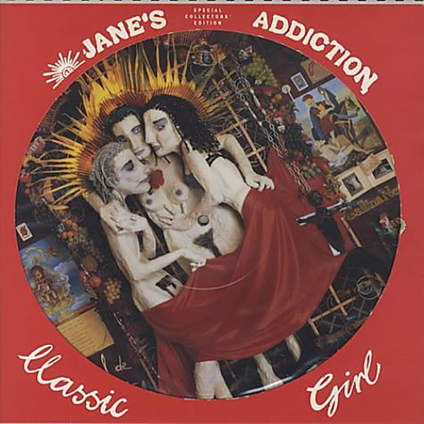

# Classic Girl

By **Jane’s Addiction**

## Album Data

- **Catalog:** Beets
- **Format:** Digital, Album
- **Album:** Classic Girl
- **Artist:** Jane’s Addiction
- **Albumartist:** Jane’s Addiction
- **Genre:** Grunge
- **MusicBrainz Album Artist ID:** [e3434cc7-d348-491a-9dc8-325af3d9086d](https://musicbrainz.org/artist/e3434cc7-d348-491a-9dc8-325af3d9086d)
- **MusicBrainz Album ID:** [da9318a4-6687-4123-9582-5ea7d2c245c3](https://musicbrainz.org/release/da9318a4-6687-4123-9582-5ea7d2c245c3)
- **MusicBrainz Release Group ID:** [3a61d1b4-d3dd-338e-9095-6daca0972a4f](https://musicbrainz.org/release-group/3a61d1b4-d3dd-338e-9095-6daca0972a4f)
- **Year:** 1991
- **Catalog #:** 9 25727-2
- **Label:** Warner Bros. Records
- **Total Tracks:** 11

## Album Tracks

### Track 01 - Up the Beach

- **Artist:** Jane’s Addiction
- **Format:** ALAC
- **Genre:** Indie Rock
- **Length:** 3:01
- **MusicBrainz Track ID:** [c782f5d2-e877-4363-94c3-19e0307f51d1](https://musicbrainz.org/recording/c782f5d2-e877-4363-94c3-19e0307f51d1)
- **Title:** Up the Beach
- **Track:** 01
- **Year:** 1988

### Track 02 - Ocean Size

- **Artist:** Jane’s Addiction
- **Format:** ALAC
- **Genre:** Hard Rock
- **Length:** 4:19
- **MusicBrainz Track ID:** [7c808b70-2b09-4906-8390-b576d816b6b1](https://musicbrainz.org/recording/7c808b70-2b09-4906-8390-b576d816b6b1)
- **Title:** Ocean Size
- **Track:** 02
- **Year:** 1988

### Track 03 - Had a Dad

- **Artist:** Jane’s Addiction
- **Format:** ALAC
- **Genre:** Grunge
- **Length:** 3:45
- **MusicBrainz Track ID:** [ac5dbabd-4663-471a-93bf-ce0aa12ffb78](https://musicbrainz.org/recording/ac5dbabd-4663-471a-93bf-ce0aa12ffb78)
- **Title:** Had a Dad
- **Track:** 03
- **Year:** 1988

### Track 04 - Ted, Just Admit It…

- **Artist:** Jane’s Addiction
- **Format:** ALAC
- **Genre:** Grunge
- **Length:** 7:22
- **MusicBrainz Track ID:** [b050bb74-92af-45fb-80b4-eaedd7d404de](https://musicbrainz.org/recording/b050bb74-92af-45fb-80b4-eaedd7d404de)
- **Title:** Ted, Just Admit It…
- **Track:** 04
- **Year:** 1988

### Track 05 - Standing in the Shower… Thinking

- **Artist:** Jane’s Addiction
- **Format:** ALAC
- **Genre:** Grunge
- **Length:** 3:05
- **MusicBrainz Track ID:** [74e50d95-fca6-4d77-a084-6a0635b8af96](https://musicbrainz.org/recording/74e50d95-fca6-4d77-a084-6a0635b8af96)
- **Title:** Standing in the Shower… Thinking
- **Track:** 05
- **Year:** 1988

### Track 06 - Summertime Rolls

- **Artist:** Jane’s Addiction
- **Format:** ALAC
- **Genre:** Indie Rock
- **Length:** 6:20
- **MusicBrainz Track ID:** [97b7a05f-847e-4b26-bfc6-756ef8297bc6](https://musicbrainz.org/recording/97b7a05f-847e-4b26-bfc6-756ef8297bc6)
- **Title:** Summertime Rolls
- **Track:** 06
- **Year:** 1988

### Track 07 - Mountain Song

- **Artist:** Jane’s Addiction
- **Format:** ALAC
- **Genre:** Grunge
- **Length:** 4:03
- **MusicBrainz Track ID:** [3e595273-9f3c-4e00-bc58-034575913e29](https://musicbrainz.org/recording/3e595273-9f3c-4e00-bc58-034575913e29)
- **Title:** Mountain Song
- **Track:** 07
- **Year:** 1988

### Track 08 - Idiots Rule

- **Artist:** Jane’s Addiction
- **Format:** ALAC
- **Genre:** Funk Metal
- **Length:** 3:01
- **MusicBrainz Track ID:** [983a5b60-b127-412b-8d71-8b043730564a](https://musicbrainz.org/recording/983a5b60-b127-412b-8d71-8b043730564a)
- **Title:** Idiots Rule
- **Track:** 08
- **Year:** 1988

### Track 09 - Jane Says

- **Artist:** Jane’s Addiction
- **Format:** ALAC
- **Genre:** Grunge
- **Length:** 4:53
- **MusicBrainz Track ID:** [26349106-50a2-432f-8fe6-1c6eed090a62](https://musicbrainz.org/recording/26349106-50a2-432f-8fe6-1c6eed090a62)
- **Title:** Jane Says
- **Track:** 09
- **Year:** 1988

### Track 10 - Thank You Boys

- **Artist:** Jane’s Addiction
- **Format:** ALAC
- **Genre:** Alternative Rock
- **Length:** 1:04
- **MusicBrainz Track ID:** [3e6e311d-fdf5-40b7-b0e0-9d5b01ae689b](https://musicbrainz.org/recording/3e6e311d-fdf5-40b7-b0e0-9d5b01ae689b)
- **Title:** Thank You Boys
- **Track:** 10
- **Year:** 1988

### Track 11 - Pig’s in Zen

- **Artist:** Jane’s Addiction
- **Format:** ALAC
- **Genre:** Grunge
- **Length:** 4:30
- **MusicBrainz Track ID:** [51524bc4-0a54-4a31-a6aa-eaf17359a994](https://musicbrainz.org/recording/51524bc4-0a54-4a31-a6aa-eaf17359a994)
- **Title:** Pig’s in Zen
- **Track:** 11
- **Year:** 1988

## See also

- [Been Caught Stealing](Been_Caught_Stealing.md)
- [Nothing’s Shocking](Nothing’s_Shocking.md)
- [Ritual de lo habitual](Ritual_de_lo_habitual.md)
- [Strays](Strays.md)
- [Roon: Nothing's Shocking](../../Roon/Jane’s_Addiction/Nothings_Shocking.md)
- [Roon: Ritual De Lo Habitual](../../Roon/Jane’s_Addiction/Ritual_De_Lo_Habitual.md)
- [Roon: Strays](../../Roon/Jane’s_Addiction/Strays.md)
