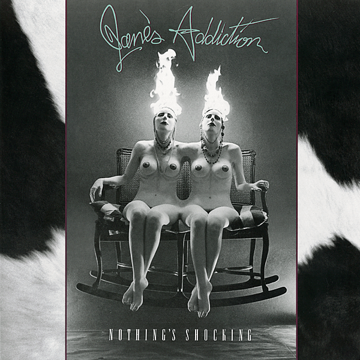

# Nothing’s Shocking

By **Jane’s Addiction**

## Album Data

- **Catalog:** Beets
- **Format:** Digital, Album
- **Album:** Nothing’s Shocking
- **Artist:** Jane’s Addiction
- **Albumartist:** Jane’s Addiction
- **Genre:** Grunge
- **MusicBrainz Album Artist ID:** [e3434cc7-d348-491a-9dc8-325af3d9086d](https://musicbrainz.org/artist/e3434cc7-d348-491a-9dc8-325af3d9086d)
- **MusicBrainz Album ID:** [6b8d4bde-25e0-3e28-b48e-e19e00d0c641](https://musicbrainz.org/release/6b8d4bde-25e0-3e28-b48e-e19e00d0c641)
- **MusicBrainz Release Group ID:** [97b7e291-8714-3e54-ac24-480be535ee8d](https://musicbrainz.org/release-group/97b7e291-8714-3e54-ac24-480be535ee8d)
- **Year:** 1988
- **Catalog #:** 
- **Label:** 
- **Total Tracks:** 09

## Album Tracks

### Track 01 - Stop!

- **Artist:** Jane’s Addiction
- **Format:** ALAC
- **Genre:** Funk Metal
- **Length:** 4:14
- **MusicBrainz Track ID:** [0f223015-9ac6-4bfc-81f5-eba7c90c0c34](https://musicbrainz.org/recording/0f223015-9ac6-4bfc-81f5-eba7c90c0c34)
- **Title:** Stop!
- **Track:** 01
- **Year:** 1990

### Track 02 - No One’s Leaving

- **Artist:** Jane’s Addiction
- **Format:** ALAC
- **Genre:** Grunge
- **Length:** 3:01
- **MusicBrainz Track ID:** [641ba54e-cb9c-457c-854c-95db6fcd4675](https://musicbrainz.org/recording/641ba54e-cb9c-457c-854c-95db6fcd4675)
- **Title:** No One’s Leaving
- **Track:** 02
- **Year:** 1990

### Track 03 - Ain’t No Right

- **Artist:** Jane’s Addiction
- **Format:** ALAC
- **Genre:** Grunge
- **Length:** 3:34
- **MusicBrainz Track ID:** [b246b8f5-1792-4695-a7ca-ef5d2aa5781c](https://musicbrainz.org/recording/b246b8f5-1792-4695-a7ca-ef5d2aa5781c)
- **Title:** Ain’t No Right
- **Track:** 03
- **Year:** 1990

### Track 04 - Obvious

- **Artist:** Jane’s Addiction
- **Format:** ALAC
- **Genre:** Funk Metal
- **Length:** 5:55
- **MusicBrainz Track ID:** [4dbc9153-35e5-47eb-9f98-d186916af4e4](https://musicbrainz.org/recording/4dbc9153-35e5-47eb-9f98-d186916af4e4)
- **Title:** Obvious
- **Track:** 04
- **Year:** 1990

### Track 05 - Been Caught Stealing

- **Artist:** Jane’s Addiction
- **Format:** ALAC
- **Genre:** Funk Metal
- **Length:** 3:34
- **MusicBrainz Track ID:** [a5e8ee8c-236c-4d0e-b883-6f9e7fef471e](https://musicbrainz.org/recording/a5e8ee8c-236c-4d0e-b883-6f9e7fef471e)
- **Title:** Been Caught Stealing
- **Track:** 05
- **Year:** 1990

### Track 06 - Three Days

- **Artist:** Jane’s Addiction
- **Format:** ALAC
- **Genre:** Funk Metal
- **Length:** 10:48
- **MusicBrainz Track ID:** [cd72c4f8-c123-4ab3-afde-c1b35bd44bf2](https://musicbrainz.org/recording/cd72c4f8-c123-4ab3-afde-c1b35bd44bf2)
- **Title:** Three Days
- **Track:** 06
- **Year:** 1990

### Track 07 - Then She Did…

- **Artist:** Jane’s Addiction
- **Format:** ALAC
- **Genre:** Grunge
- **Length:** 8:18
- **MusicBrainz Track ID:** [f85efb36-74b2-4ade-9ee6-39ecd89714a0](https://musicbrainz.org/recording/f85efb36-74b2-4ade-9ee6-39ecd89714a0)
- **Title:** Then She Did…
- **Track:** 07
- **Year:** 1990

### Track 08 - Of Course

- **Artist:** Jane’s Addiction
- **Format:** ALAC
- **Genre:** Funk Metal
- **Length:** 7:02
- **MusicBrainz Track ID:** [1a2df7c9-04f2-49b9-b1f4-f1ca6ef7b680](https://musicbrainz.org/recording/1a2df7c9-04f2-49b9-b1f4-f1ca6ef7b680)
- **Title:** Of Course
- **Track:** 08
- **Year:** 1990

### Track 09 - Classic Girl

- **Artist:** Jane’s Addiction
- **Format:** ALAC
- **Genre:** Funk Metal
- **Length:** 5:07
- **MusicBrainz Track ID:** [859c0de9-10f7-4f28-a7a7-25e49ee66911](https://musicbrainz.org/recording/859c0de9-10f7-4f28-a7a7-25e49ee66911)
- **Title:** Classic Girl
- **Track:** 09
- **Year:** 1990

## See also

- [Been Caught Stealing](Been_Caught_Stealing.md)
- [Classic Girl](Classic_Girl.md)
- [Ritual de lo habitual](Ritual_de_lo_habitual.md)
- [Strays](Strays.md)
- [Roon: Nothing's Shocking](../../Roon/Jane’s_Addiction/Nothings_Shocking.md)
- [Roon: Ritual De Lo Habitual](../../Roon/Jane’s_Addiction/Ritual_De_Lo_Habitual.md)
- [Roon: Strays](../../Roon/Jane’s_Addiction/Strays.md)
