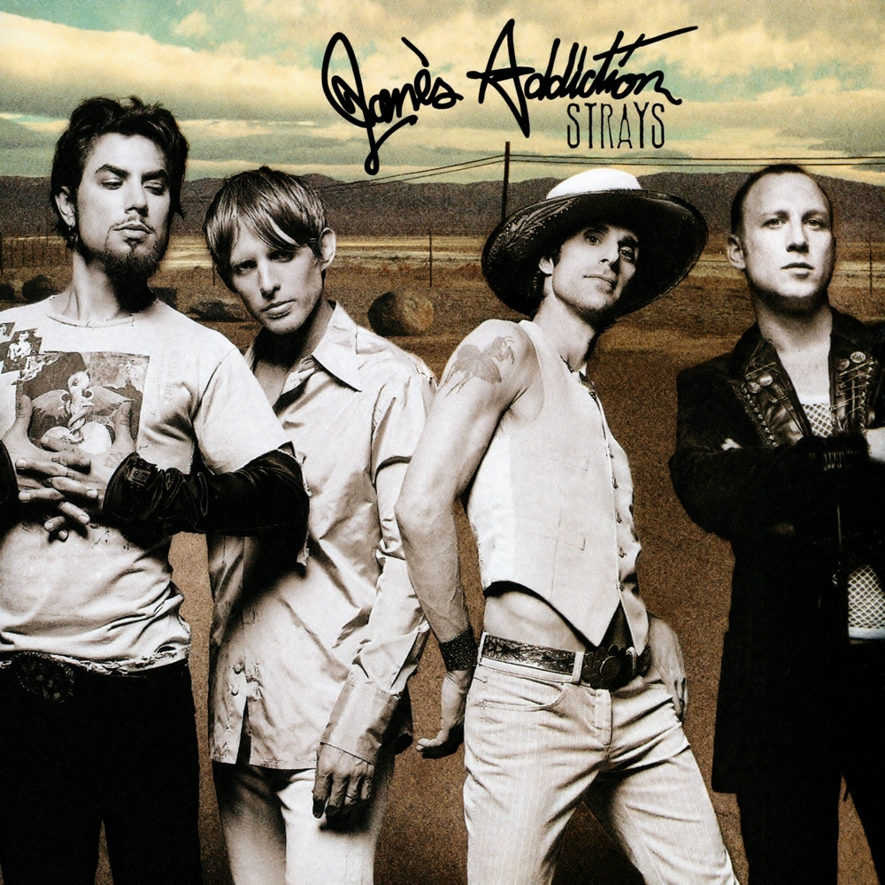

# Strays

By **Jane’s Addiction**

## Album Data

- **Catalog:** Beets
- **Format:** Digital, Album
- **Album:** Strays
- **Artist:** Jane’s Addiction
- **Albumartist:** Jane’s Addiction
- **Genre:** Grunge
- **MusicBrainz Album Artist ID:** [e3434cc7-d348-491a-9dc8-325af3d9086d](https://musicbrainz.org/artist/e3434cc7-d348-491a-9dc8-325af3d9086d)
- **MusicBrainz Album ID:** [8e92c571-8e2b-38e4-bc8a-f87a3da3682b](https://musicbrainz.org/release/8e92c571-8e2b-38e4-bc8a-f87a3da3682b)
- **MusicBrainz Release Group ID:** [bccb3052-3941-349e-85db-0ef6a38b2ed7](https://musicbrainz.org/release-group/bccb3052-3941-349e-85db-0ef6a38b2ed7)
- **Year:** 2003
- **Catalog #:** CDP 7243 5 90186 0 7
- **Label:** Capitol Records
- **Total Tracks:** 11

## Album Tracks

### Track 01 - True Nature

- **Artist:** Jane’s Addiction
- **Format:** ALAC
- **Genre:** Grunge
- **Length:** 3:49
- **MusicBrainz Track ID:** [61f1f19c-796b-49b0-9dc6-8b51a239ca07](https://musicbrainz.org/recording/61f1f19c-796b-49b0-9dc6-8b51a239ca07)
- **Title:** True Nature
- **Track:** 01
- **Year:** 2003

### Track 02 - Strays

- **Artist:** Jane’s Addiction
- **Format:** ALAC
- **Genre:** Stoner Rock
- **Length:** 4:32
- **MusicBrainz Track ID:** [9e1acc0c-029f-4b0e-a2c9-143876dcfb71](https://musicbrainz.org/recording/9e1acc0c-029f-4b0e-a2c9-143876dcfb71)
- **Title:** Strays
- **Track:** 02
- **Year:** 2003

### Track 03 - Just Because

- **Artist:** Jane’s Addiction
- **Format:** ALAC
- **Genre:** Grunge
- **Length:** 3:51
- **MusicBrainz Track ID:** [452871d0-2e84-401d-b75b-e5ac8b30809f](https://musicbrainz.org/recording/452871d0-2e84-401d-b75b-e5ac8b30809f)
- **Title:** Just Because
- **Track:** 03
- **Year:** 2003

### Track 04 - Price I Pay

- **Artist:** Jane’s Addiction
- **Format:** ALAC
- **Genre:** Indie Rock
- **Length:** 5:27
- **MusicBrainz Track ID:** [d2a567cb-a7bf-44da-a8d6-71d4d55064ac](https://musicbrainz.org/recording/d2a567cb-a7bf-44da-a8d6-71d4d55064ac)
- **Title:** Price I Pay
- **Track:** 04
- **Year:** 2003

### Track 05 - The Riches

- **Artist:** Jane’s Addiction
- **Format:** ALAC
- **Genre:** Grunge
- **Length:** 5:44
- **MusicBrainz Track ID:** [ca7e6419-4199-4ee8-9b0f-3b21a56c78a5](https://musicbrainz.org/recording/ca7e6419-4199-4ee8-9b0f-3b21a56c78a5)
- **Title:** The Riches
- **Track:** 05
- **Year:** 2003

### Track 06 - Superhero

- **Artist:** Jane’s Addiction
- **Format:** ALAC
- **Genre:** Hard Rock
- **Length:** 3:58
- **MusicBrainz Track ID:** [57721627-1556-456c-b983-195eb5221094](https://musicbrainz.org/recording/57721627-1556-456c-b983-195eb5221094)
- **Title:** Superhero
- **Track:** 06
- **Year:** 2003

### Track 07 - Wrong Girl

- **Artist:** Jane’s Addiction
- **Format:** ALAC
- **Genre:** Funk Metal
- **Length:** 4:32
- **MusicBrainz Track ID:** [bea35252-238a-4592-80f5-ff61f2da7ed4](https://musicbrainz.org/recording/bea35252-238a-4592-80f5-ff61f2da7ed4)
- **Title:** Wrong Girl
- **Track:** 07
- **Year:** 2003

### Track 08 - Everybody’s Friend

- **Artist:** Jane’s Addiction
- **Format:** ALAC
- **Genre:** Grunge
- **Length:** 3:18
- **MusicBrainz Track ID:** [4fa942b8-cf07-44b4-a246-9399d76aeac8](https://musicbrainz.org/recording/4fa942b8-cf07-44b4-a246-9399d76aeac8)
- **Title:** Everybody’s Friend
- **Track:** 08
- **Year:** 2003

### Track 09 - Suffer Some

- **Artist:** Jane’s Addiction
- **Format:** ALAC
- **Genre:** Funk Metal
- **Length:** 4:14
- **MusicBrainz Track ID:** [5736ae78-f16e-45bc-89bd-3c14e818b21a](https://musicbrainz.org/recording/5736ae78-f16e-45bc-89bd-3c14e818b21a)
- **Title:** Suffer Some
- **Track:** 09
- **Year:** 2003

### Track 10 - Hypersonic

- **Artist:** Jane’s Addiction
- **Format:** ALAC
- **Genre:** Grunge
- **Length:** 3:32
- **MusicBrainz Track ID:** [a70b5a3b-fe7e-47f4-bf85-219a78d20101](https://musicbrainz.org/recording/a70b5a3b-fe7e-47f4-bf85-219a78d20101)
- **Title:** Hypersonic
- **Track:** 10
- **Year:** 2003

### Track 11 - To Match the Sun

- **Artist:** Jane’s Addiction
- **Format:** ALAC
- **Genre:** Alternative Metal
- **Length:** 5:25
- **MusicBrainz Track ID:** [77ca53c8-f64d-4475-8e67-111ccfa858b2](https://musicbrainz.org/recording/77ca53c8-f64d-4475-8e67-111ccfa858b2)
- **Title:** To Match the Sun
- **Track:** 11
- **Year:** 2003

## See also

- [Been Caught Stealing](Been_Caught_Stealing.md)
- [Classic Girl](Classic_Girl.md)
- [Nothing’s Shocking](Nothing’s_Shocking.md)
- [Ritual de lo habitual](Ritual_de_lo_habitual.md)
- [Roon: Nothing's Shocking](../../Roon/Jane’s_Addiction/Nothings_Shocking.md)
- [Roon: Ritual De Lo Habitual](../../Roon/Jane’s_Addiction/Ritual_De_Lo_Habitual.md)
- [Roon: Strays](../../Roon/Jane’s_Addiction/Strays.md)
