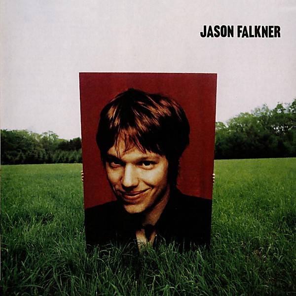

# Presents Author Unknown

By **Jason Falkner**

## Album Data

- **Catalog:** Beets
- **Format:** Digital, Album
- **Album:** Presents Author Unknown
- **Artist:** Jason Falkner
- **Albumartist:** Jason Falkner
- **Genre:** Pop
- **MusicBrainz Album Artist ID:** [54c49b97-22bd-4e0e-998f-60ba4b9d7abf](https://musicbrainz.org/artist/54c49b97-22bd-4e0e-998f-60ba4b9d7abf)
- **MusicBrainz Album ID:** [7f08035c-320c-47a9-a5e0-5dfcfabb99f1](https://musicbrainz.org/release/7f08035c-320c-47a9-a5e0-5dfcfabb99f1)
- **MusicBrainz Release Group ID:** [10d63dbb-ae7a-3a7b-a292-4236e58fdf01](https://musicbrainz.org/release-group/10d63dbb-ae7a-3a7b-a292-4236e58fdf01)
- **Year:** 1996
- **Catalog #:** 61941-2
- **Label:** Elektra
- **Total Tracks:** 12

## Album Tracks

### Track 01 - I Live

- **Artist:** Jason Falkner
- **Format:** ALAC
- **Genre:** Neo-Psychedelia
- **Length:** 3:10
- **MusicBrainz Track ID:** [8c31b957-3562-4f1c-9fb2-ca6fc86ef394](https://musicbrainz.org/recording/8c31b957-3562-4f1c-9fb2-ca6fc86ef394)
- **Title:** I Live
- **Track:** 01
- **Year:** 1996

### Track 02 - Miracle Medicine

- **Artist:** Jason Falkner
- **Format:** ALAC
- **Genre:** Power Pop
- **Length:** 3:26
- **MusicBrainz Track ID:** [e769f583-48a6-4d0f-ba82-95d41f93fc92](https://musicbrainz.org/recording/e769f583-48a6-4d0f-ba82-95d41f93fc92)
- **Title:** Miracle Medicine
- **Track:** 02
- **Year:** 1996

### Track 03 - Hectified

- **Artist:** Jason Falkner
- **Format:** ALAC
- **Genre:** Power Pop
- **Length:** 2:44
- **MusicBrainz Track ID:** [6ee88473-be0b-47c8-a09c-1bb877ecbb9f](https://musicbrainz.org/recording/6ee88473-be0b-47c8-a09c-1bb877ecbb9f)
- **Title:** Hectified
- **Track:** 03
- **Year:** 1996

### Track 04 - Don't Show Me Heaven

- **Artist:** Jason Falkner
- **Format:** ALAC
- **Genre:** Power Pop
- **Length:** 4:15
- **MusicBrainz Track ID:** [cd5f1e15-4ff5-42c9-9043-32ac7cb34d5f](https://musicbrainz.org/recording/cd5f1e15-4ff5-42c9-9043-32ac7cb34d5f)
- **Title:** Don't Show Me Heaven
- **Track:** 04
- **Year:** 1996

### Track 05 - She Goes to Bed

- **Artist:** Jason Falkner
- **Format:** ALAC
- **Genre:** Power Pop
- **Length:** 4:15
- **MusicBrainz Track ID:** [dcbe8cec-71e4-4d6f-a288-bb1101a38175](https://musicbrainz.org/recording/dcbe8cec-71e4-4d6f-a288-bb1101a38175)
- **Title:** She Goes to Bed
- **Track:** 05
- **Year:** 1996

### Track 06 - ...Nobody Knows

- **Artist:** Jason Falkner
- **Format:** ALAC
- **Genre:** Power Pop
- **Length:** 4:06
- **MusicBrainz Track ID:** [128ca041-1d8b-463b-b574-3c8ab6d9a708](https://musicbrainz.org/recording/128ca041-1d8b-463b-b574-3c8ab6d9a708)
- **Title:** ...Nobody Knows
- **Track:** 06
- **Year:** 1996

### Track 07 - Follow Me

- **Artist:** Jason Falkner
- **Format:** ALAC
- **Genre:** Power Pop
- **Length:** 4:07
- **MusicBrainz Track ID:** [57b65749-607a-4a3c-bd29-06e63d75a9e4](https://musicbrainz.org/recording/57b65749-607a-4a3c-bd29-06e63d75a9e4)
- **Title:** Follow Me
- **Track:** 07
- **Year:** 1996

### Track 08 - Before My Heart Attacks

- **Artist:** Jason Falkner
- **Format:** ALAC
- **Genre:** Power Pop
- **Length:** 3:43
- **MusicBrainz Track ID:** [554dbcb2-4c3d-4ef9-9807-1c664c3fb475](https://musicbrainz.org/recording/554dbcb2-4c3d-4ef9-9807-1c664c3fb475)
- **Title:** Before My Heart Attacks
- **Track:** 08
- **Year:** 1996

### Track 09 - Afraid Himself To Be

- **Artist:** Jason Falkner
- **Format:** ALAC
- **Genre:** Power Pop
- **Length:** 3:41
- **MusicBrainz Track ID:** [ce50081f-5978-4bad-bb03-29a5641cab5d](https://musicbrainz.org/recording/ce50081f-5978-4bad-bb03-29a5641cab5d)
- **Title:** Afraid Himself To Be
- **Track:** 09
- **Year:** 1996

### Track 10 - Miss Understanding

- **Artist:** Jason Falkner
- **Format:** ALAC
- **Genre:** Power Pop
- **Length:** 2:59
- **MusicBrainz Track ID:** [9a91be79-ac9e-471c-b46c-012bf3f9d7a7](https://musicbrainz.org/recording/9a91be79-ac9e-471c-b46c-012bf3f9d7a7)
- **Title:** Miss Understanding
- **Track:** 10
- **Year:** 1996

### Track 11 - I Go Astray

- **Artist:** Jason Falkner
- **Format:** ALAC
- **Genre:** Power Pop
- **Length:** 3:49
- **MusicBrainz Track ID:** [f4d6eddf-dde2-4724-bfca-06c8ffb6b604](https://musicbrainz.org/recording/f4d6eddf-dde2-4724-bfca-06c8ffb6b604)
- **Title:** I Go Astray
- **Track:** 11
- **Year:** 1996

### Track 12 - Untitled

- **Artist:** Jason Falkner
- **Format:** ALAC
- **Genre:** Power Pop
- **Length:** 4:01
- **MusicBrainz Track ID:** [895df2c2-2c73-4ab2-b57b-fa986dad16e1](https://musicbrainz.org/recording/895df2c2-2c73-4ab2-b57b-fa986dad16e1)
- **Title:** Untitled
- **Track:** 12
- **Year:** 1996

## See also

- [Can You Still Feel?](Can_You_Still_Feel.md)
- [I'm OK You're OK](Im_OK_Youre_OK.md)
