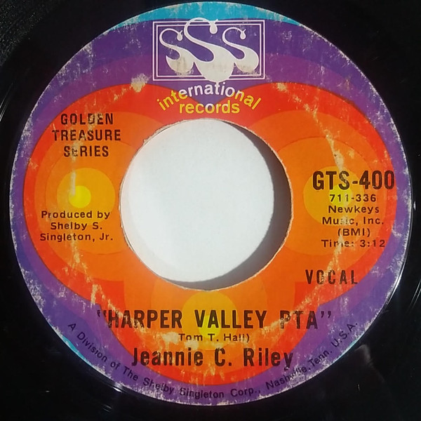

# Harper Valley P.T.A.

By **Jeannie C. Riley**

## Album Data

- **Catalog:** Beets
- **Format:** Digital, Album
- **Album:** Harper Valley P.T.A.
- **Artist:** Jeannie C. Riley
- **Albumartist:** Jeannie C. Riley
- **Genre:** Classic Country
- **MusicBrainz Album Artist ID:** [https](https://musicbrainz.org/artist/https)
- **MusicBrainz Album ID:** [https](https://musicbrainz.org/release/https)
- **MusicBrainz Release Group ID:** 
- **Year:** 1968
- **Catalog #:** 
- **Label:** Sun Records
- **Total Tracks:** 11

## Album Tracks

### Track 01 - Harper Valley P.T.A.

- **Artist:** Jeannie C. Riley
- **Format:** MP3
- **Genre:** Classic Country
- **Length:** 3:12
- **MusicBrainz Track ID:** [https](https://musicbrainz.org/recording/https)
- **Title:** Harper Valley P.T.A.
- **Track:** 01
- **Year:** 1968

### Track 02 - Widow Jones

- **Artist:** Jeannie C. Riley
- **Format:** MP3
- **Genre:** Classic Country
- **Length:** 2:30
- **MusicBrainz Track ID:** [https](https://musicbrainz.org/recording/https)
- **Title:** Widow Jones
- **Track:** 02
- **Year:** 1968

### Track 03 - No Brass Band

- **Artist:** Jeannie C. Riley
- **Format:** MP3
- **Genre:** Classic Country
- **Length:** 2:28
- **MusicBrainz Track ID:** [https](https://musicbrainz.org/recording/https)
- **Title:** No Brass Band
- **Track:** 03
- **Year:** 1968

### Track 04 - Mr. Harper

- **Artist:** Jeannie C. Riley
- **Format:** MP3
- **Genre:** Classic Country
- **Length:** 2:07
- **MusicBrainz Track ID:** [https](https://musicbrainz.org/recording/https)
- **Title:** Mr. Harper
- **Track:** 04
- **Year:** 1968

### Track 05 - Run Jeannie Run

- **Artist:** Jeannie C. Riley
- **Format:** MP3
- **Genre:** Classic Country
- **Length:** 3:25
- **MusicBrainz Track ID:** [https](https://musicbrainz.org/recording/https)
- **Title:** Run Jeannie Run
- **Track:** 05
- **Year:** 1968

### Track 06 - Shed Me No Tears

- **Artist:** Jeannie C. Riley
- **Format:** MP3
- **Genre:** Classic Country
- **Length:** 2:05
- **MusicBrainz Track ID:** [https](https://musicbrainz.org/recording/https)
- **Title:** Shed Me No Tears
- **Track:** 06
- **Year:** 1968

### Track 07 - The Cotton Patch

- **Artist:** Jeannie C. Riley
- **Format:** MP3
- **Genre:** Country
- **Length:** 3:41
- **MusicBrainz Track ID:** [https](https://musicbrainz.org/recording/https)
- **Title:** The Cotton Patch
- **Track:** 07
- **Year:** 1968

### Track 08 - Sippin' Shirley Thompson

- **Artist:** Jeannie C. Riley
- **Format:** MP3
- **Genre:** Classic Country
- **Length:** 2:08
- **MusicBrainz Track ID:** [https](https://musicbrainz.org/recording/https)
- **Title:** Sippin' Shirley Thompson
- **Track:** 08
- **Year:** 1968

### Track 09 - The Little Town Square

- **Artist:** Jeannie C. Riley
- **Format:** MP3
- **Genre:** Classic Country
- **Length:** 2:18
- **MusicBrainz Track ID:** [https](https://musicbrainz.org/recording/https)
- **Title:** The Little Town Square
- **Track:** 09
- **Year:** 1968

### Track 10 - The Ballad of Louise

- **Artist:** Jeannie C. Riley
- **Format:** MP3
- **Genre:** Classic Country
- **Length:** 2:57
- **MusicBrainz Track ID:** [https](https://musicbrainz.org/recording/https)
- **Title:** The Ballad of Louise
- **Track:** 10
- **Year:** 1968

### Track 11 - Satan Place

- **Artist:** Jeannie C. Riley
- **Format:** MP3
- **Genre:** Classic Country
- **Length:** 3:19
- **MusicBrainz Track ID:** [https](https://musicbrainz.org/recording/https)
- **Title:** Satan Place
- **Track:** 11
- **Year:** 1968

## See also

- [Vinyl: Harper Valley P.T.A.](../../Vinyl/Jeannie_C_Riley/Harper_Valley_PTA.md)
- [Vinyl: ](../../Vinyl/Jeannie_C_Riley/Jeannie_C_Riley.md)
