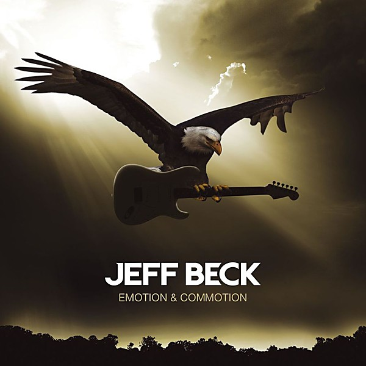

# Emotion & Commotion

By **Jeff Beck**

## Album Data

- **Catalog:** Beets
- **Format:** Digital, Album
- **Album:** Emotion & Commotion
- **Artist:** Jeff Beck
- **Albumartist:** Jeff Beck
- **Genre:** Rock
- **MusicBrainz Album Artist ID:** [14a4bc78-1c2d-4ca7-8d1b-9b58076a2a17](https://musicbrainz.org/artist/14a4bc78-1c2d-4ca7-8d1b-9b58076a2a17)
- **MusicBrainz Album ID:** [41b9dbe2-eeed-4009-9396-50f298ce2b7a](https://musicbrainz.org/release/41b9dbe2-eeed-4009-9396-50f298ce2b7a)
- **MusicBrainz Release Group ID:** [a5fec79a-eb30-442c-a349-55fa19930e3f](https://musicbrainz.org/release-group/a5fec79a-eb30-442c-a349-55fa19930e3f)
- **Year:** 2010
- **Catalog #:** WPCR-13816
- **Label:** ATCO Records
- **Total Tracks:** 12

## Album Tracks

### Track 01 - Corpus Christi Carol

- **Artist:** Jeff Beck
- **Format:** ALAC
- **Genre:** Rock
- **Length:** 2:40
- **MusicBrainz Track ID:** [df28754b-5725-43ad-a60c-e42ec6c27030](https://musicbrainz.org/recording/df28754b-5725-43ad-a60c-e42ec6c27030)
- **Title:** Corpus Christi Carol
- **Track:** 01
- **Year:** 2010

### Track 02 - Hammerhead

- **Artist:** Jeff Beck
- **Format:** ALAC
- **Genre:** Progressive Rock
- **Length:** 4:15
- **MusicBrainz Track ID:** [42516aa7-9b9f-441b-b58f-518e952b1a1f](https://musicbrainz.org/recording/42516aa7-9b9f-441b-b58f-518e952b1a1f)
- **Title:** Hammerhead
- **Track:** 02
- **Year:** 2010

### Track 03 - Never Alone

- **Artist:** Jeff Beck
- **Format:** ALAC
- **Genre:** Rock
- **Length:** 4:22
- **MusicBrainz Track ID:** [d70c6cc1-3744-4509-8e03-9360bca94ec2](https://musicbrainz.org/recording/d70c6cc1-3744-4509-8e03-9360bca94ec2)
- **Title:** Never Alone
- **Track:** 03
- **Year:** 2010

### Track 04 - Over the Rainbow

- **Artist:** Jeff Beck
- **Format:** ALAC
- **Genre:** Smooth Jazz
- **Length:** 3:10
- **MusicBrainz Track ID:** [38b376d0-7f35-4f05-9e53-8a6d91f410e9](https://musicbrainz.org/recording/38b376d0-7f35-4f05-9e53-8a6d91f410e9)
- **Title:** Over the Rainbow
- **Track:** 04
- **Year:** 2010

### Track 08 - Nessun Dorma

- **Artist:** Jeff Beck
- **Format:** ALAC
- **Genre:** Opera
- **Length:** 2:56
- **MusicBrainz Track ID:** [43682d7f-f583-4288-a8e2-239c4e8f3656](https://musicbrainz.org/recording/43682d7f-f583-4288-a8e2-239c4e8f3656)
- **Title:** Nessun Dorma
- **Track:** 08
- **Year:** 2010

### Track 12 - Cry Me A River

- **Artist:** Jeff Beck
- **Format:** MP3
- **Genre:** Rock
- **Length:** 4:31
- **MusicBrainz Track ID:** [52ebf6c1-f543-491e-b59b-90753ccefdc8](https://musicbrainz.org/recording/52ebf6c1-f543-491e-b59b-90753ccefdc8)
- **Title:** Cry Me A River
- **Track:** 12
- **Year:** 2010

### Track 07 - Lilac Wine

- **Artist:** Jeff Beck feat. Imelda May
- **Format:** ALAC
- **Genre:** Rock
- **Length:** 4:44
- **MusicBrainz Track ID:** [d477632e-918c-4dc7-abee-c3a51cdb6f0a](https://musicbrainz.org/recording/d477632e-918c-4dc7-abee-c3a51cdb6f0a)
- **Title:** Lilac Wine
- **Track:** 07
- **Year:** 2010

### Track 06 - Serene

- **Artist:** Jeff Beck feat. Olivia Safe
- **Format:** ALAC
- **Genre:** Rock
- **Length:** 6:05
- **MusicBrainz Track ID:** [b9f0fda6-36b3-49f6-9d9f-e8844c8a848c](https://musicbrainz.org/recording/b9f0fda6-36b3-49f6-9d9f-e8844c8a848c)
- **Title:** Serene
- **Track:** 06
- **Year:** 2010

### Track 10 - Elegy for Dunkirk

- **Artist:** Jeff Beck feat. Olivia Safe
- **Format:** ALAC
- **Genre:** Rock
- **Length:** 5:03
- **MusicBrainz Track ID:** [21437d71-40be-4ded-b28b-31cb6224ea2a](https://musicbrainz.org/recording/21437d71-40be-4ded-b28b-31cb6224ea2a)
- **Title:** Elegy for Dunkirk
- **Track:** 10
- **Year:** 2010

### Track 05 - I Put a Spell on You

- **Artist:** Jeff Beck feat. Joss Stone
- **Format:** ALAC
- **Genre:** Rock
- **Length:** 2:59
- **MusicBrainz Track ID:** [52034fff-6b79-4ea1-915b-e5906dc7af39](https://musicbrainz.org/recording/52034fff-6b79-4ea1-915b-e5906dc7af39)
- **Title:** I Put a Spell on You
- **Track:** 05
- **Year:** 2010

### Track 09 - There's No Other Me

- **Artist:** Jeff Beck feat. Joss Stone
- **Format:** ALAC
- **Genre:** Rock
- **Length:** 4:05
- **MusicBrainz Track ID:** [d4224bfd-96ea-4e55-badf-ee5ed76a6f4e](https://musicbrainz.org/recording/d4224bfd-96ea-4e55-badf-ee5ed76a6f4e)
- **Title:** There's No Other Me
- **Track:** 09
- **Year:** 2010

## See also

- [Blow by Blow](Blow_by_Blow.md)
- [Roon: Blow By Blow](../../Roon/Jeff_Beck/Blow_By_Blow.md)
- [Roon: Emotion & Commotion](../../Roon/Jeff_Beck/Emotion_and_Commotion.md)
- [Roon: Truth](../../Roon/Jeff_Beck/Truth.md)
- [Vinyl: Blow By Blow](../../Vinyl/Jeff_Beck/Blow_By_Blow.md)
- [Vinyl: ](../../Vinyl/Jeff_Beck/Jeff_Beck.md)
