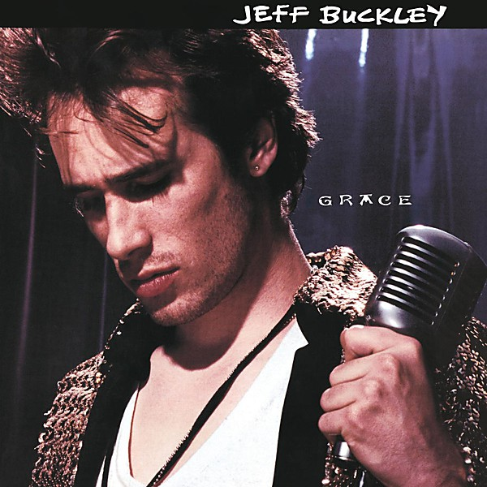

# Grace

By **Jeff Buckley**

## Album Data

- **Catalog:** Beets
- **Format:** Digital, Album
- **Album:** Grace
- **Artist:** Jeff Buckley
- **Albumartist:** Jeff Buckley
- **Genre:** Alternative Rock
- **MusicBrainz Album Artist ID:** [e6e879c0-3d56-4f12-b3c5-3ce459661a8e](https://musicbrainz.org/artist/e6e879c0-3d56-4f12-b3c5-3ce459661a8e)
- **MusicBrainz Album ID:** [b2f862e5-a1f3-475d-85a1-6cb1160286aa](https://musicbrainz.org/release/b2f862e5-a1f3-475d-85a1-6cb1160286aa)
- **MusicBrainz Release Group ID:** [ea29c347-696f-3165-986d-7bad1394b178](https://musicbrainz.org/release-group/ea29c347-696f-3165-986d-7bad1394b178)
- **Year:** 1994
- **Catalog #:** CK 57528
- **Label:** Columbia
- **Total Tracks:** 10

## Album Tracks

### Track 01 - Mojo Pin

- **Artist:** Jeff Buckley
- **Format:** MP3
- **Genre:** Alternative Rock
- **Length:** 5:41
- **MusicBrainz Track ID:** [19dcc05e-6f91-42e3-b549-d80135d8b45a](https://musicbrainz.org/recording/19dcc05e-6f91-42e3-b549-d80135d8b45a)
- **Title:** Mojo Pin
- **Track:** 01
- **Year:** 1994

### Track 02 - Grace

- **Artist:** Jeff Buckley
- **Format:** MP3
- **Genre:** Indie Rock
- **Length:** 5:21
- **MusicBrainz Track ID:** [71feb283-9a0d-491d-a40b-8ccae7fc728b](https://musicbrainz.org/recording/71feb283-9a0d-491d-a40b-8ccae7fc728b)
- **Title:** Grace
- **Track:** 02
- **Year:** 1994

### Track 03 - Last Goodbye

- **Artist:** Jeff Buckley
- **Format:** MP3
- **Genre:** Indie Rock
- **Length:** 4:35
- **MusicBrainz Track ID:** [3156ff92-7e8f-4cd7-9ebc-b11b9373479b](https://musicbrainz.org/recording/3156ff92-7e8f-4cd7-9ebc-b11b9373479b)
- **Title:** Last Goodbye
- **Track:** 03
- **Year:** 1994

### Track 04 - Lilac Wine

- **Artist:** Jeff Buckley
- **Format:** MP3
- **Genre:** Alternative Rock
- **Length:** 4:32
- **MusicBrainz Track ID:** [026a33b3-cd65-4eaf-b761-8f4a67c3ace2](https://musicbrainz.org/recording/026a33b3-cd65-4eaf-b761-8f4a67c3ace2)
- **Title:** Lilac Wine
- **Track:** 04
- **Year:** 1994

### Track 05 - So Real

- **Artist:** Jeff Buckley
- **Format:** MP3
- **Genre:** Indie Rock
- **Length:** 4:43
- **MusicBrainz Track ID:** [1e587065-3298-4828-9cb4-7c8949bc6a18](https://musicbrainz.org/recording/1e587065-3298-4828-9cb4-7c8949bc6a18)
- **Title:** So Real
- **Track:** 05
- **Year:** 1994

### Track 06 - Hallelujah

- **Artist:** Jeff Buckley
- **Format:** MP3
- **Genre:** Alternative Rock
- **Length:** 6:52
- **MusicBrainz Track ID:** [da1308d1-6037-4ba1-b6fc-a643a4201140](https://musicbrainz.org/recording/da1308d1-6037-4ba1-b6fc-a643a4201140)
- **Title:** Hallelujah
- **Track:** 06
- **Year:** 1994

### Track 07 - Lover, You Should’ve Come Over

- **Artist:** Jeff Buckley
- **Format:** MP3
- **Genre:** Alternative Rock
- **Length:** 6:43
- **MusicBrainz Track ID:** [a15695cc-32d6-4e09-8515-24d1e6f9dac6](https://musicbrainz.org/recording/a15695cc-32d6-4e09-8515-24d1e6f9dac6)
- **Title:** Lover, You Should’ve Come Over
- **Track:** 07
- **Year:** 1994

### Track 08 - Corpus Christi Carol

- **Artist:** Jeff Buckley
- **Format:** MP3
- **Genre:** Alternative Rock
- **Length:** 2:56
- **MusicBrainz Track ID:** [50fd6b05-c0a1-4125-9246-c326b8029d02](https://musicbrainz.org/recording/50fd6b05-c0a1-4125-9246-c326b8029d02)
- **Title:** Corpus Christi Carol
- **Track:** 08
- **Year:** 1994

### Track 09 - Eternal Life

- **Artist:** Jeff Buckley
- **Format:** MP3
- **Genre:** Indie Rock
- **Length:** 4:51
- **MusicBrainz Track ID:** [e23161fe-1fc4-47a5-ac4f-4d7b20eb952b](https://musicbrainz.org/recording/e23161fe-1fc4-47a5-ac4f-4d7b20eb952b)
- **Title:** Eternal Life
- **Track:** 09
- **Year:** 1994

### Track 10 - Dream Brother

- **Artist:** Jeff Buckley
- **Format:** MP3
- **Genre:** Indie Rock
- **Length:** 5:26
- **MusicBrainz Track ID:** [985f5dbc-11d1-46aa-b3cf-be334574fe8d](https://musicbrainz.org/recording/985f5dbc-11d1-46aa-b3cf-be334574fe8d)
- **Title:** Dream Brother
- **Track:** 10
- **Year:** 1994

