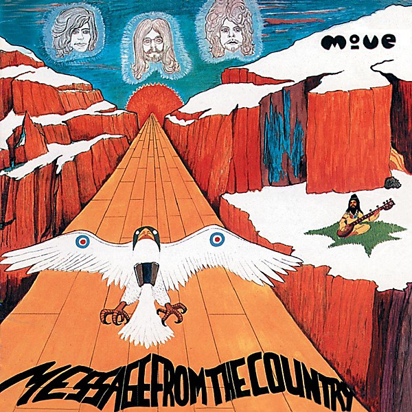

# A Message From The Country

By **Jeff Lynne**

## Album Data

- **Catalog:** Beets
- **Format:** Digital, Album
- **Album:** A Message From The Country
- **Artist:** Jeff Lynne
- **Albumartist:** Jeff Lynne
- **Genre:** Progressive Rock
- **MusicBrainz Album Artist ID:** 
- **MusicBrainz Album ID:** 
- **MusicBrainz Release Group ID:** 
- **Year:** 1989
- **Catalog #:** 9 26184-2
- **Label:** Reprise Records
- **Total Tracks:** 11

## Album Tracks

### Track 01 - Every Little Thing

- **Artist:** Jeff Lynne
- **Format:** ALAC
- **Genre:** Progressive Rock
- **Length:** 3:44
- **MusicBrainz Track ID:** [328a0829-5519-442a-b3ff-e283897950a1](https://musicbrainz.org/recording/328a0829-5519-442a-b3ff-e283897950a1)
- **Title:** Every Little Thing
- **Track:** 01
- **Year:** 1990

### Track 02 - Don't Let Go

- **Artist:** Jeff Lynne
- **Format:** ALAC
- **Genre:** Rockabilly
- **Length:** 3:01
- **MusicBrainz Track ID:** [5d01e0f9-3e10-4bf4-aef9-c80072f9228c](https://musicbrainz.org/recording/5d01e0f9-3e10-4bf4-aef9-c80072f9228c)
- **Title:** Don't Let Go
- **Track:** 02
- **Year:** 1990

### Track 03 - Lift Me Up

- **Artist:** Jeff Lynne
- **Format:** ALAC
- **Genre:** Progressive Rock
- **Length:** 3:38
- **MusicBrainz Track ID:** [4c90669d-ed67-496f-99c2-0ea87d3e2903](https://musicbrainz.org/recording/4c90669d-ed67-496f-99c2-0ea87d3e2903)
- **Title:** Lift Me Up
- **Track:** 03
- **Year:** 1990

### Track 04 - Nobody Home

- **Artist:** Jeff Lynne
- **Format:** ALAC
- **Genre:** Rock
- **Length:** 3:53
- **MusicBrainz Track ID:** [58295f8c-fd99-4b35-90e8-467a362a8412](https://musicbrainz.org/recording/58295f8c-fd99-4b35-90e8-467a362a8412)
- **Title:** Nobody Home
- **Track:** 04
- **Year:** 1990

### Track 05 - September Song

- **Artist:** Jeff Lynne
- **Format:** ALAC
- **Genre:** Soft Rock
- **Length:** 2:59
- **MusicBrainz Track ID:** [c8f7945c-4bc7-46ae-9e13-34d3a8d2a637](https://musicbrainz.org/recording/c8f7945c-4bc7-46ae-9e13-34d3a8d2a637)
- **Title:** September Song
- **Track:** 05
- **Year:** 1990

### Track 06 - Now You're Gone

- **Artist:** Jeff Lynne
- **Format:** ALAC
- **Genre:** Progressive Rock
- **Length:** 3:58
- **MusicBrainz Track ID:** [df5770f9-fbf1-44d3-a651-ed9f46cca963](https://musicbrainz.org/recording/df5770f9-fbf1-44d3-a651-ed9f46cca963)
- **Title:** Now You're Gone
- **Track:** 06
- **Year:** 1990

### Track 07 - Don't Say Goodbye

- **Artist:** Jeff Lynne
- **Format:** ALAC
- **Genre:** Soft Rock
- **Length:** 3:10
- **MusicBrainz Track ID:** [2ff8dbc9-29fa-4cca-8728-6303283c5f91](https://musicbrainz.org/recording/2ff8dbc9-29fa-4cca-8728-6303283c5f91)
- **Title:** Don't Say Goodbye
- **Track:** 07
- **Year:** 1990

### Track 08 - What Would It Take

- **Artist:** Jeff Lynne
- **Format:** ALAC
- **Genre:** Rock
- **Length:** 2:42
- **MusicBrainz Track ID:** [f2d44010-370c-474d-8310-8be2e59b715b](https://musicbrainz.org/recording/f2d44010-370c-474d-8310-8be2e59b715b)
- **Title:** What Would It Take
- **Track:** 08
- **Year:** 1990

### Track 09 - Stormy Weather

- **Artist:** Jeff Lynne
- **Format:** ALAC
- **Genre:** Jazz Fusion
- **Length:** 3:43
- **MusicBrainz Track ID:** [d9a1b13f-e991-4b23-ab1e-a23bb2959c66](https://musicbrainz.org/recording/d9a1b13f-e991-4b23-ab1e-a23bb2959c66)
- **Title:** Stormy Weather
- **Track:** 09
- **Year:** 1990

### Track 10 - Blown Away

- **Artist:** Jeff Lynne
- **Format:** ALAC
- **Genre:** Soft Rock
- **Length:** 3:33
- **MusicBrainz Track ID:** [22a68f2b-7fac-4ef5-8888-72e1a9ed5c3a](https://musicbrainz.org/recording/22a68f2b-7fac-4ef5-8888-72e1a9ed5c3a)
- **Title:** Blown Away
- **Track:** 10
- **Year:** 1990

### Track 11 - Save Me Now

- **Artist:** Jeff Lynne
- **Format:** ALAC
- **Genre:** Folk Rock
- **Length:** 2:37
- **MusicBrainz Track ID:** [10c979c4-218d-475c-9c83-01ed416dc969](https://musicbrainz.org/recording/10c979c4-218d-475c-9c83-01ed416dc969)
- **Title:** Save Me Now
- **Track:** 11
- **Year:** 1990

## See also

- [Armchair Theatre](Armchair_Theatre.md)
- [CD: Alone In The Universe](../../CD/Jeff_Lynne/Alone_In_The_Universe.md)
- [CD: Armchair Theatre](../../CD/Jeff_Lynne/Armchair_Theatre.md)
- [CD: ](../../CD/Jeff_Lynne/Jeff_Lynne.md)
- [Roon: Armchair Theatre](../../Roon/Jeff_Lynne/Armchair_Theatre.md)
- [Roon: Jeff Lynne's ELO - Alone In The Universe (bonus track version)](../../Roon/Jeff_Lynne/Jeff_Lynnes_ELO_-_Alone_In_The_Universe_bonus_track_version.md)
- [Roon: Jeff Lynne's ELO - Alone in the Universe](../../Roon/Jeff_Lynne/Jeff_Lynnes_ELO_-_Alone_in_the_Universe.md)
