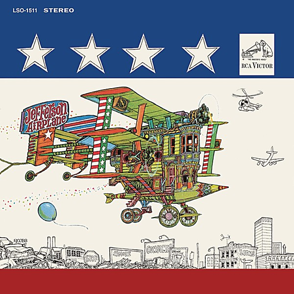

# After Bathing At Baxter's

By **Jefferson Airplane**

## Album Data

- **Catalog:** Beets
- **Format:** Digital, Album
- **Album:** After Bathing At Baxter's
- **Artist:** Jefferson Airplane
- **Albumartist:** Jefferson Airplane
- **Genre:** Psychedelic Rock
- **MusicBrainz Album Artist ID:** 
- **MusicBrainz Album ID:** 
- **MusicBrainz Release Group ID:** 
- **Year:** 0000
- **Catalog #:** 82876 53225 2
- **Label:** BMG Heritage
- **Total Tracks:** 15

## Album Tracks

### Track 01 - The Ballad of You & Me & Pooneil

- **Artist:** Jefferson Airplane
- **Format:** ALAC
- **Genre:** Psychedelic Rock
- **Length:** 4:35
- **MusicBrainz Track ID:** [764ae15e-fd02-4a09-8f75-ecf08db54f90](https://musicbrainz.org/recording/764ae15e-fd02-4a09-8f75-ecf08db54f90)
- **Title:** The Ballad of You & Me & Pooneil
- **Track:** 01
- **Year:** 2003

### Track 02 - A Small Package of Value Will Come to You, Shortly

- **Artist:** Jefferson Airplane
- **Format:** ALAC
- **Genre:** Psychedelic Rock
- **Length:** 1:34
- **MusicBrainz Track ID:** [c4f7ed92-4559-492a-a504-ddd5640b7563](https://musicbrainz.org/recording/c4f7ed92-4559-492a-a504-ddd5640b7563)
- **Title:** A Small Package of Value Will Come to You, Shortly
- **Track:** 02
- **Year:** 2003

### Track 03 - Young Girl Sunday Blues

- **Artist:** Jefferson Airplane
- **Format:** ALAC
- **Genre:** Acid Rock
- **Length:** 3:35
- **MusicBrainz Track ID:** [59326429-b3be-4c09-861c-6c9bbe573107](https://musicbrainz.org/recording/59326429-b3be-4c09-861c-6c9bbe573107)
- **Title:** Young Girl Sunday Blues
- **Track:** 03
- **Year:** 2003

### Track 04 - Martha

- **Artist:** Jefferson Airplane
- **Format:** ALAC
- **Genre:** Acid Rock
- **Length:** 3:26
- **MusicBrainz Track ID:** [088d8261-8efb-46f2-821a-5099cdc30ce5](https://musicbrainz.org/recording/088d8261-8efb-46f2-821a-5099cdc30ce5)
- **Title:** Martha
- **Track:** 04
- **Year:** 2003

### Track 05 - Wild Tyme (H)

- **Artist:** Jefferson Airplane
- **Format:** ALAC
- **Genre:** Psychedelic Rock
- **Length:** 3:10
- **MusicBrainz Track ID:** [c3b83854-c5dd-4a51-aae2-9a197e3665f4](https://musicbrainz.org/recording/c3b83854-c5dd-4a51-aae2-9a197e3665f4)
- **Title:** Wild Tyme (H)
- **Track:** 05
- **Year:** 2003

### Track 06 - The Last Wall of the Castle

- **Artist:** Jefferson Airplane
- **Format:** ALAC
- **Genre:** Acid Rock
- **Length:** 2:40
- **MusicBrainz Track ID:** [5116052a-a0cc-4441-a759-6a3db2748d82](https://musicbrainz.org/recording/5116052a-a0cc-4441-a759-6a3db2748d82)
- **Title:** The Last Wall of the Castle
- **Track:** 06
- **Year:** 2003

### Track 07 - Rejoyce

- **Artist:** Jefferson Airplane
- **Format:** ALAC
- **Genre:** Acid Rock
- **Length:** 4:03
- **MusicBrainz Track ID:** [abfc72cf-87fc-4570-8b4c-0c09a5807a91](https://musicbrainz.org/recording/abfc72cf-87fc-4570-8b4c-0c09a5807a91)
- **Title:** Rejoyce
- **Track:** 07
- **Year:** 2003

### Track 08 - Watch Her Ride

- **Artist:** Jefferson Airplane
- **Format:** ALAC
- **Genre:** Acid Rock
- **Length:** 3:11
- **MusicBrainz Track ID:** [6f97391f-4e05-4e3d-9b05-f3f1281aa356](https://musicbrainz.org/recording/6f97391f-4e05-4e3d-9b05-f3f1281aa356)
- **Title:** Watch Her Ride
- **Track:** 08
- **Year:** 2003

### Track 09 - Spare Chaynge

- **Artist:** Jefferson Airplane
- **Format:** ALAC
- **Genre:** Acid Rock
- **Length:** 9:12
- **MusicBrainz Track ID:** [cb53385f-513e-4fa9-84d7-fd47e3ba7301](https://musicbrainz.org/recording/cb53385f-513e-4fa9-84d7-fd47e3ba7301)
- **Title:** Spare Chaynge
- **Track:** 09
- **Year:** 2003

### Track 10 - Two Heads

- **Artist:** Jefferson Airplane
- **Format:** ALAC
- **Genre:** Acid Rock
- **Length:** 3:13
- **MusicBrainz Track ID:** [a2bb9ed2-1a30-4fd1-a70f-66bbd39ff99b](https://musicbrainz.org/recording/a2bb9ed2-1a30-4fd1-a70f-66bbd39ff99b)
- **Title:** Two Heads
- **Track:** 10
- **Year:** 2003

### Track 11 - Won't You Try? / Saturday Afternoon

- **Artist:** Jefferson Airplane
- **Format:** ALAC
- **Genre:** Psychedelic Rock
- **Length:** 5:07
- **MusicBrainz Track ID:** [1bf47f61-730b-46f3-899c-406b26b2c6be](https://musicbrainz.org/recording/1bf47f61-730b-46f3-899c-406b26b2c6be)
- **Title:** Won't You Try? / Saturday Afternoon
- **Track:** 11
- **Year:** 2003

### Track 12 - The Ballad of You & Me & Pooneil (live - long version)

- **Artist:** Jefferson Airplane
- **Format:** ALAC
- **Genre:** Psychedelic Rock
- **Length:** 11:07
- **MusicBrainz Track ID:** [ab614cc1-3500-42ad-bc1e-e50c5acab778](https://musicbrainz.org/recording/ab614cc1-3500-42ad-bc1e-e50c5acab778)
- **Title:** The Ballad of You & Me & Pooneil (live - long version)
- **Track:** 12
- **Year:** 2003

### Track 13 - Martha (mono single version)

- **Artist:** Jefferson Airplane
- **Format:** ALAC
- **Genre:** Folk Rock
- **Length:** 3:29
- **MusicBrainz Track ID:** [5957a5ea-e1e3-4820-baf8-92f37023d5ab](https://musicbrainz.org/recording/5957a5ea-e1e3-4820-baf8-92f37023d5ab)
- **Title:** Martha (mono single version)
- **Track:** 13
- **Year:** 2003

### Track 14 - Two Heads (alternate version)

- **Artist:** Jefferson Airplane
- **Format:** ALAC
- **Genre:** Psychedelic Rock
- **Length:** 3:18
- **MusicBrainz Track ID:** [4029f408-4a67-4d86-ab42-a8b63d22ccef](https://musicbrainz.org/recording/4029f408-4a67-4d86-ab42-a8b63d22ccef)
- **Title:** Two Heads (alternate version)
- **Track:** 14
- **Year:** 2003

### Track 15 - Things Are Better in the East (demo version)

- **Artist:** Jefferson Airplane
- **Format:** ALAC
- **Genre:** Psychedelic Rock
- **Length:** 6:40
- **MusicBrainz Track ID:** [2450be12-21a7-4687-bf84-7ce7af78736c](https://musicbrainz.org/recording/2450be12-21a7-4687-bf84-7ce7af78736c)
- **Title:** Things Are Better in the East (demo version)
- **Track:** 15
- **Year:** 2003

## See also

- [After Bathing at Baxter's](After_Bathing_at_Baxters.md)
- [Bark](Bark.md)
- [Bless Its Pointed Little Head](Bless_Its_Pointed_Little_Head.md)
- [Crown of Creation](Crown_of_Creation.md)
- [Early Flight](Early_Flight.md)
- [Jefferson Airplane](Jefferson_Airplane.md)
- [Jefferson Airplane Takes Off](Jefferson_Airplane_Takes_Off.md)
- [Live at Fillmore West 11-25 thru 11-27 1966](Live_at_Fillmore_West_11-25_thru_11-27_1966.md)
- [Long John Silver](Long_John_Silver.md)
- [Return To The Matrix](Return_To_The_Matrix.md)
- [Surrealistic Pillow](Surrealistic_Pillow.md)
- [Sweeping Up the Spotlight](Sweeping_Up_the_Spotlight.md)
- [The Essential Jefferson Airplane - Amazon Prime](The_Essential_Jefferson_Airplane_-_Amazon_Prime.md)
- [Thirty Seconds Over Winterland](Thirty_Seconds_Over_Winterland.md)
- [Volunteers](Volunteers.md)
- [CD: After Bathing At Baxter's](../../CD/Jefferson_Airplane/After_Bathing_At_Baxters.md)
- [CD: Bark](../../CD/Jefferson_Airplane/Bark.md)
- [CD: Early Flight Thirty Seconds Over Winterland](../../CD/Jefferson_Airplane/Early_Flight_Thirty_Seconds_Over_Winterland.md)
- [CD: ](../../CD/Jefferson_Airplane/Jefferson_Airplane.md)
- [CD: Long John Silver](../../CD/Jefferson_Airplane/Long_John_Silver.md)
- [CD: Original Album Classics (Disc 1)](../../CD/Jefferson_Airplane/Original_Album_Classics_Disc_1.md)
- [Roon: After Bathing At Baxters](../../Roon/Jefferson_Airplane/After_Bathing_At_Baxters.md)
- [Roon: Bark (Bonus Tracks)](../../Roon/Jefferson_Airplane/Bark_Bonus_Tracks.md)
- [Roon: Bless Its Pointed Little Head](../../Roon/Jefferson_Airplane/Bless_Its_Pointed_Little_Head.md)
- [Roon: Crown Of Creation](../../Roon/Jefferson_Airplane/Crown_Of_Creation.md)
- [Roon: Long John Silver](../../Roon/Jefferson_Airplane/Long_John_Silver.md)
- [Roon: Surrealistic Pillow](../../Roon/Jefferson_Airplane/Surrealistic_Pillow.md)
- [Roon: Thirty Seconds Over Winterland [Live] (Expanded Edition)](../../Roon/Jefferson_Airplane/Thirty_Seconds_Over_Winterland_[Live]_Expanded_Edition.md)
- [Roon: Volunteers](../../Roon/Jefferson_Airplane/Volunteers.md)
- [Vinyl: After Bathing At Baxter's](../../Vinyl/Jefferson_Airplane/After_Bathing_At_Baxters.md)
- [Vinyl: Crown Of Creation](../../Vinyl/Jefferson_Airplane/Crown_Of_Creation.md)
- [Vinyl: ](../../Vinyl/Jefferson_Airplane/Jefferson_Airplane.md)
- [Vinyl: Mexico](../../Vinyl/Jefferson_Airplane/Mexico.md)
- [Vinyl: Surrealistic Pillow](../../Vinyl/Jefferson_Airplane/Surrealistic_Pillow.md)
