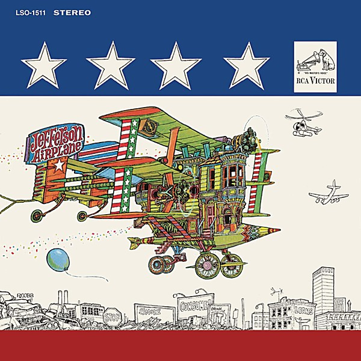

# After Bathing at Baxter's

By **Jefferson Airplane**

## Album Data

- **Catalog:** Beets
- **Format:** Digital, Album
- **Album:** After Bathing at Baxter's
- **Artist:** Jefferson Airplane
- **Albumartist:** Jefferson Airplane
- **Genre:** Psychedelic Rock
- **MusicBrainz Album Artist ID:** [39c2a93d-9afa-4a22-9bba-c087ab056e1c](https://musicbrainz.org/artist/39c2a93d-9afa-4a22-9bba-c087ab056e1c)
- **MusicBrainz Album ID:** [7a6e129f-4114-315c-af87-3a11ae686daf](https://musicbrainz.org/release/7a6e129f-4114-315c-af87-3a11ae686daf)
- **MusicBrainz Release Group ID:** [bb178c25-91e9-3fbf-bfc9-0ce399784293](https://musicbrainz.org/release-group/bb178c25-91e9-3fbf-bfc9-0ce399784293)
- **Year:** 2003
- **Catalog #:** Icon 1039
- **Label:** Iconoclassic Records
- **Total Tracks:** 13

## Album Tracks

### Track 01 - When the Earth Moves Again

- **Artist:** Jefferson Airplane
- **Format:** ALAC
- **Genre:** Psychedelic Rock
- **Length:** 3:56
- **MusicBrainz Track ID:** [c0267375-d270-499f-ba95-473b73377a70](https://musicbrainz.org/recording/c0267375-d270-499f-ba95-473b73377a70)
- **Title:** When the Earth Moves Again
- **Track:** 01
- **Year:** 2015

### Track 02 - Feel So Good

- **Artist:** Jefferson Airplane
- **Format:** ALAC
- **Genre:** Psychedelic Rock
- **Length:** 4:39
- **MusicBrainz Track ID:** [625908d1-a78f-45b5-be5f-682438c7072f](https://musicbrainz.org/recording/625908d1-a78f-45b5-be5f-682438c7072f)
- **Title:** Feel So Good
- **Track:** 02
- **Year:** 2015

### Track 03 - Crazy Miranda

- **Artist:** Jefferson Airplane
- **Format:** ALAC
- **Genre:** Acid Rock
- **Length:** 3:25
- **MusicBrainz Track ID:** [d1c10be4-e657-4f10-b325-6f3a6d7cf76d](https://musicbrainz.org/recording/d1c10be4-e657-4f10-b325-6f3a6d7cf76d)
- **Title:** Crazy Miranda
- **Track:** 03
- **Year:** 2015

### Track 04 - Pretty as You Feel

- **Artist:** Jefferson Airplane
- **Format:** ALAC
- **Genre:** Psychedelic Rock
- **Length:** 4:32
- **MusicBrainz Track ID:** [52662976-e676-4e00-a114-5ceae8cc5b2d](https://musicbrainz.org/recording/52662976-e676-4e00-a114-5ceae8cc5b2d)
- **Title:** Pretty as You Feel
- **Track:** 04
- **Year:** 2015

### Track 05 - Wild Turkey

- **Artist:** Jefferson Airplane
- **Format:** ALAC
- **Genre:** Acid Rock
- **Length:** 4:46
- **MusicBrainz Track ID:** [16f664b6-b94a-4565-8f9d-8012d9e149e6](https://musicbrainz.org/recording/16f664b6-b94a-4565-8f9d-8012d9e149e6)
- **Title:** Wild Turkey
- **Track:** 05
- **Year:** 2015

### Track 06 - Law Man

- **Artist:** Jefferson Airplane
- **Format:** ALAC
- **Genre:** Psychedelic Rock
- **Length:** 2:44
- **MusicBrainz Track ID:** [3f4c357e-62a7-43bf-b555-c64926cc9da7](https://musicbrainz.org/recording/3f4c357e-62a7-43bf-b555-c64926cc9da7)
- **Title:** Law Man
- **Track:** 06
- **Year:** 2015

### Track 07 - Rock and Roll Island

- **Artist:** Jefferson Airplane
- **Format:** ALAC
- **Genre:** Psychedelic Rock
- **Length:** 3:46
- **MusicBrainz Track ID:** [bf050578-7d74-4135-876e-77e3e9240caf](https://musicbrainz.org/recording/bf050578-7d74-4135-876e-77e3e9240caf)
- **Title:** Rock and Roll Island
- **Track:** 07
- **Year:** 2015

### Track 08 - Third Week in the Chelsea

- **Artist:** Jefferson Airplane
- **Format:** ALAC
- **Genre:** Psychedelic Rock
- **Length:** 4:36
- **MusicBrainz Track ID:** [991c8c5f-08c1-45cc-91a4-6777a01bfc08](https://musicbrainz.org/recording/991c8c5f-08c1-45cc-91a4-6777a01bfc08)
- **Title:** Third Week in the Chelsea
- **Track:** 08
- **Year:** 2015

### Track 09 - Never Argue With a German If You’re Tired or European Song

- **Artist:** Jefferson Airplane
- **Format:** ALAC
- **Genre:** Psychedelic Rock
- **Length:** 4:35
- **MusicBrainz Track ID:** [505ca23e-8689-4e11-9287-7a01d34ce02a](https://musicbrainz.org/recording/505ca23e-8689-4e11-9287-7a01d34ce02a)
- **Title:** Never Argue With a German If You’re Tired or European Song
- **Track:** 09
- **Year:** 2015

### Track 10 - Thunk

- **Artist:** Jefferson Airplane
- **Format:** ALAC
- **Genre:** Psychedelic Rock
- **Length:** 3:00
- **MusicBrainz Track ID:** [c52208d9-1743-41f4-8838-dc7a4db07aa3](https://musicbrainz.org/recording/c52208d9-1743-41f4-8838-dc7a4db07aa3)
- **Title:** Thunk
- **Track:** 10
- **Year:** 2015

### Track 11 - War Movie

- **Artist:** Jefferson Airplane
- **Format:** ALAC
- **Genre:** Psychedelic Rock
- **Length:** 4:49
- **MusicBrainz Track ID:** [fdcf6de4-f1ca-4dea-a5a3-bf88e436e534](https://musicbrainz.org/recording/fdcf6de4-f1ca-4dea-a5a3-bf88e436e534)
- **Title:** War Movie
- **Track:** 11
- **Year:** 2015

### Track 12 - Pretty As You Feel (Mono Single Version)

- **Artist:** Jefferson Airplane
- **Format:** ALAC
- **Genre:** Psychedelic Rock
- **Length:** 3:11
- **MusicBrainz Track ID:** [a7abca77-deba-4b52-a6c2-f05a79fcbc45](https://musicbrainz.org/recording/a7abca77-deba-4b52-a6c2-f05a79fcbc45)
- **Title:** Pretty As You Feel (Mono Single Version)
- **Track:** 12
- **Year:** 2015

### Track 13 - Feel So Good (Unedited)

- **Artist:** Jefferson Airplane
- **Format:** ALAC
- **Genre:** Psychedelic Rock
- **Length:** 9:24
- **MusicBrainz Track ID:** [edb27271-d57c-44c3-abde-1a5dfc57ee0a](https://musicbrainz.org/recording/edb27271-d57c-44c3-abde-1a5dfc57ee0a)
- **Title:** Feel So Good (Unedited)
- **Track:** 13
- **Year:** 2015

## See also

- [After Bathing At Baxter's](After_Bathing_At_Baxters.md)
- [Bark](Bark.md)
- [Bless Its Pointed Little Head](Bless_Its_Pointed_Little_Head.md)
- [Crown of Creation](Crown_of_Creation.md)
- [Early Flight](Early_Flight.md)
- [Jefferson Airplane](Jefferson_Airplane.md)
- [Jefferson Airplane Takes Off](Jefferson_Airplane_Takes_Off.md)
- [Live at Fillmore West 11-25 thru 11-27 1966](Live_at_Fillmore_West_11-25_thru_11-27_1966.md)
- [Long John Silver](Long_John_Silver.md)
- [Return To The Matrix](Return_To_The_Matrix.md)
- [Surrealistic Pillow](Surrealistic_Pillow.md)
- [Sweeping Up the Spotlight](Sweeping_Up_the_Spotlight.md)
- [The Essential Jefferson Airplane - Amazon Prime](The_Essential_Jefferson_Airplane_-_Amazon_Prime.md)
- [Thirty Seconds Over Winterland](Thirty_Seconds_Over_Winterland.md)
- [Volunteers](Volunteers.md)
- [CD: After Bathing At Baxter's](../../CD/Jefferson_Airplane/After_Bathing_At_Baxters.md)
- [CD: Bark](../../CD/Jefferson_Airplane/Bark.md)
- [CD: Early Flight Thirty Seconds Over Winterland](../../CD/Jefferson_Airplane/Early_Flight_Thirty_Seconds_Over_Winterland.md)
- [CD: ](../../CD/Jefferson_Airplane/Jefferson_Airplane.md)
- [CD: Long John Silver](../../CD/Jefferson_Airplane/Long_John_Silver.md)
- [CD: Original Album Classics (Disc 1)](../../CD/Jefferson_Airplane/Original_Album_Classics_Disc_1.md)
- [Roon: After Bathing At Baxters](../../Roon/Jefferson_Airplane/After_Bathing_At_Baxters.md)
- [Roon: Bark (Bonus Tracks)](../../Roon/Jefferson_Airplane/Bark_Bonus_Tracks.md)
- [Roon: Bless Its Pointed Little Head](../../Roon/Jefferson_Airplane/Bless_Its_Pointed_Little_Head.md)
- [Roon: Crown Of Creation](../../Roon/Jefferson_Airplane/Crown_Of_Creation.md)
- [Roon: Long John Silver](../../Roon/Jefferson_Airplane/Long_John_Silver.md)
- [Roon: Surrealistic Pillow](../../Roon/Jefferson_Airplane/Surrealistic_Pillow.md)
- [Roon: Thirty Seconds Over Winterland [Live] (Expanded Edition)](../../Roon/Jefferson_Airplane/Thirty_Seconds_Over_Winterland_[Live]_Expanded_Edition.md)
- [Roon: Volunteers](../../Roon/Jefferson_Airplane/Volunteers.md)
- [Vinyl: After Bathing At Baxter's](../../Vinyl/Jefferson_Airplane/After_Bathing_At_Baxters.md)
- [Vinyl: Crown Of Creation](../../Vinyl/Jefferson_Airplane/Crown_Of_Creation.md)
- [Vinyl: ](../../Vinyl/Jefferson_Airplane/Jefferson_Airplane.md)
- [Vinyl: Mexico](../../Vinyl/Jefferson_Airplane/Mexico.md)
- [Vinyl: Surrealistic Pillow](../../Vinyl/Jefferson_Airplane/Surrealistic_Pillow.md)
