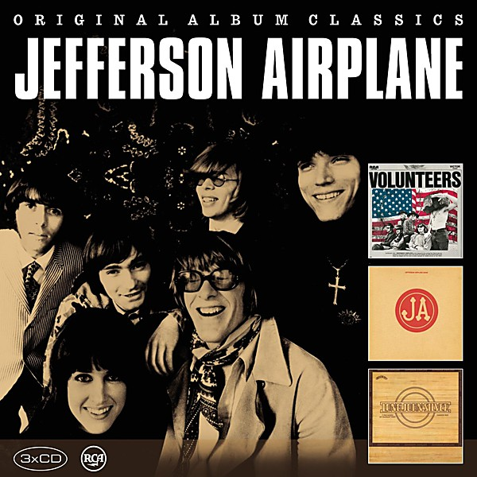

# Bark

By **Jefferson Airplane**

## Album Data

- **Catalog:** Beets
- **Format:** Digital, Album
- **Album:** Bark
- **Artist:** Jefferson Airplane
- **Albumartist:** Jefferson Airplane
- **Genre:** Psychedelic Rock
- **MusicBrainz Album Artist ID:** [39c2a93d-9afa-4a22-9bba-c087ab056e1c](https://musicbrainz.org/artist/39c2a93d-9afa-4a22-9bba-c087ab056e1c)
- **MusicBrainz Album ID:** [fc2c1f10-083d-4026-9ee0-bf1d6748e4f9](https://musicbrainz.org/release/fc2c1f10-083d-4026-9ee0-bf1d6748e4f9)
- **MusicBrainz Release Group ID:** [a4f9d4f4-c2db-3134-9143-2afe22c0f061](https://musicbrainz.org/release-group/a4f9d4f4-c2db-3134-9143-2afe22c0f061)
- **Year:** 2015
- **Catalog #:** 66801-2
- **Label:** RCA
- **Total Tracks:** 10

## Album Tracks

### Track 01 - Clergy

- **Artist:** Jefferson Airplane
- **Format:** ALAC
- **Genre:** Psychedelic Rock
- **Length:** 1:34
- **MusicBrainz Track ID:** [76def4e6-11df-4da1-a158-cb4a0ea6fbf8](https://musicbrainz.org/recording/76def4e6-11df-4da1-a158-cb4a0ea6fbf8)
- **Title:** Clergy
- **Track:** 01
- **Year:** 1996

### Track 02 - 3/5’s of a Mile in 10 Seconds

- **Artist:** Jefferson Airplane
- **Format:** ALAC
- **Genre:** Rock
- **Length:** 4:39
- **MusicBrainz Track ID:** [c2366d4e-3cfd-4236-b8b8-d30659d06626](https://musicbrainz.org/recording/c2366d4e-3cfd-4236-b8b8-d30659d06626)
- **Title:** 3/5’s of a Mile in 10 Seconds
- **Track:** 02
- **Year:** 1996

### Track 03 - Somebody to Love

- **Artist:** Jefferson Airplane
- **Format:** ALAC
- **Genre:** Psychedelic Rock
- **Length:** 4:16
- **MusicBrainz Track ID:** [b8b87d77-817a-418c-93d4-847f44c92c4f](https://musicbrainz.org/recording/b8b87d77-817a-418c-93d4-847f44c92c4f)
- **Title:** Somebody to Love
- **Track:** 03
- **Year:** 1996

### Track 04 - Fat Angel

- **Artist:** Jefferson Airplane
- **Format:** ALAC
- **Genre:** Raga Rock
- **Length:** 7:35
- **MusicBrainz Track ID:** [51016a74-7c34-44b5-bf65-29f84c3120bc](https://musicbrainz.org/recording/51016a74-7c34-44b5-bf65-29f84c3120bc)
- **Title:** Fat Angel
- **Track:** 04
- **Year:** 1996

### Track 05 - Rock Me Baby

- **Artist:** Jefferson Airplane
- **Format:** ALAC
- **Genre:** Acid Rock
- **Length:** 7:44
- **MusicBrainz Track ID:** [235169e6-04cc-4aad-b18d-f520877c52e1](https://musicbrainz.org/recording/235169e6-04cc-4aad-b18d-f520877c52e1)
- **Title:** Rock Me Baby
- **Track:** 05
- **Year:** 1996

### Track 06 - The Other Side of This Life

- **Artist:** Jefferson Airplane
- **Format:** ALAC
- **Genre:** Acid Rock
- **Length:** 6:45
- **MusicBrainz Track ID:** [19bec1fd-85bc-42d4-8cea-d1a478343d17](https://musicbrainz.org/recording/19bec1fd-85bc-42d4-8cea-d1a478343d17)
- **Title:** The Other Side of This Life
- **Track:** 06
- **Year:** 1996

### Track 07 - It’s No Secret

- **Artist:** Jefferson Airplane
- **Format:** ALAC
- **Genre:** Rock
- **Length:** 3:31
- **MusicBrainz Track ID:** [cd3be4c2-beb1-45b2-bd2a-c3ebf5ee1541](https://musicbrainz.org/recording/cd3be4c2-beb1-45b2-bd2a-c3ebf5ee1541)
- **Title:** It’s No Secret
- **Track:** 07
- **Year:** 1996

### Track 08 - Plastic Fantastic Lover

- **Artist:** Jefferson Airplane
- **Format:** ALAC
- **Genre:** Psychedelic Rock
- **Length:** 3:53
- **MusicBrainz Track ID:** [fd2969e5-86f1-4db5-96db-fcd27d95a26a](https://musicbrainz.org/recording/fd2969e5-86f1-4db5-96db-fcd27d95a26a)
- **Title:** Plastic Fantastic Lover
- **Track:** 08
- **Year:** 1996

### Track 09 - Turn Out the Lights

- **Artist:** Jefferson Airplane
- **Format:** ALAC
- **Genre:** Psychedelic Rock
- **Length:** 1:25
- **MusicBrainz Track ID:** [e4161be7-b400-48b5-a977-2ee116ca3ec1](https://musicbrainz.org/recording/e4161be7-b400-48b5-a977-2ee116ca3ec1)
- **Title:** Turn Out the Lights
- **Track:** 09
- **Year:** 1996

### Track 10 - Bear Melt

- **Artist:** Jefferson Airplane
- **Format:** ALAC
- **Genre:** Acid Rock
- **Length:** 11:20
- **MusicBrainz Track ID:** [d08c37a1-3f91-46a5-b4b5-b84701849aaa](https://musicbrainz.org/recording/d08c37a1-3f91-46a5-b4b5-b84701849aaa)
- **Title:** Bear Melt
- **Track:** 10
- **Year:** 1996

