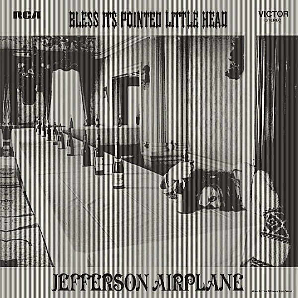

# Bless Its Pointed Little Head

By **Jefferson Airplane**

## Album Data

- **Catalog:** Beets
- **Format:** Digital, Album
- **Album:** Bless Its Pointed Little Head
- **Artist:** Jefferson Airplane
- **Albumartist:** Jefferson Airplane
- **Genre:** Rock
- **MusicBrainz Album Artist ID:** [39c2a93d-9afa-4a22-9bba-c087ab056e1c](https://musicbrainz.org/artist/39c2a93d-9afa-4a22-9bba-c087ab056e1c)
- **MusicBrainz Album ID:** [70e2d206-27cf-4a35-81f5-afaf7dd75ec6](https://musicbrainz.org/release/70e2d206-27cf-4a35-81f5-afaf7dd75ec6)
- **MusicBrainz Release Group ID:** [427fe5f9-a86f-3474-9993-600edfa17fba](https://musicbrainz.org/release-group/427fe5f9-a86f-3474-9993-600edfa17fba)
- **Year:** 1996
- **Catalog #:** 07863 67561-2
- **Label:** RCA
- **Total Tracks:** 11

## Album Tracks

### Track 01 - Lather

- **Artist:** Jefferson Airplane
- **Format:** ALAC
- **Genre:** Acid Rock
- **Length:** 2:55
- **MusicBrainz Track ID:** [289adf80-7be6-415f-a0f7-78e6f660aab0](https://musicbrainz.org/recording/289adf80-7be6-415f-a0f7-78e6f660aab0)
- **Title:** Lather
- **Track:** 01
- **Year:** 1998

### Track 02 - In Time

- **Artist:** Jefferson Airplane
- **Format:** ALAC
- **Genre:** Acid Rock
- **Length:** 4:10
- **MusicBrainz Track ID:** [a29b82c6-2574-46e9-8839-7db5cefab4f3](https://musicbrainz.org/recording/a29b82c6-2574-46e9-8839-7db5cefab4f3)
- **Title:** In Time
- **Track:** 02
- **Year:** 1998

### Track 03 - Triad

- **Artist:** Jefferson Airplane
- **Format:** ALAC
- **Genre:** Psychedelic Rock
- **Length:** 4:53
- **MusicBrainz Track ID:** [398e7043-0e4d-4b6e-9879-c928a9f92515](https://musicbrainz.org/recording/398e7043-0e4d-4b6e-9879-c928a9f92515)
- **Title:** Triad
- **Track:** 03
- **Year:** 1998

### Track 04 - Star Track

- **Artist:** Jefferson Airplane
- **Format:** ALAC
- **Genre:** Acid Rock
- **Length:** 3:08
- **MusicBrainz Track ID:** [7367633b-1135-4d25-a45c-0bcd8c94ce5e](https://musicbrainz.org/recording/7367633b-1135-4d25-a45c-0bcd8c94ce5e)
- **Title:** Star Track
- **Track:** 04
- **Year:** 1998

### Track 05 - Share a Little Joke

- **Artist:** Jefferson Airplane
- **Format:** ALAC
- **Genre:** Acid Rock
- **Length:** 3:05
- **MusicBrainz Track ID:** [e68e6f7e-08d6-4fef-8848-4c415a3d5538](https://musicbrainz.org/recording/e68e6f7e-08d6-4fef-8848-4c415a3d5538)
- **Title:** Share a Little Joke
- **Track:** 05
- **Year:** 1998

### Track 06 - Cushingura

- **Artist:** Jefferson Airplane
- **Format:** ALAC
- **Genre:** Acid Rock
- **Length:** 1:17
- **MusicBrainz Track ID:** [b4680662-712a-4507-b7b0-77992aed3941](https://musicbrainz.org/recording/b4680662-712a-4507-b7b0-77992aed3941)
- **Title:** Cushingura
- **Track:** 06
- **Year:** 1998

### Track 07 - If You Feel

- **Artist:** Jefferson Airplane
- **Format:** ALAC
- **Genre:** Acid Rock
- **Length:** 3:19
- **MusicBrainz Track ID:** [020dfce8-851d-4210-9b48-b0653eed02ee](https://musicbrainz.org/recording/020dfce8-851d-4210-9b48-b0653eed02ee)
- **Title:** If You Feel
- **Track:** 07
- **Year:** 1998

### Track 08 - Crown of Creation

- **Artist:** Jefferson Airplane
- **Format:** ALAC
- **Genre:** Acid Rock
- **Length:** 2:53
- **MusicBrainz Track ID:** [586c7b2e-7f6b-45d9-a2c6-b97b33be8c82](https://musicbrainz.org/recording/586c7b2e-7f6b-45d9-a2c6-b97b33be8c82)
- **Title:** Crown of Creation
- **Track:** 08
- **Year:** 1998

### Track 09 - Ice Cream Phoenix

- **Artist:** Jefferson Airplane
- **Format:** ALAC
- **Genre:** Acid Rock
- **Length:** 2:59
- **MusicBrainz Track ID:** [2f65883e-caa9-446f-8c26-c52a9b24c8f3](https://musicbrainz.org/recording/2f65883e-caa9-446f-8c26-c52a9b24c8f3)
- **Title:** Ice Cream Phoenix
- **Track:** 09
- **Year:** 1998

### Track 10 - Greasy Heart

- **Artist:** Jefferson Airplane
- **Format:** ALAC
- **Genre:** Acid Rock
- **Length:** 3:25
- **MusicBrainz Track ID:** [9dbb0e0a-9a70-4cce-baec-844b62915505](https://musicbrainz.org/recording/9dbb0e0a-9a70-4cce-baec-844b62915505)
- **Title:** Greasy Heart
- **Track:** 10
- **Year:** 1998

### Track 11 - The House at Pooneil Corners

- **Artist:** Jefferson Airplane
- **Format:** ALAC
- **Genre:** Acid Rock
- **Length:** 5:49
- **MusicBrainz Track ID:** [0c255914-dc6c-4a53-bebe-681baf21c6d9](https://musicbrainz.org/recording/0c255914-dc6c-4a53-bebe-681baf21c6d9)
- **Title:** The House at Pooneil Corners
- **Track:** 11
- **Year:** 1998

## See also

- [After Bathing at Baxter's](After_Bathing_at_Baxters.md)
- [After Bathing At Baxter's](After_Bathing_At_Baxters.md)
- [Bark](Bark.md)
- [Crown of Creation](Crown_of_Creation.md)
- [Early Flight](Early_Flight.md)
- [Jefferson Airplane](Jefferson_Airplane.md)
- [Jefferson Airplane Takes Off](Jefferson_Airplane_Takes_Off.md)
- [Live at Fillmore West 11-25 thru 11-27 1966](Live_at_Fillmore_West_11-25_thru_11-27_1966.md)
- [Long John Silver](Long_John_Silver.md)
- [Return To The Matrix](Return_To_The_Matrix.md)
- [Surrealistic Pillow](Surrealistic_Pillow.md)
- [Sweeping Up the Spotlight](Sweeping_Up_the_Spotlight.md)
- [The Essential Jefferson Airplane - Amazon Prime](The_Essential_Jefferson_Airplane_-_Amazon_Prime.md)
- [Thirty Seconds Over Winterland](Thirty_Seconds_Over_Winterland.md)
- [Volunteers](Volunteers.md)
- [CD: After Bathing At Baxter's](../../CD/Jefferson_Airplane/After_Bathing_At_Baxters.md)
- [CD: Bark](../../CD/Jefferson_Airplane/Bark.md)
- [CD: Early Flight Thirty Seconds Over Winterland](../../CD/Jefferson_Airplane/Early_Flight_Thirty_Seconds_Over_Winterland.md)
- [CD: ](../../CD/Jefferson_Airplane/Jefferson_Airplane.md)
- [CD: Long John Silver](../../CD/Jefferson_Airplane/Long_John_Silver.md)
- [CD: Original Album Classics (Disc 1)](../../CD/Jefferson_Airplane/Original_Album_Classics_Disc_1.md)
- [Roon: After Bathing At Baxters](../../Roon/Jefferson_Airplane/After_Bathing_At_Baxters.md)
- [Roon: Bark (Bonus Tracks)](../../Roon/Jefferson_Airplane/Bark_Bonus_Tracks.md)
- [Roon: Bless Its Pointed Little Head](../../Roon/Jefferson_Airplane/Bless_Its_Pointed_Little_Head.md)
- [Roon: Crown Of Creation](../../Roon/Jefferson_Airplane/Crown_Of_Creation.md)
- [Roon: Long John Silver](../../Roon/Jefferson_Airplane/Long_John_Silver.md)
- [Roon: Surrealistic Pillow](../../Roon/Jefferson_Airplane/Surrealistic_Pillow.md)
- [Roon: Thirty Seconds Over Winterland [Live] (Expanded Edition)](../../Roon/Jefferson_Airplane/Thirty_Seconds_Over_Winterland_[Live]_Expanded_Edition.md)
- [Roon: Volunteers](../../Roon/Jefferson_Airplane/Volunteers.md)
- [Vinyl: After Bathing At Baxter's](../../Vinyl/Jefferson_Airplane/After_Bathing_At_Baxters.md)
- [Vinyl: Crown Of Creation](../../Vinyl/Jefferson_Airplane/Crown_Of_Creation.md)
- [Vinyl: ](../../Vinyl/Jefferson_Airplane/Jefferson_Airplane.md)
- [Vinyl: Mexico](../../Vinyl/Jefferson_Airplane/Mexico.md)
- [Vinyl: Surrealistic Pillow](../../Vinyl/Jefferson_Airplane/Surrealistic_Pillow.md)
