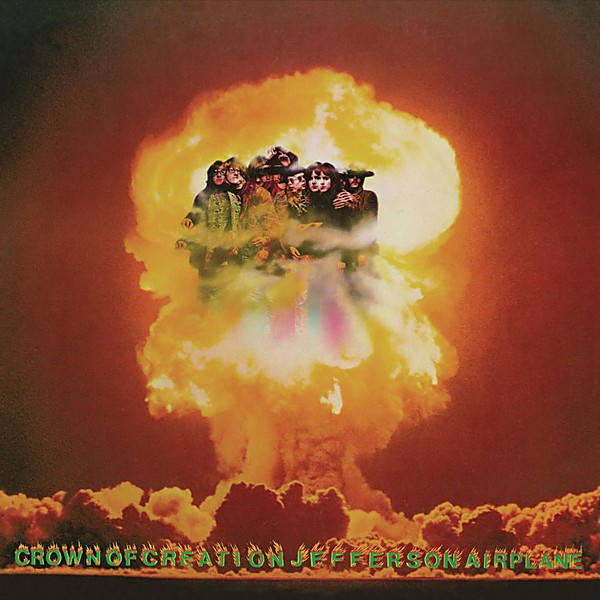

# Crown of Creation

By **Jefferson Airplane**

## Album Data

- **Catalog:** Beets
- **Format:** Digital, Album
- **Album:** Crown of Creation
- **Artist:** Jefferson Airplane
- **Albumartist:** Jefferson Airplane
- **Genre:** Acid Rock
- **MusicBrainz Album Artist ID:** [39c2a93d-9afa-4a22-9bba-c087ab056e1c](https://musicbrainz.org/artist/39c2a93d-9afa-4a22-9bba-c087ab056e1c)
- **MusicBrainz Album ID:** [6e00b3db-f271-4d3e-a10d-36964774fce2](https://musicbrainz.org/release/6e00b3db-f271-4d3e-a10d-36964774fce2)
- **MusicBrainz Release Group ID:** [8b2b0602-018e-3877-abe8-d21f22a0f59b](https://musicbrainz.org/release-group/8b2b0602-018e-3877-abe8-d21f22a0f59b)
- **Year:** 1998
- **Catalog #:** 0786367419-2
- **Label:** RCA
- **Total Tracks:** 09

## Album Tracks

### Track 01 - High Flyin' Bird

- **Artist:** Jefferson Airplane
- **Format:** ALAC
- **Genre:** Acid Rock
- **Length:** 2:33
- **MusicBrainz Track ID:** [40122445-20e0-48ad-92d0-a84ca20d7c57](https://musicbrainz.org/recording/40122445-20e0-48ad-92d0-a84ca20d7c57)
- **Title:** High Flyin' Bird
- **Track:** 01
- **Year:** 1997

### Track 02 - Runnin' 'Round This World

- **Artist:** Jefferson Airplane
- **Format:** ALAC
- **Genre:** Psychedelic Rock
- **Length:** 2:23
- **MusicBrainz Track ID:** [daff5eda-d94d-43be-8f48-02bf7c90aa76](https://musicbrainz.org/recording/daff5eda-d94d-43be-8f48-02bf7c90aa76)
- **Title:** Runnin' 'Round This World
- **Track:** 02
- **Year:** 1997

### Track 03 - That's Alright

- **Artist:** Jefferson Airplane
- **Format:** ALAC
- **Genre:** Psychedelic Rock
- **Length:** 2:14
- **MusicBrainz Track ID:** [ce41359e-1813-4765-90a0-ed7d52f00001](https://musicbrainz.org/recording/ce41359e-1813-4765-90a0-ed7d52f00001)
- **Title:** That's Alright
- **Track:** 03
- **Year:** 1997

### Track 04 - In the Morning

- **Artist:** Jefferson Airplane
- **Format:** ALAC
- **Genre:** Psychedelic Rock
- **Length:** 6:26
- **MusicBrainz Track ID:** [530259f6-a1a8-407b-b3ff-d001639c9f40](https://musicbrainz.org/recording/530259f6-a1a8-407b-b3ff-d001639c9f40)
- **Title:** In the Morning
- **Track:** 04
- **Year:** 1997

### Track 05 - J.P.P. McStep B. Blues

- **Artist:** Jefferson Airplane
- **Format:** ALAC
- **Genre:** Psychedelic Rock
- **Length:** 2:50
- **MusicBrainz Track ID:** [e2821238-2163-4851-95e3-4145a9990bd4](https://musicbrainz.org/recording/e2821238-2163-4851-95e3-4145a9990bd4)
- **Title:** J.P.P. McStep B. Blues
- **Track:** 05
- **Year:** 1997

### Track 06 - Go to Her

- **Artist:** Jefferson Airplane
- **Format:** ALAC
- **Genre:** Acid Rock
- **Length:** 4:00
- **MusicBrainz Track ID:** [a874a64b-8511-416c-9573-78c9ab4a741a](https://musicbrainz.org/recording/a874a64b-8511-416c-9573-78c9ab4a741a)
- **Title:** Go to Her
- **Track:** 06
- **Year:** 1997

### Track 07 - Up or Down

- **Artist:** Jefferson Airplane
- **Format:** ALAC
- **Genre:** Psychedelic Rock
- **Length:** 6:19
- **MusicBrainz Track ID:** [d9160cca-21e7-45a5-9d45-cc1fca5569f2](https://musicbrainz.org/recording/d9160cca-21e7-45a5-9d45-cc1fca5569f2)
- **Title:** Up or Down
- **Track:** 07
- **Year:** 1997

### Track 08 - Mexico

- **Artist:** Jefferson Airplane
- **Format:** ALAC
- **Genre:** Psychedelic Rock
- **Length:** 2:06
- **MusicBrainz Track ID:** [0a21bf5d-3ca0-427e-bdd5-e82663cdd5fd](https://musicbrainz.org/recording/0a21bf5d-3ca0-427e-bdd5-e82663cdd5fd)
- **Title:** Mexico
- **Track:** 08
- **Year:** 1997

### Track 09 - Have You Seen the Saucers

- **Artist:** Jefferson Airplane
- **Format:** ALAC
- **Genre:** Psychedelic Rock
- **Length:** 3:40
- **MusicBrainz Track ID:** [73bd119b-f409-43b0-a031-502f299416c0](https://musicbrainz.org/recording/73bd119b-f409-43b0-a031-502f299416c0)
- **Title:** Have You Seen the Saucers
- **Track:** 09
- **Year:** 1997

## See also

- [After Bathing at Baxter's](After_Bathing_at_Baxters.md)
- [After Bathing At Baxter's](After_Bathing_At_Baxters.md)
- [Bark](Bark.md)
- [Bless Its Pointed Little Head](Bless_Its_Pointed_Little_Head.md)
- [Early Flight](Early_Flight.md)
- [Jefferson Airplane](Jefferson_Airplane.md)
- [Jefferson Airplane Takes Off](Jefferson_Airplane_Takes_Off.md)
- [Live at Fillmore West 11-25 thru 11-27 1966](Live_at_Fillmore_West_11-25_thru_11-27_1966.md)
- [Long John Silver](Long_John_Silver.md)
- [Return To The Matrix](Return_To_The_Matrix.md)
- [Surrealistic Pillow](Surrealistic_Pillow.md)
- [Sweeping Up the Spotlight](Sweeping_Up_the_Spotlight.md)
- [The Essential Jefferson Airplane - Amazon Prime](The_Essential_Jefferson_Airplane_-_Amazon_Prime.md)
- [Thirty Seconds Over Winterland](Thirty_Seconds_Over_Winterland.md)
- [Volunteers](Volunteers.md)
- [CD: After Bathing At Baxter's](../../CD/Jefferson_Airplane/After_Bathing_At_Baxters.md)
- [CD: Bark](../../CD/Jefferson_Airplane/Bark.md)
- [CD: Early Flight Thirty Seconds Over Winterland](../../CD/Jefferson_Airplane/Early_Flight_Thirty_Seconds_Over_Winterland.md)
- [CD: ](../../CD/Jefferson_Airplane/Jefferson_Airplane.md)
- [CD: Long John Silver](../../CD/Jefferson_Airplane/Long_John_Silver.md)
- [CD: Original Album Classics (Disc 1)](../../CD/Jefferson_Airplane/Original_Album_Classics_Disc_1.md)
- [Roon: After Bathing At Baxters](../../Roon/Jefferson_Airplane/After_Bathing_At_Baxters.md)
- [Roon: Bark (Bonus Tracks)](../../Roon/Jefferson_Airplane/Bark_Bonus_Tracks.md)
- [Roon: Bless Its Pointed Little Head](../../Roon/Jefferson_Airplane/Bless_Its_Pointed_Little_Head.md)
- [Roon: Crown Of Creation](../../Roon/Jefferson_Airplane/Crown_Of_Creation.md)
- [Roon: Long John Silver](../../Roon/Jefferson_Airplane/Long_John_Silver.md)
- [Roon: Surrealistic Pillow](../../Roon/Jefferson_Airplane/Surrealistic_Pillow.md)
- [Roon: Thirty Seconds Over Winterland [Live] (Expanded Edition)](../../Roon/Jefferson_Airplane/Thirty_Seconds_Over_Winterland_[Live]_Expanded_Edition.md)
- [Roon: Volunteers](../../Roon/Jefferson_Airplane/Volunteers.md)
- [Vinyl: After Bathing At Baxter's](../../Vinyl/Jefferson_Airplane/After_Bathing_At_Baxters.md)
- [Vinyl: Crown Of Creation](../../Vinyl/Jefferson_Airplane/Crown_Of_Creation.md)
- [Vinyl: ](../../Vinyl/Jefferson_Airplane/Jefferson_Airplane.md)
- [Vinyl: Mexico](../../Vinyl/Jefferson_Airplane/Mexico.md)
- [Vinyl: Surrealistic Pillow](../../Vinyl/Jefferson_Airplane/Surrealistic_Pillow.md)
