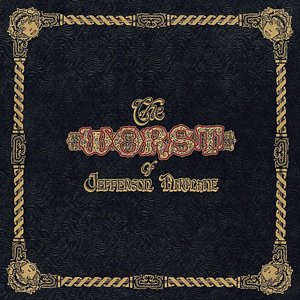

# Early Flight

By **Jefferson Airplane**

## Album Data

- **Catalog:** Beets
- **Format:** Digital, Album
- **Album:** Early Flight
- **Artist:** Jefferson Airplane
- **Albumartist:** Jefferson Airplane
- **Genre:** Psychedelic Rock
- **MusicBrainz Album Artist ID:** [39c2a93d-9afa-4a22-9bba-c087ab056e1c](https://musicbrainz.org/artist/39c2a93d-9afa-4a22-9bba-c087ab056e1c)
- **MusicBrainz Album ID:** [659fd6ef-fea6-49f3-a859-d44c111b6e4e](https://musicbrainz.org/release/659fd6ef-fea6-49f3-a859-d44c111b6e4e)
- **MusicBrainz Release Group ID:** [1af5895e-a07f-30f0-bd0e-16e019c4b034](https://musicbrainz.org/release-group/1af5895e-a07f-30f0-bd0e-16e019c4b034)
- **Year:** 1997
- **Catalog #:** EK 45271
- **Label:** Epic
- **Total Tracks:** 13

## Album Tracks

### Track 01 - Planes

- **Artist:** Jefferson Airplane
- **Format:** ALAC
- **Genre:** Psychedelic Rock
- **Length:** 4:27
- **MusicBrainz Track ID:** [7eb2c42f-6ba7-42f8-9ea0-fc5d6a92a2a1](https://musicbrainz.org/recording/7eb2c42f-6ba7-42f8-9ea0-fc5d6a92a2a1)
- **Title:** Planes
- **Track:** 01
- **Year:** 1989

### Track 02 - Freedom

- **Artist:** Jefferson Airplane
- **Format:** ALAC
- **Genre:** Psychedelic Rock
- **Length:** 4:54
- **MusicBrainz Track ID:** [26428461-50cf-47e0-bc70-0bc50471dc7d](https://musicbrainz.org/recording/26428461-50cf-47e0-bc70-0bc50471dc7d)
- **Title:** Freedom
- **Track:** 02
- **Year:** 1989

### Track 03 - Solidarity

- **Artist:** Jefferson Airplane
- **Format:** ALAC
- **Genre:** Psychedelic Rock
- **Length:** 5:08
- **MusicBrainz Track ID:** [ed66ae59-2a6e-45e2-a6a8-f647e11516c2](https://musicbrainz.org/recording/ed66ae59-2a6e-45e2-a6a8-f647e11516c2)
- **Title:** Solidarity
- **Track:** 03
- **Year:** 1989

### Track 04 - Madeleine Street

- **Artist:** Jefferson Airplane
- **Format:** ALAC
- **Genre:** Psychedelic Rock
- **Length:** 4:15
- **MusicBrainz Track ID:** [5bb1d7f8-30f3-4eec-a434-9eb22c22c04a](https://musicbrainz.org/recording/5bb1d7f8-30f3-4eec-a434-9eb22c22c04a)
- **Title:** Madeleine Street
- **Track:** 04
- **Year:** 1989

### Track 05 - Ice Age

- **Artist:** Jefferson Airplane
- **Format:** ALAC
- **Genre:** Psychedelic Rock
- **Length:** 4:18
- **MusicBrainz Track ID:** [a390b9d1-b4d2-4332-8d13-4bc91a498ce2](https://musicbrainz.org/recording/a390b9d1-b4d2-4332-8d13-4bc91a498ce2)
- **Title:** Ice Age
- **Track:** 05
- **Year:** 1989

### Track 06 - Summer of Love

- **Artist:** Jefferson Airplane
- **Format:** ALAC
- **Genre:** Psychedelic Rock
- **Length:** 4:17
- **MusicBrainz Track ID:** [2e71a3ac-aeaa-4da5-a359-b6bcbb2804ea](https://musicbrainz.org/recording/2e71a3ac-aeaa-4da5-a359-b6bcbb2804ea)
- **Title:** Summer of Love
- **Track:** 06
- **Year:** 1989

### Track 07 - The Wheel

- **Artist:** Jefferson Airplane
- **Format:** ALAC
- **Genre:** Psychedelic Rock
- **Length:** 6:10
- **MusicBrainz Track ID:** [5302aef3-a79f-4c6c-92d7-04b86e5e4429](https://musicbrainz.org/recording/5302aef3-a79f-4c6c-92d7-04b86e5e4429)
- **Title:** The Wheel
- **Track:** 07
- **Year:** 1989

### Track 08 - Common Market Madrigal

- **Artist:** Jefferson Airplane
- **Format:** ALAC
- **Genre:** Acid Rock
- **Length:** 2:46
- **MusicBrainz Track ID:** [0b162702-138d-421b-989b-9ed574d194a1](https://musicbrainz.org/recording/0b162702-138d-421b-989b-9ed574d194a1)
- **Title:** Common Market Madrigal
- **Track:** 08
- **Year:** 1989

### Track 09 - True Love

- **Artist:** Jefferson Airplane
- **Format:** ALAC
- **Genre:** Pop Rock
- **Length:** 3:44
- **MusicBrainz Track ID:** [ffdb33bb-e1e4-4c10-bfd6-d7c327a0ad8c](https://musicbrainz.org/recording/ffdb33bb-e1e4-4c10-bfd6-d7c327a0ad8c)
- **Title:** True Love
- **Track:** 09
- **Year:** 1989

### Track 10 - Upfront Blues

- **Artist:** Jefferson Airplane
- **Format:** ALAC
- **Genre:** Psychedelic Rock
- **Length:** 2:02
- **MusicBrainz Track ID:** [c0f6321d-7fa8-4914-9b10-be49fce832d9](https://musicbrainz.org/recording/c0f6321d-7fa8-4914-9b10-be49fce832d9)
- **Title:** Upfront Blues
- **Track:** 10
- **Year:** 1989

### Track 11 - Now Is the Time

- **Artist:** Jefferson Airplane
- **Format:** ALAC
- **Genre:** Psychedelic Rock
- **Length:** 4:53
- **MusicBrainz Track ID:** [977f25dd-f38e-4ed1-a881-b3185913f5de](https://musicbrainz.org/recording/977f25dd-f38e-4ed1-a881-b3185913f5de)
- **Title:** Now Is the Time
- **Track:** 11
- **Year:** 1989

### Track 12 - Too Many Years

- **Artist:** Jefferson Airplane
- **Format:** ALAC
- **Genre:** Psychedelic Rock
- **Length:** 4:11
- **MusicBrainz Track ID:** [42f76dcf-137c-4a2d-b74a-ac0c89fe2b85](https://musicbrainz.org/recording/42f76dcf-137c-4a2d-b74a-ac0c89fe2b85)
- **Title:** Too Many Years
- **Track:** 12
- **Year:** 1989

### Track 13 - Panda

- **Artist:** Jefferson Airplane
- **Format:** ALAC
- **Genre:** Acid Rock
- **Length:** 3:38
- **MusicBrainz Track ID:** [5eb9e555-73a8-4ff0-a56f-45d81faaf369](https://musicbrainz.org/recording/5eb9e555-73a8-4ff0-a56f-45d81faaf369)
- **Title:** Panda
- **Track:** 13
- **Year:** 1989

## See also

- [After Bathing at Baxter's](After_Bathing_at_Baxters.md)
- [After Bathing At Baxter's](After_Bathing_At_Baxters.md)
- [Bark](Bark.md)
- [Bless Its Pointed Little Head](Bless_Its_Pointed_Little_Head.md)
- [Crown of Creation](Crown_of_Creation.md)
- [Jefferson Airplane](Jefferson_Airplane.md)
- [Jefferson Airplane Takes Off](Jefferson_Airplane_Takes_Off.md)
- [Live at Fillmore West 11-25 thru 11-27 1966](Live_at_Fillmore_West_11-25_thru_11-27_1966.md)
- [Long John Silver](Long_John_Silver.md)
- [Return To The Matrix](Return_To_The_Matrix.md)
- [Surrealistic Pillow](Surrealistic_Pillow.md)
- [Sweeping Up the Spotlight](Sweeping_Up_the_Spotlight.md)
- [The Essential Jefferson Airplane - Amazon Prime](The_Essential_Jefferson_Airplane_-_Amazon_Prime.md)
- [Thirty Seconds Over Winterland](Thirty_Seconds_Over_Winterland.md)
- [Volunteers](Volunteers.md)
- [CD: After Bathing At Baxter's](../../CD/Jefferson_Airplane/After_Bathing_At_Baxters.md)
- [CD: Bark](../../CD/Jefferson_Airplane/Bark.md)
- [CD: Early Flight Thirty Seconds Over Winterland](../../CD/Jefferson_Airplane/Early_Flight_Thirty_Seconds_Over_Winterland.md)
- [CD: ](../../CD/Jefferson_Airplane/Jefferson_Airplane.md)
- [CD: Long John Silver](../../CD/Jefferson_Airplane/Long_John_Silver.md)
- [CD: Original Album Classics (Disc 1)](../../CD/Jefferson_Airplane/Original_Album_Classics_Disc_1.md)
- [Roon: After Bathing At Baxters](../../Roon/Jefferson_Airplane/After_Bathing_At_Baxters.md)
- [Roon: Bark (Bonus Tracks)](../../Roon/Jefferson_Airplane/Bark_Bonus_Tracks.md)
- [Roon: Bless Its Pointed Little Head](../../Roon/Jefferson_Airplane/Bless_Its_Pointed_Little_Head.md)
- [Roon: Crown Of Creation](../../Roon/Jefferson_Airplane/Crown_Of_Creation.md)
- [Roon: Long John Silver](../../Roon/Jefferson_Airplane/Long_John_Silver.md)
- [Roon: Surrealistic Pillow](../../Roon/Jefferson_Airplane/Surrealistic_Pillow.md)
- [Roon: Thirty Seconds Over Winterland [Live] (Expanded Edition)](../../Roon/Jefferson_Airplane/Thirty_Seconds_Over_Winterland_[Live]_Expanded_Edition.md)
- [Roon: Volunteers](../../Roon/Jefferson_Airplane/Volunteers.md)
- [Vinyl: After Bathing At Baxter's](../../Vinyl/Jefferson_Airplane/After_Bathing_At_Baxters.md)
- [Vinyl: Crown Of Creation](../../Vinyl/Jefferson_Airplane/Crown_Of_Creation.md)
- [Vinyl: ](../../Vinyl/Jefferson_Airplane/Jefferson_Airplane.md)
- [Vinyl: Mexico](../../Vinyl/Jefferson_Airplane/Mexico.md)
- [Vinyl: Surrealistic Pillow](../../Vinyl/Jefferson_Airplane/Surrealistic_Pillow.md)
